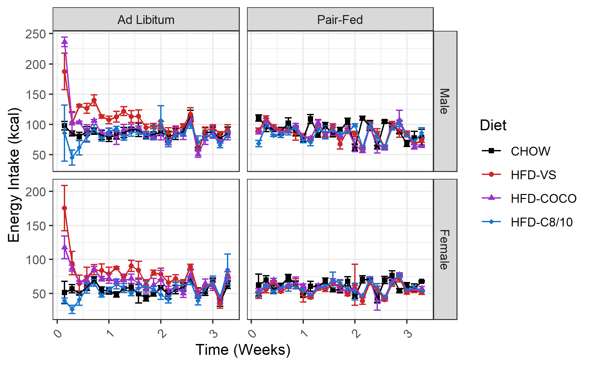
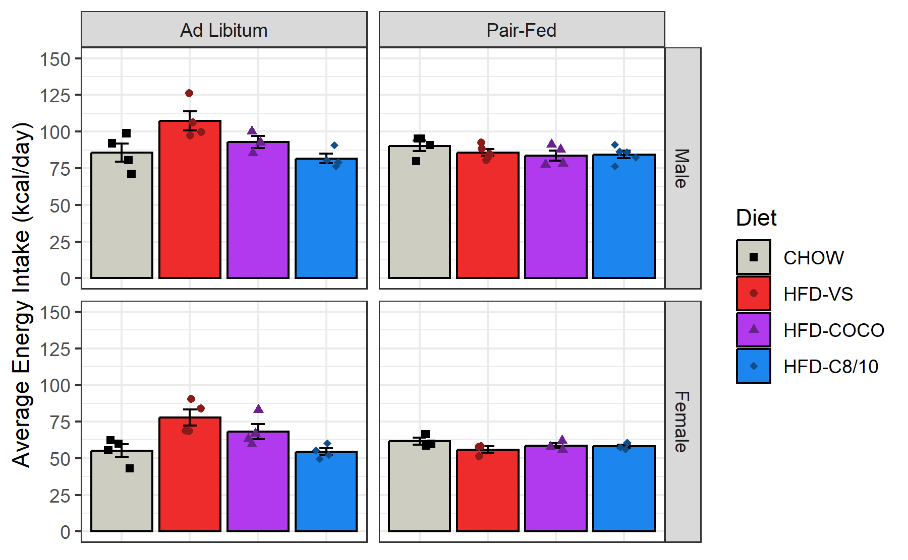
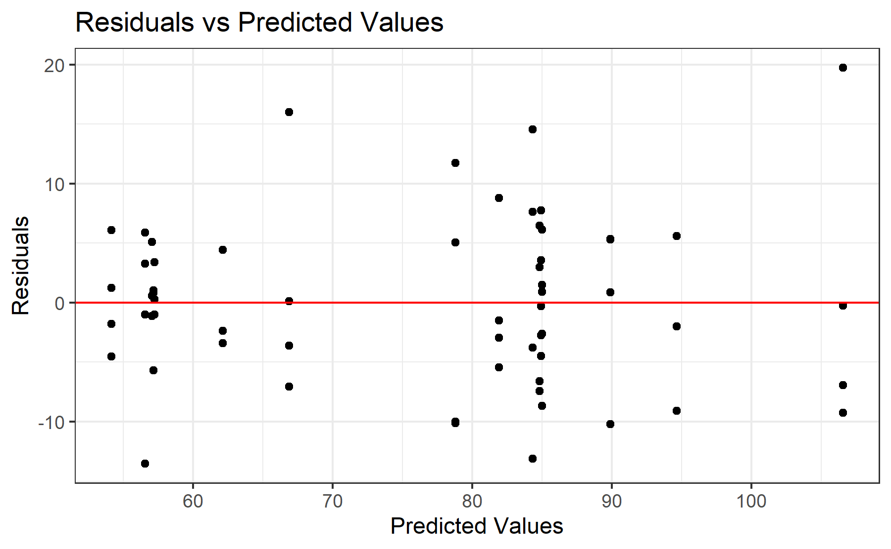
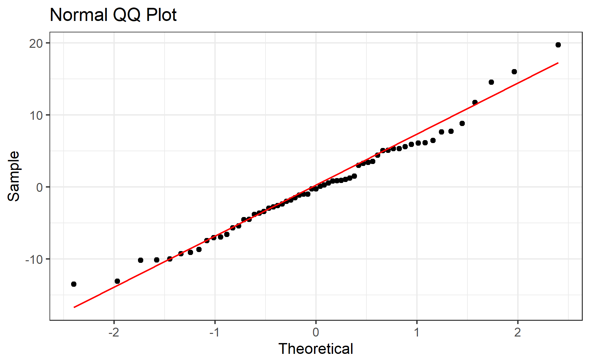

# Experiment 1 - Energy Intake
Brent Bachman
2025-05-01

- [<span class="toc-section-number">1</span> Packages](#packages)
- [<span class="toc-section-number">2</span> Data](#data)
  - [<span class="toc-section-number">2.1</span> Import, tidy, and
    transform](#import-tidy-and-transform)
  - [<span class="toc-section-number">2.2</span> Visualize - Line
    Plot](#visualize---line-plot)
- [<span class="toc-section-number">3</span> Summarize](#summarize)
  - [<span class="toc-section-number">3.1</span> Visualize - Bar
    Plot](#visualize---bar-plot)
- [<span class="toc-section-number">4</span> Model](#model)
  - [<span class="toc-section-number">4.1</span>
    Assumptions](#assumptions)
    - [<span class="toc-section-number">4.1.1</span> Linearity and
      Homoskedasticity](#linearity-and-homoskedasticity)
    - [<span class="toc-section-number">4.1.2</span>
      Normality](#normality)
  - [<span class="toc-section-number">4.2</span> Omnibus
    Tests](#omnibus-tests)
  - [<span class="toc-section-number">4.3</span> Reference =
    CHOW](#reference--chow)
  - [<span class="toc-section-number">4.4</span> Reference =
    HFD-VS](#reference--hfd-vs)
  - [<span class="toc-section-number">4.5</span> Reference =
    HFD-COCO](#reference--hfd-coco)
- [<span class="toc-section-number">5</span> Communicate](#communicate)
- [<span class="toc-section-number">6</span> References](#references)

# Packages

``` r
library("tidyverse")
```

``` r
# install.packages("tidyverse")
```

``` r
sessionInfo()
```

    R version 4.4.2 (2024-10-31 ucrt)
    Platform: x86_64-w64-mingw32/x64
    Running under: Windows 11 x64 (build 26100)

    Matrix products: default


    locale:
    [1] LC_COLLATE=English_United States.utf8 
    [2] LC_CTYPE=English_United States.utf8   
    [3] LC_MONETARY=English_United States.utf8
    [4] LC_NUMERIC=C                          
    [5] LC_TIME=English_United States.utf8    

    time zone: America/New_York
    tzcode source: internal

    attached base packages:
    [1] stats     graphics  grDevices utils     datasets  methods   base     

    other attached packages:
     [1] lubridate_1.9.3 forcats_1.0.0   stringr_1.5.1   dplyr_1.1.4    
     [5] purrr_1.0.2     readr_2.1.5     tidyr_1.3.1     tibble_3.2.1   
     [9] ggplot2_3.5.1   tidyverse_2.0.0

    loaded via a namespace (and not attached):
     [1] gtable_0.3.5      jsonlite_1.8.8    compiler_4.4.2    tidyselect_1.2.1 
     [5] scales_1.3.0      yaml_2.3.10       fastmap_1.2.0     R6_2.5.1         
     [9] generics_0.1.3    knitr_1.48        munsell_0.5.1     pillar_1.9.0     
    [13] tzdb_0.4.0        rlang_1.1.4       utf8_1.2.4        stringi_1.8.4    
    [17] xfun_0.47         timechange_0.3.0  cli_3.6.3         withr_3.0.1      
    [21] magrittr_2.0.3    digest_0.6.37     grid_4.4.2        rstudioapi_0.16.0
    [25] hms_1.1.3         lifecycle_1.0.4   vctrs_0.6.5       evaluate_1.0.0   
    [29] glue_1.7.0        fansi_1.0.6       colorspace_2.1-1  rmarkdown_2.28   
    [33] tools_4.4.2       pkgconfig_2.0.3   htmltools_0.5.8.1

# Data

## Import, tidy, and transform

``` r
# create a dataframe
mydata <- 
  
  # import the data
  read_csv(
    file = "data/experiment-1-statsdata.csv",
    show_col_types = FALSE
    ) |>
  
  # select the variables of interest 
  # ei = energy intake
  select(id, cohort, sex, diet, ei_1:ei_23) |>
  
  # Exclude subject 7
  filter(id != 7) |>
  
  # pivot the data longer
  pivot_longer(
    cols = starts_with("ei"),
    names_to = "day",
    values_to = "energy_intake",
    values_drop_na = TRUE
    ) |>
  
  # remove negative values
  filter(energy_intake >= 0) |>
  
  # perform necessary data transformation
  mutate(
  
    # recode categorical variables as factors
    id = factor(id),
    cohort = factor(
      cohort,
      levels = c(0, 1),
      labels = c("Ad Libitum", "Pair-Fed")
      ),
    sex = factor(
      sex,
      levels = c(0, 1),
      labels = c("Male", "Female")
      ),
    diet = factor(
      diet,
      levels = c(0, 1, 2, 3),
      labels = c("CHOW", "HFD-VS", "HFD-COCO", "HFD-C8/10")
      ),
    
    # recode sex using sum coding
    sex_sum = C(sex, sum),
    
    # compute time in weeks
    day = parse_number(day),
    week = day/7,
    .before = energy_intake,
    )

# view a summary of the data
summary(mydata)
```

           id              cohort        sex             diet          day    
     1      :  23   Ad Libitum:711   Male  :757   CHOW     :345   Min.   : 1  
     2      :  23   Pair-Fed  :689   Female:643   HFD-VS   :368   1st Qu.: 6  
     3      :  23                                 HFD-COCO :320   Median :12  
     4      :  23                                 HFD-C8/10:367   Mean   :12  
     5      :  23                                                 3rd Qu.:18  
     6      :  23                                                 Max.   :23  
     (Other):1262                                                             
       sex_sum         week        energy_intake   
     Male  :757   Min.   :0.1429   Min.   :  1.86  
     Female:643   1st Qu.:0.8571   1st Qu.: 58.31  
                  Median :1.7143   Median : 74.10  
                  Mean   :1.7145   Mean   : 76.22  
                  3rd Qu.:2.5714   3rd Qu.: 91.10  
                  Max.   :3.2857   Max.   :277.83  
                                                   

## Visualize - Line Plot

``` r
# create a line plot of the outcome variable over time
line_plot <-
  mydata |>  
  ggplot(
    aes(
      x = week, 
      y = energy_intake, 
      color = diet, 
      shape = diet
      )
    ) +
  
  # facet by sex and cohort
  facet_grid(
    sex ~ cohort,
    scales = "free_y"
    ) + 
  
  # plot the observed means as points
  stat_summary(
    fun = mean,
    geom = "point"
    ) +
  
  # plot the observed standard errors as errorbars
  stat_summary(
    fun.data = mean_se,
    geom = "errorbar"
    ) +
  
  # plot connecting lines
  stat_summary(
    fun = mean,
    geom = "line"
    ) +
  
  # change color title and scale
  scale_color_manual(
    name = "Diet",
    values = c(
      "CHOW"      = "black",
      "HFD-VS"    = "firebrick3",
      "HFD-COCO"  = "darkorchid3",
      "HFD-C8/10" = "dodgerblue3"
      )
    ) +
  
  # change shape title and scale
  scale_shape_manual(
    name = "Diet",
    values = c(
      "CHOW"      = 15,
      "HFD-VS"    = 16,
      "HFD-COCO"  = 17,
      "HFD-C8/10" = 18
      )
    ) +
  
  # change y-axis title and scale
  labs(y = "Energy Intake (kcal)") +
  
  # change x-axis title and scale
  scale_x_continuous(
    name = "Time (Weeks)",
    breaks = seq(from = 0, to = 4, by = 1)) +
  
  # change overall plot theme
  theme_bw() + 
  
  # rotate and adjust the x-axis tick labels
  theme(
    axis.text.x = element_text(
      angle = 45,
      vjust = 0.5,
      hjust = 0.5
      )
    )

# show the plot
line_plot
```



In the ad-lib cohort, the data for CHOW seem to be pretty flat over
time. However, HFD-VS and HFD-COCO start high on day 1, then decrease
over time; and HFD-C8/C10 starts low on day 1 then quickly return to
baseline, then remain flat for the rest of the dietary intervention.
Conversely, in the pair-fed cohort, the data seem pretty flat for all
diet groups.

# Summarize

Let’s compute the average energy intake across the dietary intervention
for each group.

``` r
# Compute each subject's average energy intake across time
avg_data <- 
  mydata |>
  
  # Compute average energy intake
  group_by(id) |>
  summarize(
    energy_intake = mean(energy_intake)
  ) |>
  
  # Ungroup by id
  ungroup()

# Show a summary of the data
summary(avg_data)
```

           id     energy_intake   
     1      : 1   Min.   : 43.02  
     2      : 1   1st Qu.: 59.82  
     3      : 1   Median : 78.98  
     4      : 1   Mean   : 76.22  
     5      : 1   3rd Qu.: 90.52  
     6      : 1   Max.   :126.29  
     (Other):55                   

``` r
# Create a dataframe called mydata
groups_data <- 
  
  # Copy the original data frame
  mydata |>
  
  # Filter mydata to include only day 0
  filter(day == 1) |>
  
  # Deselect day and week as they are not necessary for this model
  select(-day, -week, -energy_intake)

# Show a summary of the data
summary(groups_data)
```

           id            cohort       sex            diet      sex_sum  
     1      : 1   Ad Libitum:31   Male  :33   CHOW     :15   Male  :33  
     2      : 1   Pair-Fed  :30   Female:28   HFD-VS   :16   Female:28  
     3      : 1                               HFD-COCO :14              
     4      : 1                               HFD-C8/10:16              
     5      : 1                                                         
     6      : 1                                                         
     (Other):55                                                         

``` r
# Create a new dataframe by joining the groups data frame to the average data frame
model_data <-
  groups_data |>
  left_join(avg_data, by = join_by(id))

# Show a summary of the data
summary(model_data)
```

           id            cohort       sex            diet      sex_sum  
     1      : 1   Ad Libitum:31   Male  :33   CHOW     :15   Male  :33  
     2      : 1   Pair-Fed  :30   Female:28   HFD-VS   :16   Female:28  
     3      : 1                               HFD-COCO :14              
     4      : 1                               HFD-C8/10:16              
     5      : 1                                                         
     6      : 1                                                         
     (Other):55                                                         
     energy_intake   
     Min.   : 43.02  
     1st Qu.: 59.82  
     Median : 78.98  
     Mean   : 76.22  
     3rd Qu.: 90.52  
     Max.   :126.29  
                     

## Visualize - Bar Plot

``` r
# Create a bar plot of each group's average energy intake
bar_plot <-
  model_data |>  
  ggplot(
    aes(
      x     = diet, 
      y     = energy_intake, 
      color = diet, 
      fill  = diet,
      shape = diet
      )
    ) +
  
  # Facet by sex and cohort
  facet_grid(
    sex ~ cohort
    ) + 
  
  # Plot the observed means as points
  stat_summary(
    fun = mean,
    geom = "bar",
    color = "black",
    ) +
  
  # Plot the observed standard errors as errorbars
  stat_summary(
    fun.data = mean_se,
    geom = "errorbar",
    color = "black",
    width = 0.2
    ) +
  
  # Plot individual data points
  geom_point(
    position = position_jitter(
      width = 0.2
    )
  ) +
  
  # Change color title and scale
  scale_color_manual(
    name = "Diet",
    values = c(
      "CHOW"      = "black",
      "HFD-VS"    = "firebrick4",
      "HFD-COCO"  = "darkorchid4",
      "HFD-C8/10" = "dodgerblue4"
      )
    ) +
  
  # Change fill title and scale
  scale_fill_manual(
    name = "Diet",
    values = c(
      "CHOW"      = "ivory3",
      "HFD-VS"    = "firebrick2",
      "HFD-COCO"  = "darkorchid2",
      "HFD-C8/10" = "dodgerblue2"
      )
    ) +
  
  # Change shape title and scale
  scale_shape_manual(
    name = "Diet",
    values = c(
      "CHOW"      = 15,
      "HFD-VS"    = 16,
      "HFD-COCO"  = 17,
      "HFD-C8/10" = 18
      )
    ) +
  
  # Change x-axis title
  labs(x = "Diet") +
  
  # Change y-axis title and scale
  scale_y_continuous(
    name = "Average Energy Intake (kcal/day)", 
    limits = c(0, 150),
    breaks = seq(from = 0, to = 150, by = 25)
  ) +
  
  # Change overall plot theme
  theme_bw() + 
  
  # Remove x-axis tick labels
  theme(
    axis.title.x = element_blank(),
    axis.text.x  = element_blank(),
    axis.ticks.x = element_blank()
    )

# Show the plot
bar_plot
```



Consistent with the previous visualization, it looks like HFD-VS has a
greater average energy intake than all other groups in the ad libitum
cohort, but not in the pair-fed cohort. It looks like HFD-COCO has a
greater average energy intake than CHOW and HFD-C8/10 in the ad libitum
cohort, but not in the pair-fed cohort; and it looks like average energy
intake of HFD-C8/10 is not different from CHOW in either cohort.

# Model

To test the effects of sex, diet, cohort, and their interactions on
average energy intake over time, a multiple linear regression will be
built to predict average energy intake (in kcals/day) with sex
(sum-coded, Levels: male = 1, female = -1), diet (treatment coded,
levels: CHOW, HFD-VS, HFD-COCO, HFD-C8/10), cohort (treatment coded,
levels: ad libitum and pair-fed) and their interactions.

``` r
# Build a linear model with the outcome variable average energy intake and the predictors sex, diet, cohort, and the interaction between diet and cohort
model <- lm(energy_intake ~ sex_sum + diet * cohort, data = model_data)
```

## Assumptions

Before I run any statistical tests, let’s check how well the model
satisfies the assumptions.

First, I need to add the fitted and residual values to the data.

``` r
# Add the fitted and residual values to the dataset
model_data_fits <- 
  model_data |>
  mutate(
    fits = c(fitted(model)),
    resids = c(residuals(model))
  )
```

### Linearity and Homoskedasticity

Next, let’s create a residuals vs fitted plot to check for linearity and
homoskedasticity.

``` r
# Create a residuals plot to check for linearity and homoskedasticity
residuals_plot <-
  model_data_fits |>
  ggplot(
    aes(x = fits, y = resids)
  ) +
  
  # Plot individual data points
  geom_point() +
  
  # Plot a horizontal line at y = 0
  geom_hline(yintercept = 0, col = "red") + 
  
  # Change aesthetics
  labs(
    title = "Residuals vs Predicted Values",
    x = "Predicted Values",
    y = "Residuals"
  ) +
  theme_bw() 

# Show the plot
residuals_plot
```



The data seem approximately linear and homoskedastic.

### Normality

Finally, let’s create a qq plot to check for normality.

``` r
# Create a QQ plot to check for normality
qq_plot <-
  model_data_fits |>
  ggplot(
    aes(sample = resids)
  ) +
  
  # Plot boxplots
  geom_qq() +
  geom_qq_line(col = "red") +
  
  # Change aesthestics
  labs(
    title = "Normal QQ Plot",
    x = "Theoretical",
    y = "Sample"
  ) +
  theme_bw() 

# Show the plot
qq_plot
```



The data seem approximately normally distributed.

## Omnibus Tests

Now that we know this is a good model, let’s perform omnibus tests for
the effects of each predictor using the function “anova()”. This
function uses type I sum of squares. Thus, it will produce F test
statistics for the effects of each predictor entered sequentially (i.e.,
the residual effect of each predictor after accounting for the effects
of all the other predictors entered in the model before it).

``` r
# Perform omnibus tests
model |> anova()
```

    Analysis of Variance Table

    Response: energy_intake
                Df  Sum Sq Mean Sq  F value    Pr(>F)    
    sex_sum      1 11006.9 11006.9 201.6758 < 2.2e-16 ***
    diet         3  1291.9   430.6   7.8902  0.000197 ***
    cohort       1   496.0   496.0   9.0878  0.003972 ** 
    diet:cohort  3  1856.6   618.9  11.3393 7.821e-06 ***
    Residuals   52  2838.0    54.6                       
    ---
    Signif. codes:  0 '***' 0.001 '**' 0.01 '*' 0.05 '.' 0.1 ' ' 1

When predicting average energy intake over the course of the dietary
intervention, there was a significant effect of sex,
$F(1, 52) = 201.68, p < .001$, However, after accounting for sex, there
were significant additional effects of diet,
$F(3, 52) = 7.89, p < .001$, cohort, $F(1, 52) = 9.09, p = .004$, and
the interaction between diet and cohort, $F(1, 52) = 11.34, p < .001$.

## Reference = CHOW

Let’s probe these effects by producing the summary output.

``` r
# Produce summary output
model |> summary()
```


    Call:
    lm(formula = energy_intake ~ sex_sum + diet * cohort, data = model_data)

    Residuals:
         Min       1Q   Median       3Q      Max 
    -13.5113  -4.4795  -0.2659   5.0806  19.7389 

    Coefficients:
                                 Estimate Std. Error t value Pr(>|t|)    
    (Intercept)                   70.4239     2.6119  26.962  < 2e-16 ***
    sex_sum1                      13.8900     0.9572  14.512  < 2e-16 ***
    dietHFD-VS                    22.2393     3.6938   6.021 1.79e-07 ***
    dietHFD-COCO                  10.3272     3.8259   2.699  0.00935 ** 
    dietHFD-C8/10                 -2.3933     3.6938  -0.648  0.51988    
    cohortPair-Fed                 5.5862     3.8259   1.460  0.15028    
    dietHFD-VS:cohortPair-Fed    -27.2122     5.3173  -5.118 4.56e-06 ***
    dietHFD-COCO:cohortPair-Fed  -15.4209     5.4983  -2.805  0.00707 ** 
    dietHFD-C8/10:cohortPair-Fed  -2.5230     5.3173  -0.474  0.63714    
    ---
    Signif. codes:  0 '***' 0.001 '**' 0.01 '*' 0.05 '.' 0.1 ' ' 1

    Residual standard error: 7.388 on 52 degrees of freedom
    Multiple R-squared:  0.8377,    Adjusted R-squared:  0.8128 
    F-statistic: 33.56 on 8 and 52 DF,  p-value: < 2.2e-16

Overall, the model explained 84% of the variance in body weight gain;
and, after adjusting for the number of predictors, it explained 81%,
$F(8, 52) = 33.56, R^2 = 0.84, R^2_{adj} = 0.82, p < .001$.

Across sex, the difference between the ad libitum and pair-fed cohorts’
CHOW groups was not statistically significant
($B = 5.59, SE = 3.83, p = .150$). However, both HFD-VS
($B = 22.24, SE = 3.69, p < .001$) and HFD-COCO
($B = 10.33, SE = 3.83, p = .009$) consumed significantly more energy on
average per day than CHOW in the ad libitum cohort. The magnitude of the
difference between CHOW and both HFD-VS
($B = -27.21, SE = 5.32, p < .001$) and HFD-COCO
($B = -15.42, SE = 5.50, p = .007$) was significantly reduced in the
pair-fed cohort. Although HFD-C8/10 consumed slightly *less* energy on
average per day than CHOW in the ad libitum cohort, this effect was not
statistically significant ($B = -2.39, SE = 3.69, p = .520$); and it was
not significantly different in the pair-fed cohort
($B = -2.52, SE = 5.32, p = .637$).

## Reference = HFD-VS

To compare HFD-COCO and HFD-C8/C10 with HFD-VS, let’s relevel the diet
variable to make HFD-VS the reference group, then refit the model and
produce the summary output. (There is no need to rerun the omnibus
tests, as the “total” effects are already captured, and thus the output
would be identical).

``` r
# Relevel factors to change reference group to HFD-VS
model_data_vs <- 
  model_data |>
  mutate(
    diet = fct_relevel(diet, "HFD-VS"), # relevel diet
  )

# Build the model
model_vs <- 
  model |>
  update(
    data = model_data_vs
  )

# Produce the summary output
model_vs |> summary()
```


    Call:
    lm(formula = energy_intake ~ sex_sum + diet * cohort, data = model_data_vs)

    Residuals:
         Min       1Q   Median       3Q      Max 
    -13.5113  -4.4795  -0.2659   5.0806  19.7389 

    Coefficients:
                                 Estimate Std. Error t value Pr(>|t|)    
    (Intercept)                   92.6633     2.6119  35.477  < 2e-16 ***
    sex_sum1                      13.8900     0.9572  14.512  < 2e-16 ***
    dietCHOW                     -22.2393     3.6938  -6.021 1.79e-07 ***
    dietHFD-COCO                 -11.9121     3.8259  -3.114   0.0030 ** 
    dietHFD-C8/10                -24.6327     3.6938  -6.669 1.67e-08 ***
    cohortPair-Fed               -21.6260     3.7016  -5.842 3.41e-07 ***
    dietCHOW:cohortPair-Fed       27.2122     5.3173   5.118 4.56e-06 ***
    dietHFD-COCO:cohortPair-Fed   11.7913     5.4073   2.181   0.0338 *  
    dietHFD-C8/10:cohortPair-Fed  24.6892     5.2239   4.726 1.78e-05 ***
    ---
    Signif. codes:  0 '***' 0.001 '**' 0.01 '*' 0.05 '.' 0.1 ' ' 1

    Residual standard error: 7.388 on 52 degrees of freedom
    Multiple R-squared:  0.8377,    Adjusted R-squared:  0.8128 
    F-statistic: 33.56 on 8 and 52 DF,  p-value: < 2.2e-16

Both HFD-COCO ($B = -11.91, SE = 3.83, p = .003$) and HFD-C8/10
($B = -24.63, SE = 3.69, p < .001$) consumed significantly less energy
on average per day than HFD-VS in the ad libitum cohort. The magnitude
of the difference between HFD-VS and both HFD-COCO
($B = 11.79, SE = 5.41, p = .034$) and HFD-C8/10
($B = 24.69, SE = 5.22, p < .001$) was significantly reduced in the
pair-fed cohort.

## Reference = HFD-COCO

To directly compare HFD-C8/C10 to HFD-COCO, let’s relevel the diet
variable to make HFD-COCO the reference group, then refit the model and
produce the summary output. (There is no need to rerun the omnibus
tests, as the “total” effects are already captured, and thus the output
would be identical).

``` r
# Relevel factors to change reference group to HFD-VS
model_data_coco <- 
  model_data |>
  mutate(
    diet = fct_relevel(diet, "HFD-COCO"), # relevel diet
  )

# Build the model
model_coco <- 
  model |>
  update(
    data = model_data_coco
  )

# Produce the summary output
model_coco |> summary()
```


    Call:
    lm(formula = energy_intake ~ sex_sum + diet * cohort, data = model_data_coco)

    Residuals:
         Min       1Q   Median       3Q      Max 
    -13.5113  -4.4795  -0.2659   5.0806  19.7389 

    Coefficients:
                                 Estimate Std. Error t value Pr(>|t|)    
    (Intercept)                   80.7512     2.7956  28.885  < 2e-16 ***
    sex_sum1                      13.8900     0.9572  14.512  < 2e-16 ***
    dietCHOW                     -10.3272     3.8259  -2.699  0.00935 ** 
    dietHFD-VS                    11.9121     3.8259   3.114  0.00300 ** 
    dietHFD-C8/10                -12.7206     3.8259  -3.325  0.00163 ** 
    cohortPair-Fed                -9.8347     3.9583  -2.485  0.01623 *  
    dietCHOW:cohortPair-Fed       15.4209     5.4983   2.805  0.00707 ** 
    dietHFD-VS:cohortPair-Fed    -11.7913     5.4073  -2.181  0.03376 *  
    dietHFD-C8/10:cohortPair-Fed  12.8979     5.4073   2.385  0.02075 *  
    ---
    Signif. codes:  0 '***' 0.001 '**' 0.01 '*' 0.05 '.' 0.1 ' ' 1

    Residual standard error: 7.388 on 52 degrees of freedom
    Multiple R-squared:  0.8377,    Adjusted R-squared:  0.8128 
    F-statistic: 33.56 on 8 and 52 DF,  p-value: < 2.2e-16

HFD-C8/10 consumed less energy on average per day in the ad libitum
cohort, $B = -12.72, SE = 3.83, p = .002$; and the magnitude of this
difference was reduced in the pair-fed cohort,
$B = 12.90, SE = 5.41, p = .021$.

# Communicate

Let’s save the plots.

``` r
# Save the ...

# line plot
ggsave(
  plot = line_plot,
  filename = "output/experiment-1/01-energy-intake/01-line-plot.tiff",
  width = 6, height = 3.708, units = "in", dpi = 300
)

# bar plot
ggsave(
  plot = bar_plot,
  filename = "output/experiment-1/01-energy-intake/02-bar-plot.tiff",
  width = 6, height = 3.708, units = "in", dpi = 300
)

# residuals plot
ggsave(
  plot = residuals_plot,
  filename = "output/experiment-1/01-energy-intake/03-residuals-plot.tiff",
  width = 6, height = 3.708, units = "in", dpi = 300
)

# qq plot
ggsave(
  plot = qq_plot,
  filename = "output/experiment-1/01-energy-intake/04-qq-plot.tiff",
  width = 6, height = 3.708, units = "in", dpi = 300
)
```

``` r
# Save the bar plot as an rds file to be imported later and arranged into a single multi-panel plot with all the body composition data
saveRDS(
  bar_plot,
  file = "output/experiment-1/05-body-comp-figure/01-energy-intake.rds"
)
```

# References
