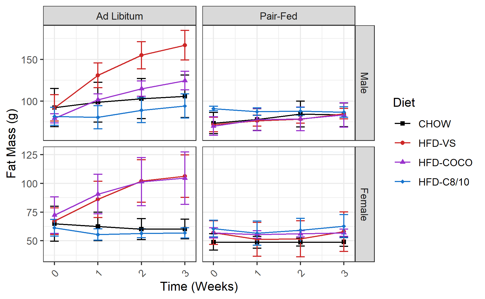
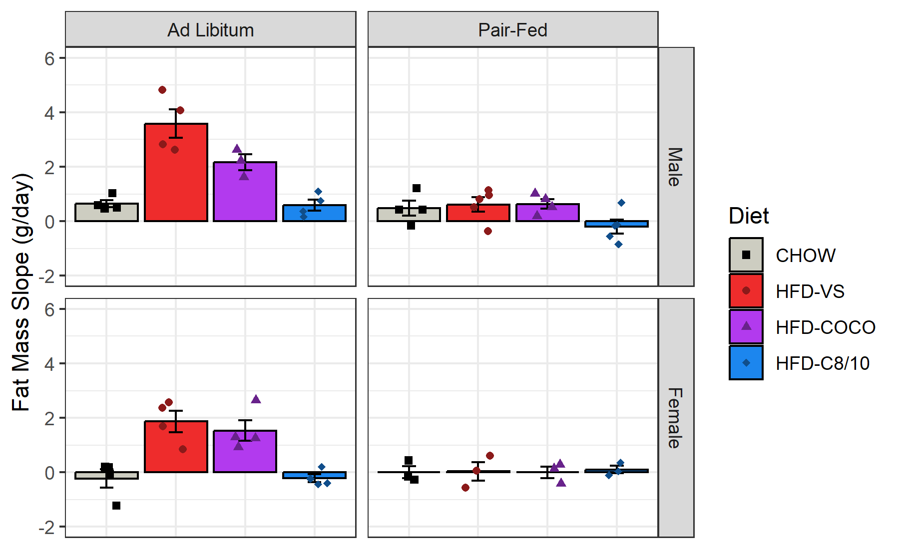
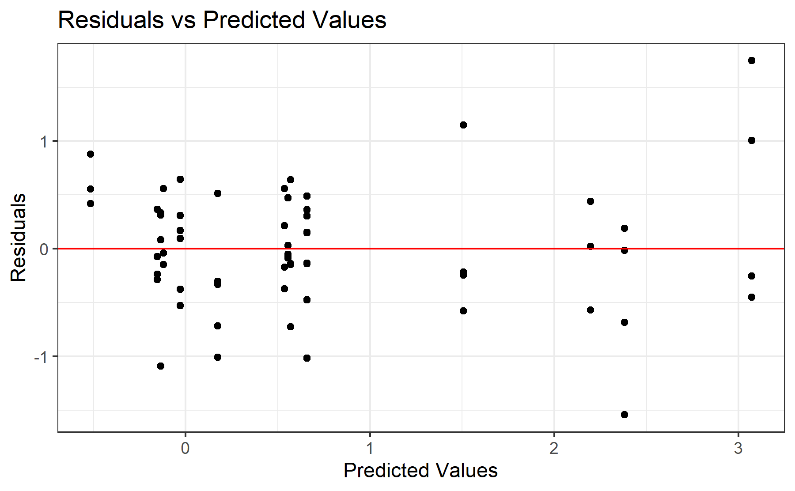
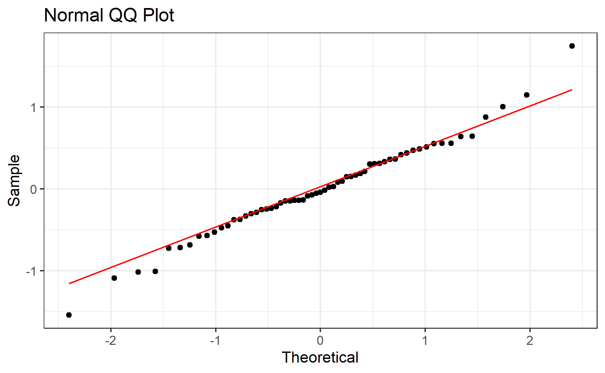

# Experiment 1 - Fat Mass
Brent Bachman
2025-05-01

- [<span class="toc-section-number">1</span> Packages](#packages)
- [<span class="toc-section-number">2</span> Data](#data)
  - [<span class="toc-section-number">2.1</span> Import, tidy, and
    transform](#import-tidy-and-transform)
  - [<span class="toc-section-number">2.2</span> Line Plot](#line-plot)
- [<span class="toc-section-number">3</span> Summarize](#summarize)
  - [<span class="toc-section-number">3.1</span> Bar Plot](#bar-plot)
- [<span class="toc-section-number">4</span> Model](#model)
  - [<span class="toc-section-number">4.1</span>
    Assumptions](#assumptions)
    - [<span class="toc-section-number">4.1.1</span> Linearity and
      Homoskedasticity](#linearity-and-homoskedasticity)
    - [<span class="toc-section-number">4.1.2</span>
      Normality](#normality)
  - [<span class="toc-section-number">4.2</span> Omnibus
    Tests](#omnibus-tests)
  - [<span class="toc-section-number">4.3</span> Reference =
    CHOW](#reference--chow)
  - [<span class="toc-section-number">4.4</span> Reference =
    HFD-VS](#reference--hfd-vs)
  - [<span class="toc-section-number">4.5</span> Reference =
    HFD-COCO](#reference--hfd-coco)
- [<span class="toc-section-number">5</span> Communicate](#communicate)
- [<span class="toc-section-number">6</span> References](#references)

# Packages

``` r
library("tidyverse")
```

``` r
# install.packages("tidyverse")
```

``` r
sessionInfo()
```

    R version 4.4.2 (2024-10-31 ucrt)
    Platform: x86_64-w64-mingw32/x64
    Running under: Windows 11 x64 (build 26100)

    Matrix products: default


    locale:
    [1] LC_COLLATE=English_United States.utf8 
    [2] LC_CTYPE=English_United States.utf8   
    [3] LC_MONETARY=English_United States.utf8
    [4] LC_NUMERIC=C                          
    [5] LC_TIME=English_United States.utf8    

    time zone: America/New_York
    tzcode source: internal

    attached base packages:
    [1] stats     graphics  grDevices utils     datasets  methods   base     

    other attached packages:
     [1] lubridate_1.9.3 forcats_1.0.0   stringr_1.5.1   dplyr_1.1.4    
     [5] purrr_1.0.2     readr_2.1.5     tidyr_1.3.1     tibble_3.2.1   
     [9] ggplot2_3.5.1   tidyverse_2.0.0

    loaded via a namespace (and not attached):
     [1] gtable_0.3.5      jsonlite_1.8.8    compiler_4.4.2    tidyselect_1.2.1 
     [5] scales_1.3.0      yaml_2.3.10       fastmap_1.2.0     R6_2.5.1         
     [9] generics_0.1.3    knitr_1.48        munsell_0.5.1     pillar_1.9.0     
    [13] tzdb_0.4.0        rlang_1.1.4       utf8_1.2.4        stringi_1.8.4    
    [17] xfun_0.47         timechange_0.3.0  cli_3.6.3         withr_3.0.1      
    [21] magrittr_2.0.3    digest_0.6.37     grid_4.4.2        rstudioapi_0.16.0
    [25] hms_1.1.3         lifecycle_1.0.4   vctrs_0.6.5       evaluate_1.0.0   
    [29] glue_1.7.0        fansi_1.0.6       colorspace_2.1-1  rmarkdown_2.28   
    [33] tools_4.4.2       pkgconfig_2.0.3   htmltools_0.5.8.1

# Data

## Import, tidy, and transform

``` r
# Create a dataframe called mydata
mydata <- 
  
  # Import the data
  read_csv(
    file = "data/experiment-1-statsdata.csv",
    show_col_types = FALSE
    ) |>
  
  # Select the variables of interest 
  # ei = energy intake
  select(id, cohort, sex, diet, fm_0:fm_21) |>
  
  # Exclude subject 7
  filter(id != 7) |>
  
  # Tidy data
  pivot_longer(
    cols = starts_with("fm"),
    names_to = "day",
    values_to = "fat_mass",
    values_drop_na = TRUE
    ) |>
  
  # Transform data
  mutate(
  
    # Recode categorical variables as factors
    id = factor(id),
    cohort = factor(
      cohort,
      levels = c(0, 1),
      labels = c("Ad Libitum", "Pair-Fed")
      ),
    sex = factor(
      sex,
      levels = c(0, 1),
      labels = c("Male", "Female")
      ),
    diet = factor(
      diet,
      levels = c(0, 1, 2, 3),
      labels = c("CHOW", "HFD-VS", "HFD-COCO", "HFD-C8/10")
      ),
    
    # Recode sex using sum coding
    sex_sum = C(sex, sum),
    
    # Compute time in weeks
    day = parse_number(day),
    week = day/7,
    .before = fat_mass,
    )

# View a summary of the data
summary(mydata)
```

           id             cohort        sex             diet         day       
     1      :  4   Ad Libitum:124   Male  :132   CHOW     :60   Min.   : 0.00  
     2      :  4   Pair-Fed  :120   Female:112   HFD-VS   :64   1st Qu.: 5.25  
     3      :  4                                 HFD-COCO :56   Median :10.50  
     4      :  4                                 HFD-C8/10:64   Mean   :10.50  
     5      :  4                                                3rd Qu.:15.75  
     6      :  4                                                Max.   :21.00  
     (Other):220                                                               
       sex_sum         week         fat_mass     
     Male  :132   Min.   :0.00   Min.   : 25.23  
     Female:112   1st Qu.:0.75   1st Qu.: 55.05  
                  Median :1.50   Median : 74.27  
                  Mean   :1.50   Mean   : 80.84  
                  3rd Qu.:2.25   3rd Qu.: 96.30  
                  Max.   :3.00   Max.   :193.04  
                                                 

## Line Plot

Let’s visualize the data.

``` r
# Create a line plot of each subject's fat mass over time
line_plot <-
  mydata |>  
  ggplot(
    aes(
      x = week, 
      y = fat_mass, 
      color = diet, 
      shape = diet
      )
    ) +
  
  # Facet by sex and cohort
  facet_grid(
    sex ~ cohort,
    scales = "free_y"
    ) + 
  
  # Plot the observed means as points
  stat_summary(
    fun = mean,
    geom = "point"
    ) +
  
  # Plot the observed standard errors as errorbars
  stat_summary(
    fun.data = mean_se,
    geom = "errorbar",
    width = 0.2
    ) +
  
  # Plot connecting lines
  stat_summary(
    fun = mean,
    geom = "line"
    ) +
  
  # Change color title and scale
  scale_color_manual(
    name = "Diet",
    values = c(
      "CHOW"      = "black",
      "HFD-VS"    = "firebrick3",
      "HFD-COCO"  = "darkorchid3",
      "HFD-C8/10" = "dodgerblue3"
      )
    ) +
  
  # Change shape title and scale
  scale_shape_manual(
    name = "Diet",
    values = c(
      "CHOW"      = 15,
      "HFD-VS"    = 16,
      "HFD-COCO"  = 17,
      "HFD-C8/10" = 18
      )
    ) +
  
  # Change y-axis title and scale
  labs(y = "Fat Mass (g)") +
  
  # Change x-axis title and scale
  scale_x_continuous(
    name = "Time (Weeks)",
    breaks = seq(from = 0, to = 4, by = 1)) +
  
  # Change overall plot theme
  theme_bw() + 
  
  # Rotate and adjust the x-axis tick labels
  theme(
    axis.text.x = element_text(
      angle = 45,
      vjust = 0.5,
      hjust = 0.5
      )
    )

# Show the plot
line_plot
```



The data seem pretty flat over time for chow and HFD-C8/10 in both males
and females in the ad libitum cohort, as well as in all diet groups in
both sexes in the pair-fed cohort. However, the slope seems to be
greater in male and female HFD-VS and HFD-COCO in the ad libitum cohort.

# Summarize

Let’s calculate the slope of each subject’s fat mass over time.

``` r
# Create a new data frame called model_data
model_data <-
  
  # Copy the original dataframe
  mydata |>
  
  # Group by subject id
  group_by(id) |>
  
  # Filter the data to include only days 0 or 21
  filter(day == 0 | day == 21) |>

  # Compute the slope of body weight
  mutate(
    fat_mass_slope = 
      (fat_mass - lag(fat_mass)) / (day - lag(day))
  ) |>
  
  # Ungroup by id
  ungroup() |> 
  
  # Select only the relevant columns
  select(
    id, cohort, sex, sex_sum, diet, fat_mass_slope
  ) |>
  
  # Drop na values
  drop_na(fat_mass_slope)

# Show a summary of the data
summary(model_data)
```

           id            cohort       sex       sex_sum          diet   
     1      : 1   Ad Libitum:31   Male  :33   Male  :33   CHOW     :15  
     2      : 1   Pair-Fed  :30   Female:28   Female:28   HFD-VS   :16  
     3      : 1                                           HFD-COCO :14  
     4      : 1                                           HFD-C8/10:16  
     5      : 1                                                         
     6      : 1                                                         
     (Other):55                                                         
     fat_mass_slope    
     Min.   :-1.22495  
     1st Qu.:-0.05086  
     Median : 0.46809  
     Mean   : 0.73139  
     3rd Qu.: 1.09424  
     Max.   : 4.81824  
                       

Looks good.

## Bar Plot

Now, let’s visualize the slopes.

``` r
# Create a bar plot of each subject's fat mass slope
bar_plot <-
  model_data |>  
  ggplot(
    aes(
      x     = diet, 
      y     = fat_mass_slope, 
      color = diet, 
      fill  = diet,
      shape = diet
      )
    ) +
  
  # Facet by sex and cohort
  facet_grid(
    sex ~ cohort,
    ) + 
  
  # Plot the observed means as points
  stat_summary(
    fun = mean,
    geom = "bar",
    color = "black",
    ) +
  
  # Plot the observed standard errors as errorbars
  stat_summary(
    fun.data = mean_se,
    geom = "errorbar",
    color = "black",
    width = 0.2
    ) +
  
  # Plot individual data points
  geom_point(
    position = position_jitter(
      width = 0.2
    )
  ) +
  
  # Change color title and scale
  scale_color_manual(
    name = "Diet",
    values = c(
      "CHOW"      = "black",
      "HFD-VS"    = "firebrick4",
      "HFD-COCO"  = "darkorchid4",
      "HFD-C8/10" = "dodgerblue4"
      )
    ) +
  
  # Change fill title and scale
  scale_fill_manual(
    name = "Diet",
    values = c(
      "CHOW"      = "ivory3",
      "HFD-VS"    = "firebrick2",
      "HFD-COCO"  = "darkorchid2",
      "HFD-C8/10" = "dodgerblue2"
      )
    ) +
  
  # Change shape title and scale
  scale_shape_manual(
    name = "Diet",
    values = c(
      "CHOW"      = 15,
      "HFD-VS"    = 16,
      "HFD-COCO"  = 17,
      "HFD-C8/10" = 18
      )
    ) +
  
  # Change x-axis title
  labs(x = "Diet") +
  
  # Change y-axis title and scale
  scale_y_continuous(
    name = "Fat Mass Slope (g/day)",
    limits = c(-2, 6),
    breaks = seq(from = -2, to = 6, by = 2)
  ) +
  
  # Change overall plot theme
  theme_bw() + 
  
  # Remove x-axis tick labels
  theme(
    axis.title.x = element_blank(),
    axis.text.x  = element_blank(),
    axis.ticks.x = element_blank()
    )

# Show the plot
bar_plot
```



Consistent with the previous visualization, it looks like HFD-VS has a
greater fat mass slope than all other groups in the ad libitum cohort,
but not the pair-fed cohort. It looks like HFD-COCO has a greater fat
mass slope than CHOW and HFD-C8/10 in the ad libitum cohort, but not the
pair-fed cohort; and it looks like the fat mass slope of HFD-C8/10 is
not different from CHOW in either cohort.

# Model

To test the effects of sex, diet, cohort, and their interactions on the
slope of fat mass over time, a multiple linear regression will be built
to predict fat mass gain (in g/day) with sex (sum-coded, Levels: male =
1, female = -1), diet (treatment coded, levels: CHOW, HFD-VS, HFD-COCO,
HFD-C8/10), cohort (treatment coded, levels: ad libitum and pair-fed)
and their interactions.

``` r
# Build a linear model with the outcome variable average energy intake and the predictors sex, diet, cohort, and the interaction between diet and cohort
model <- lm(fat_mass_slope ~ sex_sum + diet * cohort, data = model_data)
```

## Assumptions

Before I run any statistical tests, let’s check how well the model
satisfies the assumptions.

But first, I need to add the fitted and residual values to the data.

``` r
# Add the fitted and residual values to the dataset
model_data_fits <- 
  model_data |>
  mutate(
    fits = c(fitted(model)),
    resids = c(residuals(model))
  )
```

### Linearity and Homoskedasticity

Next, let’s create a residuals vs fitted plot to check for linearity and
homoskedasticity.

``` r
# Create a residuals plot to check for linearity and homoskedasticity
residuals_plot <-
  model_data_fits |>
  ggplot(
    aes(x = fits, y = resids)
  ) +
  
  # Plot individual data points
  geom_point() +
  
  # Plot a horizontal line at y = 0
  geom_hline(yintercept = 0, col = "red") + 
  
  # Change aesthetics
  labs(
    title = "Residuals vs Predicted Values",
    x = "Predicted Values",
    y = "Residuals"
  ) +
  theme_bw() 

# Show the plot
residuals_plot
```



The data seem approximately linear and homoskedastic.

### Normality

Finally, let’s create a qq plot to check for normality.

``` r
# Create a QQ plot to check for normality
qq_plot <-
  model_data_fits |>
  ggplot(
    aes(sample = resids)
  ) +
  
  # Plot boxplots
  geom_qq() +
  geom_qq_line(col = "red") +
  
  # Change aesthestics
  labs(
    title = "Normal QQ Plot",
    x = "Theoretical",
    y = "Sample"
  ) +
  theme_bw() 

# Show the plot
qq_plot
```



The data seem approximately normally distributed.

## Omnibus Tests

Now that we know this is a good model, let’s perform omnibus tests for
the effects of each predictor using the function “anova()”. This
function uses type I sum of squares. Thus, it will produce F test
statistics for the effects of each predictor entered sequentially (i.e.,
the residual effect of each predictor after accounting for the effects
of all the other predictors entered in the model before it).

``` r
# Perform omnibus tests
model |> anova()
```

    Analysis of Variance Table

    Response: fat_mass_slope
                Df  Sum Sq Mean Sq F value    Pr(>F)    
    sex_sum      1  4.4092  4.4092  11.899  0.001122 ** 
    diet         3 23.9122  7.9707  21.511 3.409e-09 ***
    cohort       1 17.4012 17.4012  46.961 8.497e-09 ***
    diet:cohort  3 14.3664  4.7888  12.924 2.001e-06 ***
    Residuals   52 19.2685  0.3705                      
    ---
    Signif. codes:  0 '***' 0.001 '**' 0.01 '*' 0.05 '.' 0.1 ' ' 1

When predicting body weight gain over the course of the dietary
intervention, there were significant effects of sex,
$F(1, 52) = 11.90, p = .001$, diet, $F(3, 52) = 21.51, p < .001$,
cohort, $F(1, 52) = 46.96, p < .001$, and the interaction between diet
and cohort, $F(1, 52) = 12.92, p < .001$.

## Reference = CHOW

Let’s probe these effects by producing the summary output.

``` r
# Produce summary output
model |> summary()
```


    Call:
    lm(formula = fat_mass_slope ~ sex_sum + diet * cohort, data = model_data)

    Residuals:
         Min       1Q   Median       3Q      Max 
    -1.54021 -0.30453 -0.04107  0.36195  1.74739 

    Coefficients:
                                 Estimate Std. Error t value Pr(>|t|)    
    (Intercept)                   0.21008    0.21522   0.976   0.3335    
    sex_sum1                      0.34474    0.07887   4.371 5.94e-05 ***
    dietHFD-VS                    2.51602    0.30436   8.266 4.84e-11 ***
    dietHFD-COCO                  1.64217    0.31525   5.209 3.30e-06 ***
    dietHFD-C8/10                -0.01997    0.30436  -0.066   0.9479    
    cohortPair-Fed                0.01463    0.31525   0.046   0.9632    
    dietHFD-VS:cohortPair-Fed    -2.42653    0.43813  -5.538 1.02e-06 ***
    dietHFD-COCO:cohortPair-Fed  -1.55292    0.45305  -3.428   0.0012 ** 
    dietHFD-C8/10:cohortPair-Fed -0.37591    0.43813  -0.858   0.3948    
    ---
    Signif. codes:  0 '***' 0.001 '**' 0.01 '*' 0.05 '.' 0.1 ' ' 1

    Residual standard error: 0.6087 on 52 degrees of freedom
    Multiple R-squared:  0.7572,    Adjusted R-squared:  0.7198 
    F-statistic: 20.27 on 8 and 52 DF,  p-value: 1.709e-13

Overall, the model explained 76% of the variance in body weight gain;
and, after adjusting for the number of predictors, it explained 72%,
$F(8, 52) = 20.27, R^2 = 0.76, R^2_{adj} = 0.72, p < .001$.

Across sex, the difference between the ad libitum and pair-fed cohorts’
CHOW groups was not statistically significant
($B = 0.01, SE = 0.32, p = .963$). However, both HFD-VS
($B = 2.52, SE = 0.30, p < .001$) and HFD-COCO
($B = 1.64, SE = 0.32, p < .001$) gained significantly more fat mass per
day than CHOW in the ad libitum cohort. The magnitude of the difference
between CHOW and both HFD-VS ($B = -2.43, SE = 0.44, p < .001$) and
HFD-COCO ($B = -1.55, SE = 0.45, p = .001$) was significantly reduced in
the pair-fed cohort. Although HFD-C8/10 gained slightly *less* fat mass
per day than CHOW in the ad libitum cohort, this effect was not
statistically significant ($B = -0.02, SE = 0.30, p = .948$); and it was
not significantly different in the pair-fed cohort
($B = 0.38, SE = 0.44, p = .395$).

## Reference = HFD-VS

To directly compare HFD-COCO and HFD-C8/C10 to HFD-VS, let’s relevel the
diet variable to make HFD-VS the reference group, then refit the model
and produce the summary output. (There is no need to rerun the omnibus
tests, as the “total” effects are already captured, and thus the output
would be identical).

``` r
# Relevel factors to change reference group to HFD-VS
model_data_vs <- 
  model_data |>
  mutate(
    diet = fct_relevel(diet, "HFD-VS"), # relevel diet
  )

# Build the model
model_vs <- 
  model |>
  update(
    data = model_data_vs
  )

# Produce the summary output
model_vs |> summary()
```


    Call:
    lm(formula = fat_mass_slope ~ sex_sum + diet * cohort, data = model_data_vs)

    Residuals:
         Min       1Q   Median       3Q      Max 
    -1.54021 -0.30453 -0.04107  0.36195  1.74739 

    Coefficients:
                                 Estimate Std. Error t value Pr(>|t|)    
    (Intercept)                   2.72610    0.21522  12.667  < 2e-16 ***
    sex_sum1                      0.34474    0.07887   4.371 5.94e-05 ***
    dietCHOW                     -2.51602    0.30436  -8.266 4.84e-11 ***
    dietHFD-COCO                 -0.87385    0.31525  -2.772  0.00771 ** 
    dietHFD-C8/10                -2.53599    0.30436  -8.332 3.82e-11 ***
    cohortPair-Fed               -2.41190    0.30500  -7.908 1.78e-10 ***
    dietCHOW:cohortPair-Fed       2.42653    0.43813   5.538 1.02e-06 ***
    dietHFD-COCO:cohortPair-Fed   0.87361    0.44555   1.961  0.05527 .  
    dietHFD-C8/10:cohortPair-Fed  2.05063    0.43043   4.764 1.56e-05 ***
    ---
    Signif. codes:  0 '***' 0.001 '**' 0.01 '*' 0.05 '.' 0.1 ' ' 1

    Residual standard error: 0.6087 on 52 degrees of freedom
    Multiple R-squared:  0.7572,    Adjusted R-squared:  0.7198 
    F-statistic: 20.27 on 8 and 52 DF,  p-value: 1.709e-13

Both HFD-COCO ($B = -0.87, SE = 0.32, p = .008$) and HFD-C8/10
($B = -2.54, SE = 0.30, p < .001$) gained significantly less fat mass
per day than HFD-VS in the ad libitum cohort. The magnitude of the
difference between HFD-VS and HFD-C8/10
($B = 2.05, SE = 0.43, p < .001$) but not HFD-COCO
($B = 0.87, SE = 0.45, p = .055$) was significantly reduced in the
pair-fed cohort.

## Reference = HFD-COCO

To directly compare HFD-C8/C10 to HFD-COCO, let’s relevel the diet
variable to make HFD-COCO the reference group, then refit the model and
produce the summary output. (There is no need to rerun the omnibus
tests, as the “total” effects are already captured, and thus the output
would be identical).

``` r
# Relevel factors to change reference group to HFD-VS
model_data_coco <- 
  model_data |>
  mutate(
    diet = fct_relevel(diet, "HFD-COCO"), # relevel diet
  )

# Build the model
model_coco <- 
  model |>
  update(
    data = model_data_coco
  )

# Produce the summary output
model_coco |> summary()
```


    Call:
    lm(formula = fat_mass_slope ~ sex_sum + diet * cohort, data = model_data_coco)

    Residuals:
         Min       1Q   Median       3Q      Max 
    -1.54021 -0.30453 -0.04107  0.36195  1.74739 

    Coefficients:
                                 Estimate Std. Error t value Pr(>|t|)    
    (Intercept)                   1.85226    0.23035   8.041 1.10e-10 ***
    sex_sum1                      0.34474    0.07887   4.371 5.94e-05 ***
    dietCHOW                     -1.64217    0.31525  -5.209 3.30e-06 ***
    dietHFD-VS                    0.87385    0.31525   2.772  0.00771 ** 
    dietHFD-C8/10                -1.66214    0.31525  -5.273 2.64e-06 ***
    cohortPair-Fed               -1.53829    0.32616  -4.716 1.84e-05 ***
    dietCHOW:cohortPair-Fed       1.55292    0.45305   3.428  0.00120 ** 
    dietHFD-VS:cohortPair-Fed    -0.87361    0.44555  -1.961  0.05527 .  
    dietHFD-C8/10:cohortPair-Fed  1.17701    0.44555   2.642  0.01087 *  
    ---
    Signif. codes:  0 '***' 0.001 '**' 0.01 '*' 0.05 '.' 0.1 ' ' 1

    Residual standard error: 0.6087 on 52 degrees of freedom
    Multiple R-squared:  0.7572,    Adjusted R-squared:  0.7198 
    F-statistic: 20.27 on 8 and 52 DF,  p-value: 1.709e-13

HFD-C8/10 gained significantly less fat mass per day than HFD-COCO in
the ad libitum cohort ($B = -1.66, SE = 0.32, p < .001$); and the
magnitude of this difference was reduced in the pair-fed cohort
($B =  1.18, SE = 0.45, p = .011$).

# Communicate

Let’s save the plots.

``` r
# Save the ...

# line plot
ggsave(
  plot = line_plot,
  filename = "output/experiment-1/03-fat-mass/01-line-plot.tiff",
  width = 6, height = 3.708, units = "in", dpi = 300
)

# bar plot
ggsave(
  plot = bar_plot,
  filename = "output/experiment-1/03-fat-mass/02-bar-plot.tiff",
  width = 6, height = 3.708, units = "in", dpi = 300
)

# residuals plot
ggsave(
  plot = residuals_plot,
  filename = "output/experiment-1/03-fat-mass/03-residuals-plot.tiff",
  width = 6, height = 3.708, units = "in", dpi = 300
)

# qq plot
ggsave(
  plot = qq_plot,
  filename = "output/experiment-1/03-fat-mass/04-qq-plot.tiff",
  width = 6, height = 3.708, units = "in", dpi = 300
)
```

``` r
# Save the bar plot as an rds file to be imported later and arranged into a single multi-panel plot with all the body composition data
saveRDS(
  bar_plot,
  file = "output/experiment-1/05-body-comp-figure/03-fat-mass.rds"
)
```

# References
