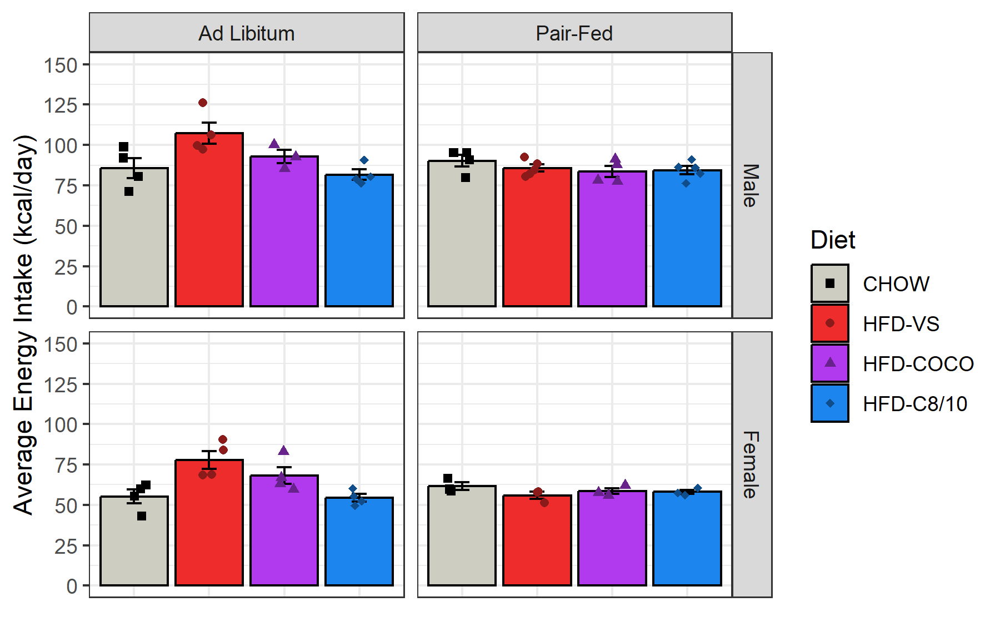
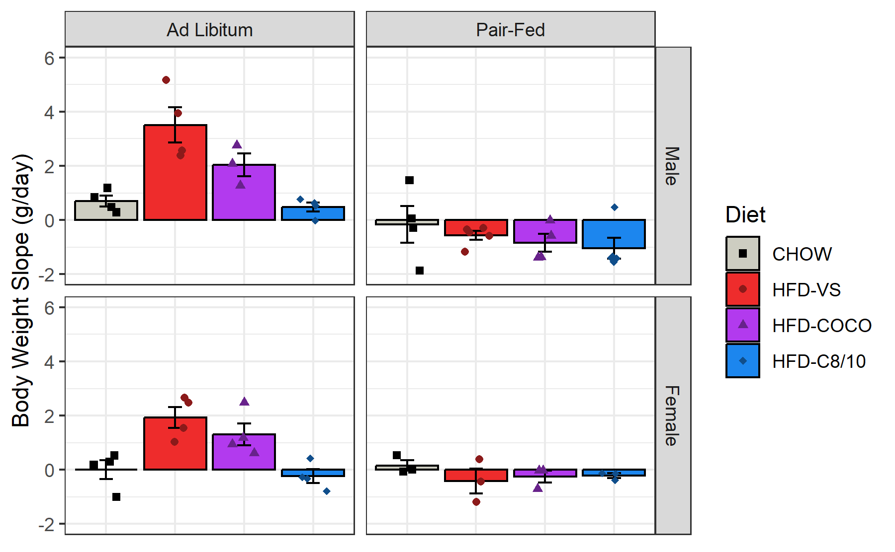
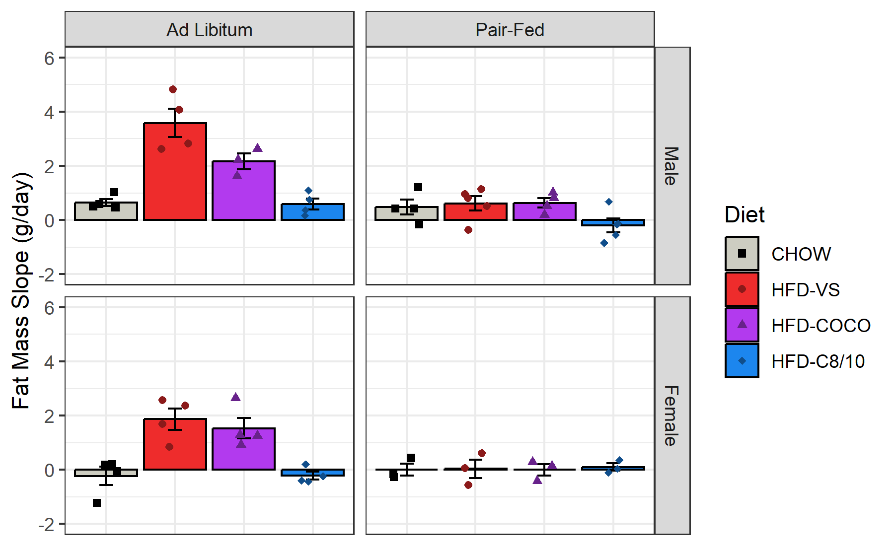
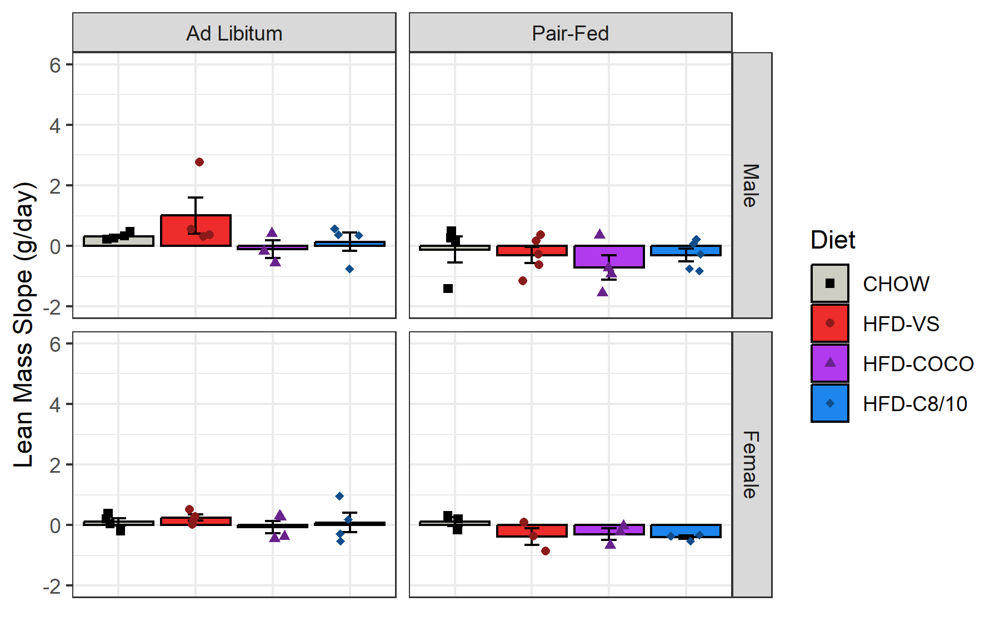
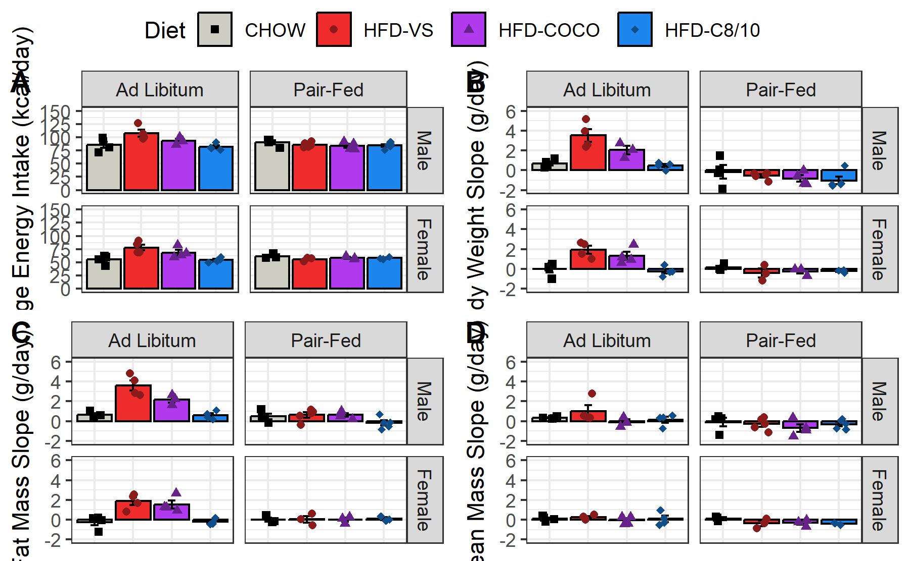

# Experiment 1 - Body Comp Figure
Brent Bachman
2025-05-01

- [<span class="toc-section-number">1</span> Packages](#packages)
- [<span class="toc-section-number">2</span> Import](#import)
- [<span class="toc-section-number">3</span> Arrange](#arrange)
- [<span class="toc-section-number">4</span> References](#references)

# Packages

``` r
library("tidyverse")
library("ggpubr")
```

``` r
# install.packages("tidyverse")
# install.packages("ggpubr")
```

``` r
sessionInfo()
```

    R version 4.4.2 (2024-10-31 ucrt)
    Platform: x86_64-w64-mingw32/x64
    Running under: Windows 11 x64 (build 26100)

    Matrix products: default


    locale:
    [1] LC_COLLATE=English_United States.utf8 
    [2] LC_CTYPE=English_United States.utf8   
    [3] LC_MONETARY=English_United States.utf8
    [4] LC_NUMERIC=C                          
    [5] LC_TIME=English_United States.utf8    

    time zone: America/New_York
    tzcode source: internal

    attached base packages:
    [1] stats     graphics  grDevices utils     datasets  methods   base     

    other attached packages:
     [1] ggpubr_0.6.0    lubridate_1.9.3 forcats_1.0.0   stringr_1.5.1  
     [5] dplyr_1.1.4     purrr_1.0.2     readr_2.1.5     tidyr_1.3.1    
     [9] tibble_3.2.1    ggplot2_3.5.1   tidyverse_2.0.0

    loaded via a namespace (and not attached):
     [1] gtable_0.3.5      jsonlite_1.8.8    ggsignif_0.6.4    compiler_4.4.2   
     [5] tidyselect_1.2.1  scales_1.3.0      yaml_2.3.10       fastmap_1.2.0    
     [9] R6_2.5.1          generics_0.1.3    knitr_1.48        backports_1.5.0  
    [13] car_3.1-2         munsell_0.5.1     pillar_1.9.0      tzdb_0.4.0       
    [17] rlang_1.1.4       utf8_1.2.4        broom_1.0.6       stringi_1.8.4    
    [21] xfun_0.47         timechange_0.3.0  cli_3.6.3         withr_3.0.1      
    [25] magrittr_2.0.3    digest_0.6.37     grid_4.4.2        rstudioapi_0.16.0
    [29] hms_1.1.3         lifecycle_1.0.4   vctrs_0.6.5       rstatix_0.7.2    
    [33] evaluate_1.0.0    glue_1.7.0        abind_1.4-8       carData_3.0-5    
    [37] fansi_1.0.6       colorspace_2.1-1  rmarkdown_2.28    tools_4.4.2      
    [41] pkgconfig_2.0.3   htmltools_0.5.8.1

# Import

First, let’s import all the ggplots for each body composition metric.

``` r
# Read the rds file
energy_intake_plot <-
  readRDS(
    file = "output/experiment-1/05-body-comp-figure/01-energy-intake.rds"
    )

# Show the plot
energy_intake_plot
```



``` r
# Read the rds file
body_weight_plot <-
  readRDS(
    file = "output/experiment-1/05-body-comp-figure/02-body-weight.rds"
    )

# Show the plot
body_weight_plot
```



``` r
# Read the rds file
fat_mass_plot <-
  readRDS(
    file = "output/experiment-1/05-body-comp-figure/03-fat-mass.rds"
    )

# Show the plot
fat_mass_plot
```



``` r
# Read the rds file
lean_mass_plot <-
  readRDS(
    file = "output/experiment-1/05-body-comp-figure/04-lean-mass.rds"
    )

# Show the plot
lean_mass_plot
```



# Arrange

``` r
# Arrange the plots for each body comp metric into a single, multi-panel plot
arranged_plot <- 
  ggarrange(
    energy_intake_plot,
    body_weight_plot,
    fat_mass_plot,
    lean_mass_plot,
    nrow = 2,
    ncol = 2,
    labels = c("A", "B", "C", "D"),
    common.legend = TRUE
  )

# Show the plot
arranged_plot
```



``` r
# Save the arranged plot at 1200 dpi
ggsave(
  plot = arranged_plot,
  filename = "output/experiment-1/05-body-comp-figure/05-arranged-plot-1200.tiff",
  width = 6, height = 5.5, units = "in", dpi = 1200
  )

# Save the arranged plot at 300 dpi
ggsave(
  plot = arranged_plot,
  filename = "output/experiment-1/05-body-comp-figure/05-arranged-plot-300.tiff",
  width = 6, height = 5.5, units = "in", dpi = 300
  )
```

# References
