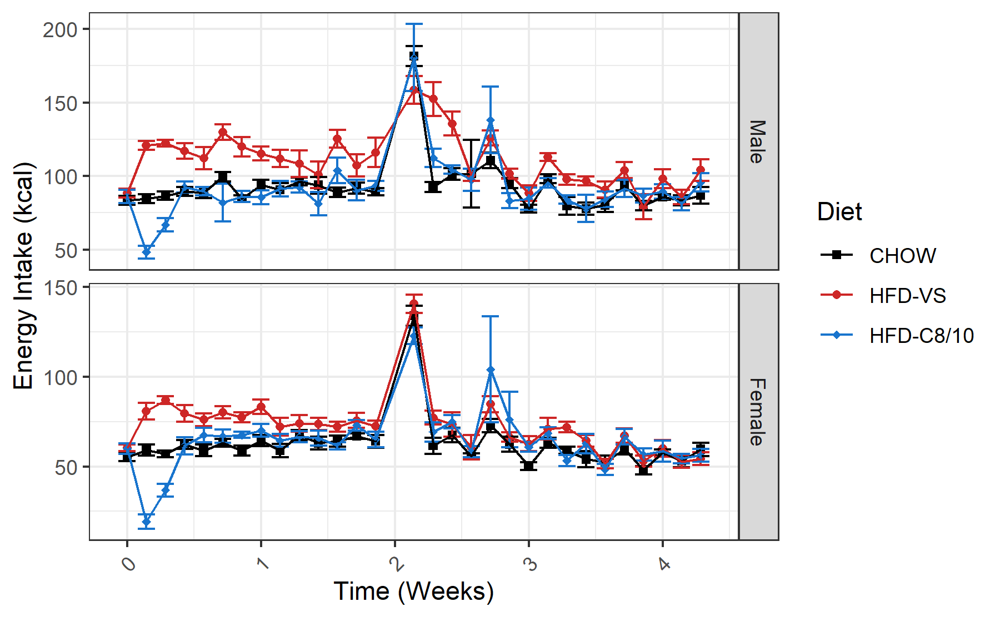
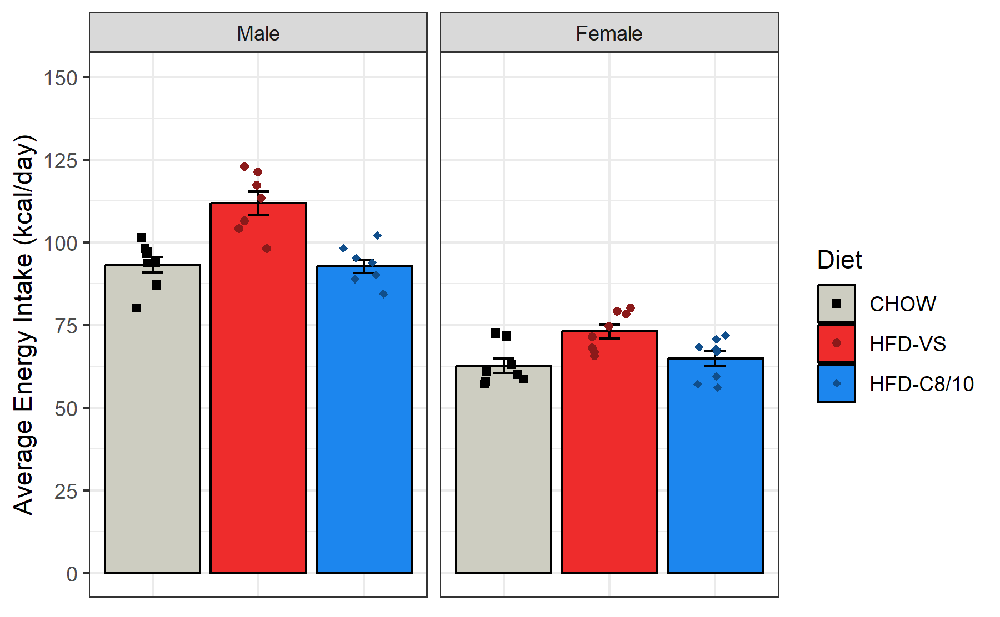
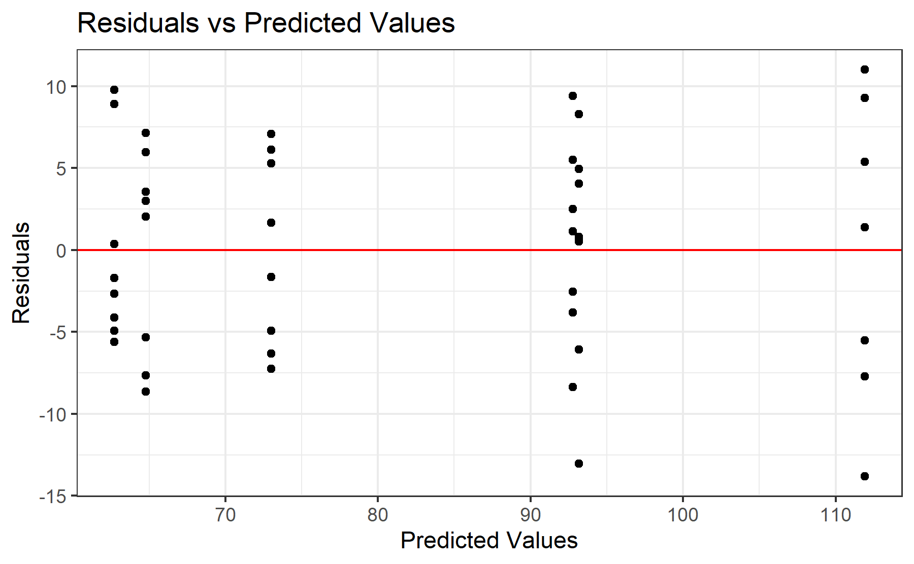
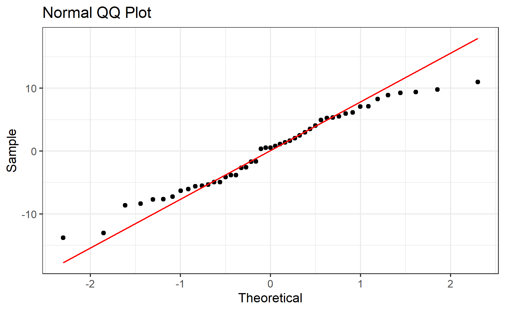

# Experiment 2 - Energy Intake
Brent Bachman
2025-05-01

- [<span class="toc-section-number">1</span> Packages](#packages)
- [<span class="toc-section-number">2</span> Data](#data)
  - [<span class="toc-section-number">2.1</span> Import, tidy, and
    transform](#import-tidy-and-transform)
  - [<span class="toc-section-number">2.2</span> Line Plot](#line-plot)
- [<span class="toc-section-number">3</span> Summarize](#summarize)
  - [<span class="toc-section-number">3.1</span> Bar Plot](#bar-plot)
- [<span class="toc-section-number">4</span> Model](#model)
  - [<span class="toc-section-number">4.1</span>
    Assumptions](#assumptions)
    - [<span class="toc-section-number">4.1.1</span> Linearity and
      Homoskedasticity](#linearity-and-homoskedasticity)
    - [<span class="toc-section-number">4.1.2</span>
      Normality](#normality)
  - [<span class="toc-section-number">4.2</span> Omnibus
    tests](#omnibus-tests)
  - [<span class="toc-section-number">4.3</span> Reference =
    CHOW](#reference--chow)
  - [<span class="toc-section-number">4.4</span> Reference =
    HFD-VS](#reference--hfd-vs)
- [<span class="toc-section-number">5</span> Communicate](#communicate)
- [<span class="toc-section-number">6</span> References](#references)

# Packages

``` r
library("tidyverse")
```

``` r
# install.packages("tidyverse")
```

``` r
sessionInfo()
```

    R version 4.4.2 (2024-10-31 ucrt)
    Platform: x86_64-w64-mingw32/x64
    Running under: Windows 11 x64 (build 26100)

    Matrix products: default


    locale:
    [1] LC_COLLATE=English_United States.utf8 
    [2] LC_CTYPE=English_United States.utf8   
    [3] LC_MONETARY=English_United States.utf8
    [4] LC_NUMERIC=C                          
    [5] LC_TIME=English_United States.utf8    

    time zone: America/New_York
    tzcode source: internal

    attached base packages:
    [1] stats     graphics  grDevices utils     datasets  methods   base     

    other attached packages:
     [1] lubridate_1.9.3 forcats_1.0.0   stringr_1.5.1   dplyr_1.1.4    
     [5] purrr_1.0.2     readr_2.1.5     tidyr_1.3.1     tibble_3.2.1   
     [9] ggplot2_3.5.1   tidyverse_2.0.0

    loaded via a namespace (and not attached):
     [1] gtable_0.3.5      jsonlite_1.8.8    compiler_4.4.2    tidyselect_1.2.1 
     [5] scales_1.3.0      yaml_2.3.10       fastmap_1.2.0     R6_2.5.1         
     [9] generics_0.1.3    knitr_1.48        munsell_0.5.1     pillar_1.9.0     
    [13] tzdb_0.4.0        rlang_1.1.4       utf8_1.2.4        stringi_1.8.4    
    [17] xfun_0.47         timechange_0.3.0  cli_3.6.3         withr_3.0.1      
    [21] magrittr_2.0.3    digest_0.6.37     grid_4.4.2        rstudioapi_0.16.0
    [25] hms_1.1.3         lifecycle_1.0.4   vctrs_0.6.5       evaluate_1.0.0   
    [29] glue_1.7.0        fansi_1.0.6       colorspace_2.1-1  rmarkdown_2.28   
    [33] tools_4.4.2       pkgconfig_2.0.3   htmltools_0.5.8.1

# Data

## Import, tidy, and transform

``` r
# Create a dataframe called mydata
mydata <- 
  
  # Import the data
  read_csv(
    file ="data/experiment-2-statsdata.csv",
    show_col_types = FALSE
    ) |>
  
  # Select the variables of interest 
  # ei = energy intake
  select(id, sex, diet, ei_0:ei_30) |>
  
  # Tidy data
  pivot_longer(
    cols = starts_with("ei"),
    names_to = "day",
    values_to = "energy_intake",
    values_drop_na = TRUE
    ) |>
  
  # Remove negative values
  filter(energy_intake >= 0) |>
  
  # Transform data
  mutate(
  
    # Recode categorical variables as factors
    id = factor(id),
    sex = factor(
      sex,
      levels = c(0, 1),
      labels = c("Male", "Female")
      ),
    diet = factor(
      diet,
      levels = c(0, 1, 2),
      labels = c("CHOW", "HFD-VS", "HFD-C8/10")
      ),
    
    # Recode sex using sum coding
    sex_sum = C(sex, sum),
    
    # Compute time in weeks
    day = parse_number(day),
    week = day/7,
    .before = energy_intake,
    )

# View a summary of the data
summary(mydata)
```

           id           sex             diet          day          sex_sum   
     1      :  30   Male  :697   CHOW     :480   Min.   : 0.00   Male  :697  
     2      :  30   Female:720   HFD-VS   :459   1st Qu.: 7.00   Female:720  
     3      :  30                HFD-C8/10:478   Median :15.00               
     4      :  30                                Mean   :14.98               
     5      :  30                                3rd Qu.:23.00               
     7      :  30                                Max.   :30.00               
     (Other):1237                                                            
          week       energy_intake   
     Min.   :0.000   Min.   :  0.98  
     1st Qu.:1.000   1st Qu.: 62.62  
     Median :2.143   Median : 78.74  
     Mean   :2.140   Mean   : 82.26  
     3rd Qu.:3.286   3rd Qu.: 96.04  
     Max.   :4.286   Max.   :309.68  
                                     

## Line Plot

``` r
# Create a line plot of each group's daily energy intake across time
line_plot <-
  mydata |>  
  ggplot(
    aes(
      x = week, 
      y = energy_intake, 
      color = diet, 
      shape = diet
      )
    ) +
  
  # Facet by sex
  facet_grid(
    sex ~ .,
    scales = "free_y"
    ) + 
  
  # Plot the observed means as points
  stat_summary(
    fun = mean,
    geom = "point"
    ) +
  
  # Plot the observed standard errors as errorbars
  stat_summary(
    fun.data = mean_se,
    geom = "errorbar"
    ) +
  
  # Plot connecting lines
  stat_summary(
    fun = mean,
    geom = "line"
    ) +
  
  # Change color title and scale
  scale_color_manual(
    name = "Diet",
    values = c(
      "CHOW"      = "black",
      "HFD-VS"    = "firebrick3",
      "HFD-C8/10" = "dodgerblue3"
      )
    ) +
  
  # Change shape title and scale
  scale_shape_manual(
    name = "Diet",
    values = c(
      "CHOW"      = 15,
      "HFD-VS"    = 16,
      "HFD-C8/10" = 18
      )
    ) +
  
  # Change y-axis title and scale
  labs(y = "Energy Intake (kcal)") +
  
  # Change x-axis title and scale
  scale_x_continuous(
    name = "Time (Weeks)",
    breaks = seq(from = 0, to = 4, by = 1)) +
  
  # Change overall plot theme
  theme_bw() + 
  
  # Rotate and adjust the x-axis tick labels
  theme(
    axis.text.x = element_text(
      angle = 45,
      vjust = 0.5,
      hjust = 0.5
      )
    )

# Show the plot
line_plot
```



The data for CHOW seem to be pretty flat over time. However, for HFD-VS,
there seems to be a sharp increase on day 1, then it decreases over
time. For HFD-C8/10, there is a sharp decrease on day 1 that quickly
returns to baseline by day 3, then it is flat for the rest of the
dietary intervention.

# Summarize

``` r
# Create a new dataframe called "avg_data"
avg_data <- 
  
  # Copy the original dataframe "mydata"
  mydata |>
  
  # filter the dataframe to exclude subject 6 and include only days 1 to 30
  filter(id != 6 & day > 0) |>

  # Compute each subject's average energy intake across days 1 to 30
  group_by(id) |>
  summarize(
    energy_intake = mean(energy_intake)
  ) |>
  ungroup()

# Show a summary of the data
summary(avg_data)
```

           id     energy_intake   
     1      : 1   Min.   : 56.13  
     2      : 1   1st Qu.: 67.29  
     3      : 1   Median : 80.09  
     4      : 1   Mean   : 82.44  
     5      : 1   3rd Qu.: 96.24  
     7      : 1   Max.   :122.90  
     (Other):41                   

``` r
# Create a new dataframe called "groups_data"
groups_data <- 
  
  # Copy the original data frame "mydata"
  mydata |>
  
  # Filter mydata to include only day 0
  distinct(
    id, 
    .keep_all = TRUE
  ) |>
  
  # Deselect variables of disinterest
  select(-day, -week, -energy_intake)

# Show a summary of the data
summary(groups_data)
```

           id         sex            diet      sex_sum  
     1      : 1   Male  :24   CHOW     :16   Male  :24  
     2      : 1   Female:24   HFD-VS   :16   Female:24  
     3      : 1               HFD-C8/10:16              
     4      : 1                                         
     5      : 1                                         
     6      : 1                                         
     (Other):42                                         

``` r
# Create a new dataframe called model2_mdata
model_data <-
  
  # Copy the dataframe "groups_data"
  groups_data |>
  
  # Join the two dataframes together by id
  left_join(avg_data, by = join_by(id)) |>
  
  # Exclude subject 6
  filter(id != 6)

# Show a summary of the data
summary(model_data)
```

           id         sex            diet      sex_sum   energy_intake   
     1      : 1   Male  :23   CHOW     :16   Male  :23   Min.   : 56.13  
     2      : 1   Female:24   HFD-VS   :15   Female:24   1st Qu.: 67.29  
     3      : 1               HFD-C8/10:16               Median : 80.09  
     4      : 1                                          Mean   : 82.44  
     5      : 1                                          3rd Qu.: 96.24  
     7      : 1                                          Max.   :122.90  
     (Other):41                                                          

## Bar Plot

``` r
# Create a bar plot of each group's average energy intake
bar_plot <-
  model_data |>  
  ggplot(
    aes(
      x     = diet, 
      y     = energy_intake, 
      color = diet, 
      fill  = diet,
      shape = diet
      )
    ) +
  
  # Facet by sex
  facet_grid(
    . ~ sex,
    ) + 
  
  # Plot the observed means as points
  stat_summary(
    fun = mean,
    geom = "bar",
    color = "black",
    ) +
  
  # Plot the observed standard errors as errorbars
  stat_summary(
    fun.data = mean_se,
    geom = "errorbar",
    color = "black",
    width = 0.2
    ) +
  
  # Plot individual data points
  geom_point(
    position = position_jitter(
      width = 0.2
    )
  ) +
  
  # Change color title and scale
  scale_color_manual(
    name = "Diet",
    values = c(
      "CHOW"      = "black",
      "HFD-VS"    = "firebrick4",
      "HFD-C8/10" = "dodgerblue4"
      )
    ) +
  
  # Change fill title and scale
  scale_fill_manual(
    name = "Diet",
    values = c(
      "CHOW"      = "ivory3",
      "HFD-VS"    = "firebrick2",
      "HFD-C8/10" = "dodgerblue2"
      )
    ) +
  
  # Change shape title and scale
  scale_shape_manual(
    name = "Diet",
    values = c(
      "CHOW"      = 15,
      "HFD-VS"    = 16,
      "HFD-C8/10" = 18
      )
    ) +
  
  # Change x-axis title
  labs(x = "Diet") +
  
  # Change y-axis title and scale
  scale_y_continuous(
    name = "Average Energy Intake (kcal/day)",
    limits = c(0, 150), 
    breaks = seq(from = 0, to =  150, by = 25)
  ) +
  
  # Change overall plot theme
  theme_bw() + 
  
  # Remove x-axis tick labels
  theme(
    axis.title.x = element_blank(),
    axis.text.x  = element_blank(),
    axis.ticks.x = element_blank()
    ) 

# Show the plot
bar_plot
```



It looks like HFD-VS has a greater average energy intake than the other
groups in both sexes.

# Model

To test the effects of sex, diet, and their interaction on energy intake
on average throughout the dietary intervention, a multiple linear
regression model will be built to predict average energy intake (in
kcals/day) with sex (sum-coded, Levels: male = 1, female = -1), diet
(treatment coded, levels: CHOW, HFD-VS, and HFD-C8/10), and their
interaction.

``` r
# Build the model
model <- lm(
  energy_intake ~ sex_sum * diet, 
  data = model_data
  )
```

## Assumptions

Before I run any statistical tests, let’s check how well the model
satisfies the assumptions.

First, I need to add the fitted and residual values to the data.

``` r
# Add the fitted and residual values to the dataset
model_data_fits <- 
  model_data |>
  mutate(
    fits = c(fitted(model)),
    resids = c(residuals(model))
  )
```

### Linearity and Homoskedasticity

Next, let’s create a residuals vs fitted plot to check for linearity and
homoskedasticity.

``` r
# Create a residuals plot to check for linearity and homoskedasticity
residuals_plot <-
  model_data_fits |>
  ggplot(
    aes(x = fits, y = resids)
  ) +
  
  # Plot individual data points
  geom_point() +
  
  # Plot a horizontal line at y = 0
  geom_hline(yintercept = 0, col = "red") + 
  
  # Change aesthetics
  labs(
    title = "Residuals vs Predicted Values",
    x = "Predicted Values",
    y = "Residuals"
  ) +
  theme_bw() 

# Show the plot
residuals_plot
```



The data seem approximately linear and homoskedastic.

### Normality

Finally, let’s create a qq plot to check for normality.

``` r
# Create a QQ plot to check for normality
qq_plot <-
  model_data_fits |>
  ggplot(
    aes(sample = resids)
  ) +
  
  # Plot boxplots
  geom_qq() +
  geom_qq_line(col = "red") +
  
  # Change aesthestics
  labs(
    title = "Normal QQ Plot",
    x = "Theoretical",
    y = "Sample"
  ) +
  theme_bw() 

# Show the plot
qq_plot
```



The data seem approximately normally distributed.

## Omnibus tests

With the model built, let’s perform omnibus tests for the effects of
each predictor using the function “anova()”. This function uses type I
sum of squares. Thus, it will produce F test statistics for the effects
of each predictor entered sequentially (i.e., the residual effect of
each predictor after accounting for the effects of all the other
predictors entered in the model before it).

``` r
# Perform omnibus tests
model |> anova()
```

    Analysis of Variance Table

    Response: energy_intake
                 Df  Sum Sq Mean Sq  F value    Pr(>F)    
    sex_sum       1 11949.9 11949.9 266.8135 < 2.2e-16 ***
    diet          2  1967.7   983.9  21.9673  3.28e-07 ***
    sex_sum:diet  2   250.8   125.4   2.7997   0.07249 .  
    Residuals    41  1836.3    44.8                       
    ---
    Signif. codes:  0 '***' 0.001 '**' 0.01 '*' 0.05 '.' 0.1 ' ' 1

When predicting average energy intake over the course of the dietary
intervention, there was a significant effect of sex,
$F(1, 41) = 266.81, p < .001$, and diet, $F(1, 41) = 21.97, p < .001$.
However, after acounting for sex and diet, there was not a significant
two-way interaction between sex and diet, $F(1, 41) = 2.80, p = .073$.

## Reference = CHOW

Let’s probe these effects by producing the summary output.

``` r
# Produce summary output
model |> summary()
```


    Call:
    lm(formula = energy_intake ~ sex_sum * diet, data = model_data)

    Residuals:
         Min       1Q   Median       3Q      Max 
    -13.7989  -5.1308   0.5453   5.3146  11.0001 

    Coefficients:
                           Estimate Std. Error t value Pr(>|t|)    
    (Intercept)             77.9482     1.6731  46.589  < 2e-16 ***
    sex_sum1                15.2227     1.6731   9.099 2.18e-11 ***
    dietHFD-VS              14.5006     2.4080   6.022 4.03e-07 ***
    dietHFD-C8/10            0.8246     2.3661   0.349   0.7292    
    sex_sum1:dietHFD-VS      4.2288     2.4080   1.756   0.0865 .  
    sex_sum1:dietHFD-C8/10  -1.2270     2.3661  -0.519   0.6069    
    ---
    Signif. codes:  0 '***' 0.001 '**' 0.01 '*' 0.05 '.' 0.1 ' ' 1

    Residual standard error: 6.692 on 41 degrees of freedom
    Multiple R-squared:  0.8853,    Adjusted R-squared:  0.8713 
    F-statistic: 63.27 on 5 and 41 DF,  p-value: < 2.2e-16

Overall, the model explained 89% of the variance in average energy
intake; and, after adjusting for the number of predictors, it explained
87%, $F(5, 41) = 63.27, R^2 = 0.89, R^2_{adj} = 0.87, p < .001$.

Unsurprisingly, male CHOW consumed significantly more energy on average
per day than female CHOW ($B = 15.22, SE = 1.67, p < .001$). Across the
sexes, HFD-VS ($B = 14.50, SE = 2.41, p < .001$) but not HFD-C8/10
($B = 0.83, SE = 2.37, p = .729$) consumed significantly more energy on
average per day than CHOW. Although the difference between HFD-VS and
CHOW was increased in males compared to females, this increase was not
statistically significant ($B = 4.23, SE = 2.41, p = .087$). The
difference between HFD-C8/10 and CHOW was not significantly different
between the sexes ($B = -1.23, SE = 2.37, p = .607$).

## Reference = HFD-VS

To compare HFD-C8/C10 with HFD-VS, let’s relevel the diet variable to
make HFD-VS the reference group, then refit the model and produce the
summary output. (There is no need to rerun the omnibus tests, as the
“total” effects are already captured, and thus the output would be
identical).

``` r
# Relevel factors to change reference group to HFD-VS
model_data_vs <- 
  model_data |>
  mutate(
    diet = fct_relevel(diet, "HFD-VS"), # relevel diet
  )

# Build the model
model_vs <- 
  model |>
  update(
    data = model_data_vs
  )

# Produce the summary output
model_vs |> summary()
```


    Call:
    lm(formula = energy_intake ~ sex_sum * diet, data = model_data_vs)

    Residuals:
         Min       1Q   Median       3Q      Max 
    -13.7989  -5.1308   0.5453   5.3146  11.0001 

    Coefficients:
                           Estimate Std. Error t value Pr(>|t|)    
    (Intercept)              92.449      1.732  53.383  < 2e-16 ***
    sex_sum1                 19.451      1.732  11.232 4.35e-14 ***
    dietCHOW                -14.501      2.408  -6.022 4.03e-07 ***
    dietHFD-C8/10           -13.676      2.408  -5.679 1.24e-06 ***
    sex_sum1:dietCHOW        -4.229      2.408  -1.756   0.0865 .  
    sex_sum1:dietHFD-C8/10   -5.456      2.408  -2.266   0.0288 *  
    ---
    Signif. codes:  0 '***' 0.001 '**' 0.01 '*' 0.05 '.' 0.1 ' ' 1

    Residual standard error: 6.692 on 41 degrees of freedom
    Multiple R-squared:  0.8853,    Adjusted R-squared:  0.8713 
    F-statistic: 63.27 on 5 and 41 DF,  p-value: < 2.2e-16

Across the sexes, HFD-C8/10 consumed significantly less energy on
average per day than HFD-VS ($B = -13.68, SE = 2.41, p < .001$); and the
magnitude of this difference was smaller in females
($B = -5.46, SE = 2.41, p = .029$).

# Communicate

Let’s save the plots.

``` r
# Save the ...

# line plot
ggsave(
  plot = line_plot,
  filename = "output/experiment-2/01-energy-intake/01-line-plot.tiff",
  width = 6, height = 3.708, units = "in", dpi = 300
)

# bar plot
ggsave(
  plot = bar_plot,
  filename = "output/experiment-2/01-energy-intake/02-bar-plot.tiff",
  width = 6, height = 3.708, units = "in", dpi = 300
)

# residuals plot
ggsave(
  plot = residuals_plot,
  filename = "output/experiment-2/01-energy-intake/03-residuals-plot.tiff",
  width = 6, height = 3.708, units = "in", dpi = 300
)

# qq plot
ggsave(
  plot = qq_plot,
  filename = "output/experiment-2/01-energy-intake/04-qq-plot.tiff",
  width = 6, height = 3.708, units = "in", dpi = 300
)
```

``` r
# Save the bar plot as an rds file to be imported later and arranged into a single multi-panel plot with all the body composition data
saveRDS(
  bar_plot,
  file = "output/experiment-2/05-body-comp-figure/01-energy-intake.rds"
)
```

# References
