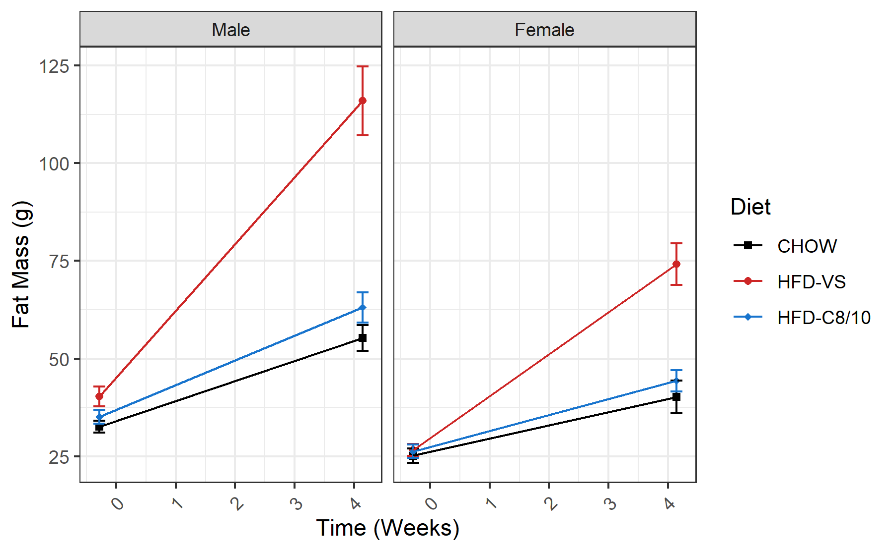
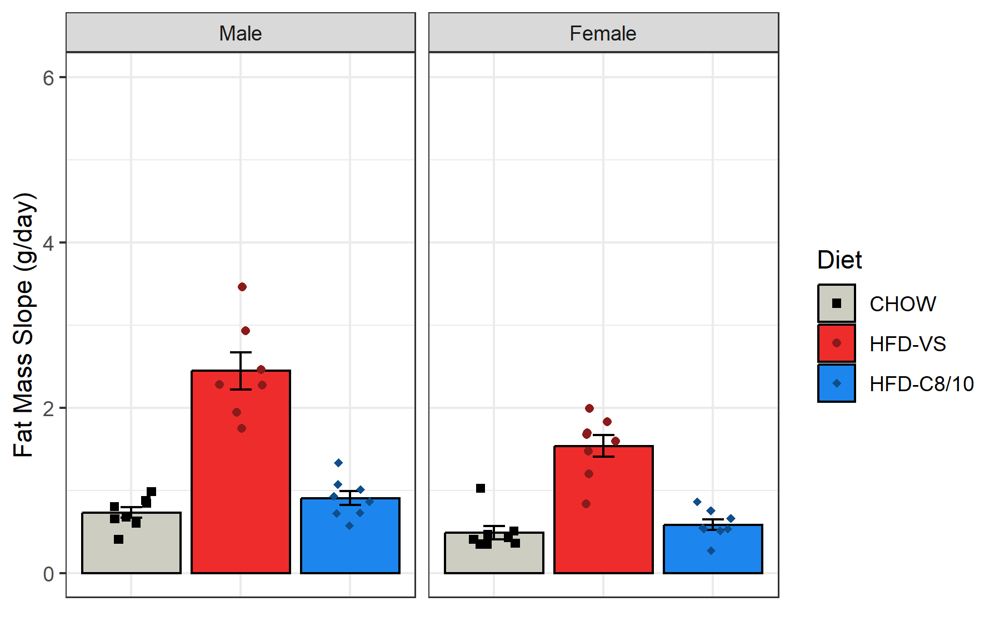
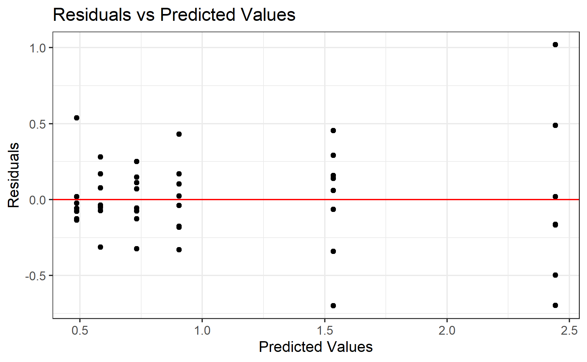
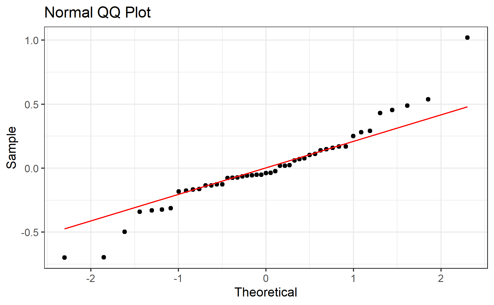

# Experiment 2 - Fat Mass
Brent Bachman
2025-05-01

- [<span class="toc-section-number">1</span> Packages](#packages)
- [<span class="toc-section-number">2</span> Data](#data)
  - [<span class="toc-section-number">2.1</span> Import, tidy, and
    transform](#import-tidy-and-transform)
  - [<span class="toc-section-number">2.2</span> Line Plot](#line-plot)
- [<span class="toc-section-number">3</span> Summarize](#summarize)
  - [<span class="toc-section-number">3.1</span> Bar Plot](#bar-plot)
- [<span class="toc-section-number">4</span> Model](#model)
  - [<span class="toc-section-number">4.1</span>
    Assumptions](#assumptions)
    - [<span class="toc-section-number">4.1.1</span> Linearity and
      Homoskedasticity](#linearity-and-homoskedasticity)
    - [<span class="toc-section-number">4.1.2</span>
      Normality](#normality)
  - [<span class="toc-section-number">4.2</span> Omnibus
    Tests](#omnibus-tests)
  - [<span class="toc-section-number">4.3</span> Reference =
    CHOW](#reference--chow)
  - [<span class="toc-section-number">4.4</span> Reference =
    HFD-VS](#reference--hfd-vs)
- [<span class="toc-section-number">5</span> Communicate](#communicate)
- [<span class="toc-section-number">6</span> References](#references)

# Packages

``` r
library("tidyverse")
```

``` r
# install.packages("tidyverse")
```

``` r
sessionInfo()
```

    R version 4.4.2 (2024-10-31 ucrt)
    Platform: x86_64-w64-mingw32/x64
    Running under: Windows 11 x64 (build 26100)

    Matrix products: default


    locale:
    [1] LC_COLLATE=English_United States.utf8 
    [2] LC_CTYPE=English_United States.utf8   
    [3] LC_MONETARY=English_United States.utf8
    [4] LC_NUMERIC=C                          
    [5] LC_TIME=English_United States.utf8    

    time zone: America/New_York
    tzcode source: internal

    attached base packages:
    [1] stats     graphics  grDevices utils     datasets  methods   base     

    other attached packages:
     [1] lubridate_1.9.3 forcats_1.0.0   stringr_1.5.1   dplyr_1.1.4    
     [5] purrr_1.0.2     readr_2.1.5     tidyr_1.3.1     tibble_3.2.1   
     [9] ggplot2_3.5.1   tidyverse_2.0.0

    loaded via a namespace (and not attached):
     [1] gtable_0.3.5      jsonlite_1.8.8    compiler_4.4.2    tidyselect_1.2.1 
     [5] scales_1.3.0      yaml_2.3.10       fastmap_1.2.0     R6_2.5.1         
     [9] generics_0.1.3    knitr_1.48        munsell_0.5.1     pillar_1.9.0     
    [13] tzdb_0.4.0        rlang_1.1.4       utf8_1.2.4        stringi_1.8.4    
    [17] xfun_0.47         timechange_0.3.0  cli_3.6.3         withr_3.0.1      
    [21] magrittr_2.0.3    digest_0.6.37     grid_4.4.2        rstudioapi_0.16.0
    [25] hms_1.1.3         lifecycle_1.0.4   vctrs_0.6.5       evaluate_1.0.0   
    [29] glue_1.7.0        fansi_1.0.6       colorspace_2.1-1  rmarkdown_2.28   
    [33] tools_4.4.2       pkgconfig_2.0.3   htmltools_0.5.8.1

# Data

## Import, tidy, and transform

``` r
# Create a dataframe called mydata
mydata <- 
  
  # Import the data
  read_csv(
    file ="data/experiment-2-statsdata.csv",
    show_col_types = FALSE
    ) |>
  
  # Select the variables of interest 
  # bw = body weight
  select(id, sex, diet, fm_m2, fm_29) |>
  
  # Exclude subject 6
  filter(id != 6) |>
  
  # Tidy data
  pivot_longer(
    cols = starts_with("fm"),
    names_to = "day",
    values_to = "fat_mass",
    values_drop_na = TRUE
    ) |>
  
  # Transform data
  mutate(
  
    # Recode categorical variables as factors
    id = factor(id),
    sex = factor(
      sex,
      levels = c(0, 1),
      labels = c("Male", "Female")
      ),
    diet = factor(
      diet,
      levels = c(0, 1, 2),
      labels = c("CHOW", "HFD-VS", "HFD-C8/10")
      ),
    
    # Recode sex using sum coding
    sex_sum = C(sex, sum),
    
    # Compute time in weeks
    day = parse_number(day),
    day = if_else(
      day == 2,
      -2, 
      29
      ),
    week = day/7,
    .before = fat_mass,
    )

# View a summary of the data
summary(mydata)
```

           id         sex            diet         day         sex_sum  
     1      : 2   Male  :46   CHOW     :32   Min.   :-2.0   Male  :46  
     2      : 2   Female:48   HFD-VS   :30   1st Qu.:-2.0   Female:48  
     3      : 2               HFD-C8/10:32   Median :13.5              
     4      : 2                              Mean   :13.5              
     5      : 2                              3rd Qu.:29.0              
     7      : 2                              Max.   :29.0              
     (Other):82                                                        
          week            fat_mass     
     Min.   :-0.2857   Min.   : 18.87  
     1st Qu.:-0.2857   1st Qu.: 29.61  
     Median : 1.9286   Median : 37.88  
     Mean   : 1.9286   Mean   : 47.61  
     3rd Qu.: 4.1429   3rd Qu.: 57.75  
     Max.   : 4.1429   Max.   :153.37  
                                       

## Line Plot

``` r
# Create a line plot of each group's fat mass over time
line_plot <-
  mydata |>  
  ggplot(
    aes(
      x = week, 
      y = fat_mass, 
      color = diet, 
      shape = diet
      )
    ) +
  
  # Facet by sex
  facet_grid(
    . ~ sex,
    scales = "free_y"
    ) + 
  
  # Plot the observed means as points
  stat_summary(
    fun = mean,
    geom = "point"
    ) +
  
  # Plot the observed standard errors as errorbars
  stat_summary(
    fun.data = mean_se,
    geom = "errorbar",
    width = 0.2
    ) +
  
  # Plot connecting lines
  stat_summary(
    fun = mean,
    geom = "line"
    ) +
  
  # Change color title and scale
  scale_color_manual(
    name = "Diet",
    values = c(
      "CHOW"      = "black",
      "HFD-VS"    = "firebrick3",
      "HFD-C8/10" = "dodgerblue3"
      )
    ) +
  
  # Change shape title and scale
  scale_shape_manual(
    name = "Diet",
    values = c(
      "CHOW"      = 15,
      "HFD-VS"    = 16,
      "HFD-C8/10" = 18
      )
    ) +
  
  # Change y-axis title and scale
  labs(y = "Fat Mass (g)") +
  
  # Change x-axis title and scale
  scale_x_continuous(
    name = "Time (Weeks)",
    breaks = seq(from = 0, to = 4, by = 1)) +
  
  # Change overall plot theme
  theme_bw() + 
  
  # Rotate and adjust the x-axis tick labels
  theme(
    axis.text.x = element_text(
      angle = 45,
      vjust = 0.5,
      hjust = 0.5
      )
    )

# Show the plot
line_plot
```



The data for all groups seems to increase linearly over time. However,
the slope seems to be greater for HFD-VS than the other two groups in
both sexes.

# Summarize

First, let’s create a new dataframe called “model_data” and calculate
the rate of each subject’s fat mass slope over time.

``` r
# Create a new data frame called model_data
model_data <-
  
  # Copy the original dataframe
  mydata |>

  # Compute each subject's fat mass slope
  group_by(id) |>
  mutate(
    fat_mass_slope = 
      (fat_mass - lag(fat_mass)) / (day - lag(day))
  ) |>
  ungroup() |> 
  
  # Select only the relevant columns
  select(
    id, sex, sex_sum, diet, fat_mass_slope
  ) |>
  
  # Drop na values
  drop_na(fat_mass_slope)

# Show a summary of the data
summary(model_data)
```

           id         sex       sex_sum          diet    fat_mass_slope  
     1      : 1   Male  :23   Male  :23   CHOW     :16   Min.   :0.2714  
     2      : 1   Female:24   Female:24   HFD-VS   :15   1st Qu.:0.5393  
     3      : 1                           HFD-C8/10:16   Median :0.8439  
     4      : 1                                          Mean   :1.0859  
     5      : 1                                          3rd Qu.:1.5332  
     7      : 1                                          Max.   :3.4628  
     (Other):41                                                          

## Bar Plot

``` r
# Create a bar plot of each group's fat mass slope
bar_plot <-
  model_data |>  
  ggplot(
    aes(
      x     = diet, 
      y     = fat_mass_slope, 
      color = diet, 
      fill  = diet,
      shape = diet
      )
    ) +
  
  # Facet by sex
  facet_grid(
    . ~ sex,
    ) + 
  
  # Plot the observed means as points
  stat_summary(
    fun = mean,
    geom = "bar",
    color = "black",
    ) +
  
  # Plot the observed standard errors as errorbars
  stat_summary(
    fun.data = mean_se,
    geom = "errorbar",
    color = "black",
    width = 0.2
    ) +
  
  # Plot individual data points
  geom_point(
    position = position_jitter(
      width = 0.2
    )
  ) +
  
  # Change color title and scale
  scale_color_manual(
    name = "Diet",
    values = c(
      "CHOW"      = "black",
      "HFD-VS"    = "firebrick4",
      "HFD-C8/10" = "dodgerblue4"
      )
    ) +
  
  # Change fill title and scale
  scale_fill_manual(
    name = "Diet",
    values = c(
      "CHOW"      = "ivory3",
      "HFD-VS"    = "firebrick2",
      "HFD-C8/10" = "dodgerblue2"
      )
    ) +
  
  # Change shape title and scale
  scale_shape_manual(
    name = "Diet",
    values = c(
      "CHOW"      = 15,
      "HFD-VS"    = 16,
      "HFD-C8/10" = 18
      )
    ) +
  
  # Change x-axis title
  labs(x = "Diet") +
  
  # Change y-axis title and scale
  scale_y_continuous(
    name = "Fat Mass Slope (g/day)",
    limits = c(0, 6),
    breaks = seq(from = 0, to = 6, by = 2)
  ) +
  
  # Change overall plot theme
  theme_bw() + 
  
  # Remove x-axis tick labels
  theme(
    axis.title.x = element_blank(),
    axis.text.x  = element_blank(),
    axis.ticks.x = element_blank()
    ) 

# Show the plot
bar_plot
```



It looks like HFD-VS has a greater body weight slope than the other
groups in both sexes.

# Model

To test the effects of sex, diet, and their interaction on the slope of
fat mass (i.e., the rate of fat mass gain) over the course of the
dietary intervention, a multiple linear regression model will be built
to predict fat mass gain (in g/day) with sex (sum-coded, Levels: male =
1, female = -1), diet (treatment coded, levels: CHOW, HFD-VS, and
HFD-C8/10), and their interaction.

``` r
# Build the model
model <- lm(
  fat_mass_slope ~ sex_sum * diet, 
  data = model_data
  )
```

## Assumptions

Before I run any statistical tests, let’s check how well the model
satisfies the assumptions.

First, I need to add the fitted and residual values to the data.

``` r
# Add the fitted and residual values to the dataset
model_fits <- 
  model_data |>
  mutate(
    fits = c(fitted(model)),
    resids = c(residuals(model))
  )
```

### Linearity and Homoskedasticity

Next, I will create a residuals plot to check for linearity and
homoskedasticity.

``` r
# Create a residuals plot to check for linearity and homoskedasticity
residuals_plot <-
  model_fits |>
  ggplot(
    aes(x = fits, y = resids)
  ) +
  
  # Plot individual data points
  geom_point() +
  
  # Plot a horizontal line at y = 0
  geom_hline(yintercept = 0, col = "red") + 
  
  # Change aesthetics
  labs(
    title = "Residuals vs Predicted Values",
    x = "Predicted Values",
    y = "Residuals"
  ) +
  theme_bw() 

# Show the plot
residuals_plot
```



The data seem to be linear and homoskedastic.

### Normality

Next, I will create a QQ plot to check for normality.

``` r
# Create a QQ plot to check for normality
qq_plot <-
  model_fits |>
  ggplot(
    aes(sample = resids)
  ) +
  
  # Plot points and qq line
  geom_qq() +
  geom_qq_line(col = "red") +
  
  # Change aesthestics
  labs(
    title = "Normal QQ Plot",
    x = "Theoretical",
    y = "Sample"
  ) +
  theme_bw() 

# Show the plot
qq_plot
```



The data seem to mostly fall on the qq line (although there is some
deviance on the lower end), indicating that the data are approximately
normally distributed.

## Omnibus Tests

With the model built, let’s perform omnibus tests for the effects of
each predictor using the function “anova()”. This function uses type I
sum of squares. Thus, it will produce F test statistics for the effects
of each predictor entered sequentially (i.e., the residual effect of
each predictor after accounting for the effects of all the other
predictors entered in the model before it).

``` r
# Perform omnibus F tests
model |> anova()
```

    Analysis of Variance Table

    Response: fat_mass_slope
                 Df  Sum Sq Mean Sq F value    Pr(>F)    
    sex_sum       1  2.3189  2.3189 22.5310 2.524e-05 ***
    diet          2 17.3636  8.6818 84.3542 2.944e-15 ***
    sex_sum:diet  2  1.0034  0.5017  4.8747   0.01261 *  
    Residuals    41  4.2198  0.1029                      
    ---
    Signif. codes:  0 '***' 0.001 '**' 0.01 '*' 0.05 '.' 0.1 ' ' 1

There was a main effect of sex, $F(1, 41) = 22.53, p < .001$, diet,
$F(2, 41) = 84.35, p < .001$, and a two-way interaction between sex and
diet, $F(2, 41) = 4.88, p = .013$.

## Reference = CHOW

Let’s produce the summary output.

``` r
# Show summary output
model |> summary()
```


    Call:
    lm(formula = fat_mass_slope ~ sex_sum * diet, data = model_data)

    Residuals:
         Min       1Q   Median       3Q      Max 
    -0.69801 -0.13591 -0.03875  0.14314  1.01939 

    Coefficients:
                           Estimate Std. Error t value Pr(>|t|)    
    (Intercept)             0.60870    0.08020   7.590 2.46e-09 ***
    sex_sum1                0.12291    0.08020   1.532  0.13310    
    dietHFD-VS              1.38091    0.11543  11.963 5.92e-15 ***
    dietHFD-C8/10           0.13541    0.11342   1.194  0.23942    
    sex_sum1:dietHFD-VS     0.33093    0.11543   2.867  0.00652 ** 
    sex_sum1:dietHFD-C8/10  0.03754    0.11342   0.331  0.74234    
    ---
    Signif. codes:  0 '***' 0.001 '**' 0.01 '*' 0.05 '.' 0.1 ' ' 1

    Residual standard error: 0.3208 on 41 degrees of freedom
    Multiple R-squared:  0.8306,    Adjusted R-squared:  0.8099 
    F-statistic:  40.2 on 5 and 41 DF,  p-value: 9.162e-15

Overall, the model explained 83% of the variance in average energy
intake; and, after adjusting for the number of predictors, it explained
81%, $F(5, 41) = 40.20, R^2 = 0.83, R^2_{adj} = 0.81, p < .001$.

Across the sexes, HFD-VS ($B = 1.38, SE = 0.12, p < .001$) but not
HFD-C8/10 ($B = 0.14, SE = 0.11, p = .239$) gained significantly more
fat mass per day than CHOW. Although there was not a significant
difference between male and female CHOW
($B = 0.12, SE = 0.08, p = .133$), the difference between HFD-VS and
CHOW as significantly greater in males than females
($B = 0.33, SE = 0.12, p = .007$). The difference between HFD-C8/10 and
CHOW (or lack thereof) was not significantly difference between the
sexes ($0.04, SE = 0.11, p = .742$)

## Reference = HFD-VS

To compare HFD-C8/C10 with HFD-VS, let’s relevel the diet variable to
make HFD-VS the reference group, then refit the model and produce the
summary output. (There is no need to rerun the omnibus tests, as the
“total” effects are already captured, and thus the output would be
identical).

``` r
# Relevel factors to change reference group to HFD-VS
model_data_vs <- 
  model_data |>
  mutate(
    diet = fct_relevel(diet, "HFD-VS"), # relevel diet
  )

# Build the model
model_vs <- 
  model |>
  update(
    data = model_data_vs
  )

# Produce the summary output
model_vs |> summary()
```


    Call:
    lm(formula = fat_mass_slope ~ sex_sum * diet, data = model_data_vs)

    Residuals:
         Min       1Q   Median       3Q      Max 
    -0.69801 -0.13591 -0.03875  0.14314  1.01939 

    Coefficients:
                           Estimate Std. Error t value Pr(>|t|)    
    (Intercept)             1.98962    0.08302  23.966  < 2e-16 ***
    sex_sum1                0.45383    0.08302   5.467 2.47e-06 ***
    dietCHOW               -1.38091    0.11543 -11.963 5.92e-15 ***
    dietHFD-C8/10          -1.24551    0.11543 -10.790 1.50e-13 ***
    sex_sum1:dietCHOW      -0.33093    0.11543  -2.867  0.00652 ** 
    sex_sum1:dietHFD-C8/10 -0.29339    0.11543  -2.542  0.01491 *  
    ---
    Signif. codes:  0 '***' 0.001 '**' 0.01 '*' 0.05 '.' 0.1 ' ' 1

    Residual standard error: 0.3208 on 41 degrees of freedom
    Multiple R-squared:  0.8306,    Adjusted R-squared:  0.8099 
    F-statistic:  40.2 on 5 and 41 DF,  p-value: 9.162e-15

Across the sexes, HFD-C8/10 gained significantly less fat mass per day
than HFD-VS ($B = -1.25, SE = 0.12, p < .001$); and the magnitude of
this difference was greater in males than females
($B = -0.29, SE = 0.12, p =.015$).

# Communicate

Let’s save the plots.

``` r
# Save the ...

# line plot
ggsave(
  plot = line_plot,
  filename = "output/experiment-2/03-fat-mass/01-line-plot.tiff",
  width = 6, height = 3.708, units = "in", dpi = 300
)

# bar plot
ggsave(
  plot = bar_plot,
  filename = "output/experiment-2/03-fat-mass/02-bar-plot.tiff",
  width = 6, height = 3.708, units = "in", dpi = 300
)

# residuals plot
ggsave(
  plot = residuals_plot,
  filename = "output/experiment-2/03-fat-mass/03-residuals-plot.tiff",
  width = 6, height = 3.708, units = "in", dpi = 300
)

# qq plot
ggsave(
  plot = qq_plot,
  filename = "output/experiment-2/03-fat-mass/04-qq-plot.tiff",
  width = 6, height = 3.708, units = "in", dpi = 300
)
```

``` r
# Save the bar plot as an rds file to be imported later and arranged into a single multi-panel plot with all the body composition data
saveRDS(
  bar_plot,
  file = "output/experiment-2/05-body-comp-figure/03-fat-mass.rds"
)
```

# References
