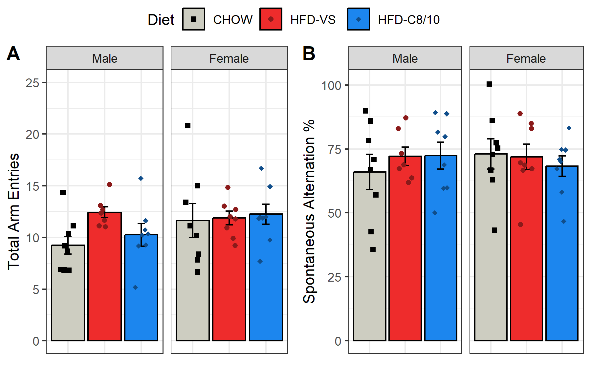

# Experiment 2 - Y-Maze
Brent Bachman
2025-05-01

- [<span class="toc-section-number">1</span> Packages](#packages)
- [<span class="toc-section-number">2</span> Data](#data)
  - [<span class="toc-section-number">2.1</span> Import, tidy, and
    transform](#import-tidy-and-transform)
  - [<span class="toc-section-number">2.2</span> Visualize](#visualize)
    - [<span class="toc-section-number">2.2.1</span> Arm
      Entries](#arm-entries)
    - [<span class="toc-section-number">2.2.2</span> Spontaneous
      Alternations](#spontaneous-alternations)
- [<span class="toc-section-number">3</span> Model 1](#model-1)
  - [<span class="toc-section-number">3.1</span>
    Assumptions](#assumptions)
    - [<span class="toc-section-number">3.1.1</span> Linearity and
      Homoskedasticity](#linearity-and-homoskedasticity)
    - [<span class="toc-section-number">3.1.2</span>
      Normality](#normality)
  - [<span class="toc-section-number">3.2</span> Omnibus
    Tests](#omnibus-tests)
  - [<span class="toc-section-number">3.3</span> Reference =
    CHOW](#reference--chow)
- [<span class="toc-section-number">4</span> Model 2](#model-2)
  - [<span class="toc-section-number">4.1</span>
    Assumptions](#assumptions-1)
    - [<span class="toc-section-number">4.1.1</span> Linearity and
      Homoskedasticity](#linearity-and-homoskedasticity-1)
    - [<span class="toc-section-number">4.1.2</span>
      Normality](#normality-1)
  - [<span class="toc-section-number">4.2</span> Omnibus
    Tests](#omnibus-tests-1)
- [<span class="toc-section-number">5</span> Communicate](#communicate)

# Packages

``` r
library("tidyverse")
library("ggpubr")
```

``` r
# install.packages("tidyverse")
# install.packages("ggpubr")
```

``` r
sessionInfo()
```

    R version 4.4.2 (2024-10-31 ucrt)
    Platform: x86_64-w64-mingw32/x64
    Running under: Windows 11 x64 (build 26100)

    Matrix products: default


    locale:
    [1] LC_COLLATE=English_United States.utf8 
    [2] LC_CTYPE=English_United States.utf8   
    [3] LC_MONETARY=English_United States.utf8
    [4] LC_NUMERIC=C                          
    [5] LC_TIME=English_United States.utf8    

    time zone: America/New_York
    tzcode source: internal

    attached base packages:
    [1] stats     graphics  grDevices utils     datasets  methods   base     

    other attached packages:
     [1] ggpubr_0.6.0    lubridate_1.9.3 forcats_1.0.0   stringr_1.5.1  
     [5] dplyr_1.1.4     purrr_1.0.2     readr_2.1.5     tidyr_1.3.1    
     [9] tibble_3.2.1    ggplot2_3.5.1   tidyverse_2.0.0

    loaded via a namespace (and not attached):
     [1] gtable_0.3.5      jsonlite_1.8.8    ggsignif_0.6.4    compiler_4.4.2   
     [5] tidyselect_1.2.1  scales_1.3.0      yaml_2.3.10       fastmap_1.2.0    
     [9] R6_2.5.1          generics_0.1.3    knitr_1.48        backports_1.5.0  
    [13] car_3.1-2         munsell_0.5.1     pillar_1.9.0      tzdb_0.4.0       
    [17] rlang_1.1.4       utf8_1.2.4        broom_1.0.6       stringi_1.8.4    
    [21] xfun_0.47         timechange_0.3.0  cli_3.6.3         withr_3.0.1      
    [25] magrittr_2.0.3    digest_0.6.37     grid_4.4.2        rstudioapi_0.16.0
    [29] hms_1.1.3         lifecycle_1.0.4   vctrs_0.6.5       rstatix_0.7.2    
    [33] evaluate_1.0.0    glue_1.7.0        abind_1.4-8       carData_3.0-5    
    [37] fansi_1.0.6       colorspace_2.1-1  rmarkdown_2.28    tools_4.4.2      
    [41] pkgconfig_2.0.3   htmltools_0.5.8.1

# Data

## Import, tidy, and transform

``` r
# Create a dataframe called mydata
mydata <- 
  
  # Import the data
  read_csv(
    file ="data/experiment-2-statsdata.csv",
    show_col_types = FALSE
    ) |>
  
  # Select the variables of interest 
  select(id, sex, diet, arm_entries, spontaneous_alternations) |>
  
  # Transform data
  mutate(
  
    # Recode categorical variables as factors
    id = factor(id),
    sex = factor(
      sex,
      levels = c(0, 1),
      labels = c("Male", "Female")
      ),
    diet = factor(
      diet,
      levels = c(0, 1, 2),
      labels = c("CHOW", "HFD-VS", "HFD-C8/10")
      ),
    
    # Recode sex using sum coding
    sex_sum = C(sex, sum)
    ) |>
  
  # Remove na values
  drop_na()

# View a summary of the data
summary(mydata)
```

           id         sex            diet     arm_entries   
     1      : 1   Male  :23   CHOW     :16   Min.   : 5.00  
     2      : 1   Female:24   HFD-VS   :15   1st Qu.: 9.00  
     3      : 1               HFD-C8/10:16   Median :11.00  
     4      : 1                              Mean   :11.26  
     5      : 1                              3rd Qu.:13.00  
     7      : 1                              Max.   :21.00  
     (Other):41                                             
     spontaneous_alternations   sex_sum  
     Min.   : 36.00           Male  :23  
     1st Qu.: 63.50           Female:24  
     Median : 70.00                      
     Mean   : 70.57                      
     3rd Qu.: 82.50                      
     Max.   :100.00                      
                                         

## Visualize

### Arm Entries

Let’s plot the number of total arm entries.

``` r
# Create a plot object
plot_arm_entries <-
  
  # Call the dataset
  mydata |>  
  
  # Plot energy intake over time, faceted by sex and diet
  ggplot(
    aes(
      x     = diet, 
      y     = arm_entries, 
      color = diet, 
      fill  = diet,
      shape = diet
      )
    ) +
  
  # Facet by sex
  facet_grid(
    . ~ sex,
    ) + 
  
  # Plot the observed means as points
  stat_summary(
    fun = mean,
    geom = "bar",
    color = "black",
    ) +
  
  # Plot the observed standard errors as errorbars
  stat_summary(
    fun.data = mean_se,
    geom = "errorbar",
    color = "black",
    width = 0.2
    ) +
  
  # Plot individual data points
  geom_point(
    position = position_jitter(
      width = 0.2
    )
  ) +
  
  # Change color title and scale
  scale_color_manual(
    name = "Diet",
    values = c(
      "CHOW"      = "black",
      "HFD-VS"    = "firebrick4",
      "HFD-C8/10" = "dodgerblue4"
      )
    ) +
  
  # Change fill title and scale
  scale_fill_manual(
    name = "Diet",
    values = c(
      "CHOW"      = "ivory3",
      "HFD-VS"    = "firebrick2",
      "HFD-C8/10" = "dodgerblue2"
      )
    ) +
  
  # Change shape title and scale
  scale_shape_manual(
    name = "Diet",
    values = c(
      "CHOW"      = 15,
      "HFD-VS"    = 16,
      "HFD-C8/10" = 18
      )
    ) +
  
  # Change x-axis title
  labs(x = "Diet") +
  
  # Change y-axis title and scale
  scale_y_continuous(
    name = "Total Arm Entries",
    limits = c(0, 25),
    breaks = seq(from = 0, to = 25, by = 5)
  ) +
  
  # Change overall plot theme
  theme_bw() + 
  
  # Remove x-axis tick labels
  theme(
    axis.title.x = element_blank(),
    axis.text.x  = element_blank(),
    axis.ticks.x = element_blank()
    )

# Show the plot
plot_arm_entries
```


From the graph, it appears that HFD-VS performed more arm entries than
the other two diet groups, but only in males.

### Spontaneous Alternations

Now let’s plot the percentage of spontaneous alternations.

``` r
# Create a plot object
plot_spontaneous_alternations <-
  
  # Call the dataset
  mydata |>  
  
  # Plot each group's spontaneous alternation percentage
  ggplot(
    aes(
      x     = diet, 
      y     = spontaneous_alternations, 
      color = diet, 
      fill  = diet,
      shape = diet
      )
    ) +
  
  # Facet by sex
  facet_grid(
    . ~ sex,
    ) + 
  
  # Plot the observed means as points
  stat_summary(
    fun = mean,
    geom = "bar",
    color = "black",
    ) +
  
  # Plot the observed standard errors as errorbars
  stat_summary(
    fun.data = mean_se,
    geom = "errorbar",
    color = "black",
    width = 0.2
    ) +
  
  # Plot individual data points
  geom_point(
    position = position_jitter(
      width = 0.2
    )
  ) +
  
  # Change color title and scale
  scale_color_manual(
    name = "Diet",
    values = c(
      "CHOW"      = "black",
      "HFD-VS"    = "firebrick4",
      "HFD-C8/10" = "dodgerblue4"
      )
    ) +
  
  # Change fill title and scale
  scale_fill_manual(
    name = "Diet",
    values = c(
      "CHOW"      = "ivory3",
      "HFD-VS"    = "firebrick2",
      "HFD-C8/10" = "dodgerblue2"
      )
    ) +
  
  # Change shape title and scale
  scale_shape_manual(
    name = "Diet",
    values = c(
      "CHOW"      = 15,
      "HFD-VS"    = 16,
      "HFD-C8/10" = 18
      )
    ) +
  
  # Change x-axis title
  labs(x = "Diet") +
  
  # Change y-axis title and scale
  scale_y_continuous(
    name = "Spontaneous Alternation %",
    limits = c(0, 101),
    breaks = seq(from = 0, to = 100, by = 25)
  ) +
  
  # Change overall plot theme
  theme_bw() + 
  
  # Remove x-axis tick labels
  theme(
    axis.title.x = element_blank(),
    axis.text.x  = element_blank(),
    axis.ticks.x = element_blank()
    )

# Show the plot
plot_spontaneous_alternations
```


There does not appear to be any group differences in spontaneous
alternation percentage, but let’s test for these effects statistically.

# Model 1

To test the effects of sex, diet, and their interaction on the number of
total arm entries in the y-maze, a multiple linear regression model will
be built with the predictors sex (sum-coded: male = 1, female = -1),
diet (treatment coded: CHOW = 0; HFD-VS and HFD-C8/10 = 1), and the
interaction between sex and diet.

``` r
# Build the model
model1 <- lm(
  arm_entries ~ sex_sum * diet,
  data = mydata
)
```

## Assumptions

Before I run any statistical tests, let’s check how well the model
satisfies the assumptions.

First, I need to add the fitted and residual values to the data.

``` r
# Add the fitted and residual values to the dataset
model1_fits <- 
  mydata |>
  mutate(
    fits = c(fitted(model1)),
    resids = c(residuals(model1))
  )
```

### Linearity and Homoskedasticity

Next, I will create a residuals plot to check for linearity and
homoskedasticity.

``` r
# Create a residuals plot to check for linearity and homoskedasticity
model1_residuals_plot <-
  model1_fits |>
  ggplot(
    aes(x = fits, y = resids)
  ) +
  
  # Plot individual data points
  geom_point() +
  
  # Plot a horizontal line at y = 0
  geom_hline(yintercept = 0, col = "red") + 
  
  # Change aesthetics
  labs(
    title = "Residuals vs Predicted Values",
    x = "Predicted Values",
    y = "Residuals"
  ) +
  theme_bw() 

# Show the plot
model1_residuals_plot
```


The data seem to be linear and homoskedastic.

### Normality

Next, I will create a QQ plot to check for normality.

``` r
# Create a QQ plot to check for normality
model1_qq_plot <-
  model1_fits |>
  ggplot(
    aes(sample = resids)
  ) +
  
  # Plot points and qq line
  geom_qq() +
  geom_qq_line(col = "red") +
  
  # Change aesthestics
  labs(
    title = "Normal QQ Plot",
    x = "Theoretical",
    y = "Sample"
  ) +
  theme_bw() 

# Show the plot
model1_qq_plot
```


The data seem to be approximately normally distributed.

## Omnibus Tests

With the model built, let’s perform omnibus tests for the effects of
each predictor using the function “anova()”. This function uses type I
sum of squares. Thus, it will produce F test statistics for the effects
of each predictor entered sequentially (i.e., the residual effect of
each predictor after accounting for the effects of all the other
predictors entered in the model before it).

``` r
# Perform omnibus F tests
model1 |> anova()
```

    Analysis of Variance Table

    Response: arm_entries
                 Df Sum Sq Mean Sq F value Pr(>F)
    sex_sum       1  21.45 21.4507  2.5059 0.1211
    diet          2  21.11 10.5574  1.2333 0.3019
    sex_sum:diet  2  19.41  9.7032  1.1335 0.3318
    Residuals    41 350.96  8.5601               

There were not significant effects of sex, $F(1, 41) = 2.51, p = .121$,
diet, $F(2, 41) = 1.23, p = .302$, or an interaction between sex and
diet, $F(2, 41) = 1.13, p = .332$.

## Reference = CHOW

Let’s take a look at the summary output.

``` r
# Produce summary output
model1 |> summary()
```


    Call:
    lm(formula = arm_entries ~ sex_sum * diet, data = mydata)

    Residuals:
       Min     1Q Median     3Q    Max 
    -5.250 -1.527 -0.250  1.125  9.375 

    Coefficients:
                           Estimate Std. Error t value Pr(>|t|)    
    (Intercept)             10.4375     0.7314  14.270   <2e-16 ***
    sex_sum1                -1.1875     0.7314  -1.624    0.112    
    dietHFD-VS               1.7143     1.0527   1.628    0.111    
    dietHFD-C8/10            0.8125     1.0344   0.785    0.437    
    sex_sum1:dietHFD-VS      1.4643     1.0527   1.391    0.172    
    sex_sum1:dietHFD-C8/10   0.1875     1.0344   0.181    0.857    
    ---
    Signif. codes:  0 '***' 0.001 '**' 0.01 '*' 0.05 '.' 0.1 ' ' 1

    Residual standard error: 2.926 on 41 degrees of freedom
    Multiple R-squared:  0.1501,    Adjusted R-squared:  0.04643 
    F-statistic: 1.448 on 5 and 41 DF,  p-value: 0.2279

The model did not explain a significant portion of the variance in the
number of total arm entries in the y-maze,
$F(5, 41) = 1.45, R^2 = 0.15, R^2_{adj} = 0.05, p = .228$.

# Model 2

To test the effects of sex, diet, and their interaction on the
percentage of spontaneous alternations in the y-maze, a multiple linear
regression model will be built with the predictors sex (sum-coded: male
= 1, female = -1), diet (treatment coded: CHOW = 0; HFD-VS and HFD-C8/10
= 1), and the interaction between sex and diet.

``` r
# Build the model
model2 <- lm(
  spontaneous_alternations ~ sex_sum * diet,
  data = mydata
)
```

## Assumptions

Before I run any statistical tests, let’s check how well the model
satisfies the assumptions.

First, I need to add the fitted and residual values to the data.

``` r
# Add the fitted and residual values to the dataset
model2_fits <- 
  mydata |>
  mutate(
    fits = c(fitted(model2)),
    resids = c(residuals(model2))
  )
```

### Linearity and Homoskedasticity

Next, I will create a residuals plot to check for linearity and
homoskedasticity.

``` r
# Create a residuals plot to check for linearity and homoskedasticity
model2_residuals_plot <-
  model2_fits |>
  ggplot(
    aes(x = fits, y = resids)
  ) +
  
  # Plot individual data points
  geom_point() +
  
  # Plot a horizontal line at y = 0
  geom_hline(yintercept = 0, col = "red") + 
  
  # Change aesthetics
  labs(
    title = "Residuals vs Predicted Values",
    x = "Predicted Values",
    y = "Residuals"
  ) +
  theme_bw() 

# Show the plot
model2_residuals_plot
```


The data seem to be linear and homoskedastic.

### Normality

Next, I will create a QQ plot to check for normality.

``` r
# Create a QQ plot to check for normality
model2_qq_plot <-
  model2_fits |>
  ggplot(
    aes(sample = resids)
  ) +
  
  # Plot points and qq line
  geom_qq() +
  geom_qq_line(col = "red") +
  
  # Change aesthestics
  labs(
    title = "Normal QQ Plot",
    x = "Theoretical",
    y = "Sample"
  ) +
  theme_bw() 

# Show the plot
model2_qq_plot
```


The data seem to be approximately normally distributed.

## Omnibus Tests

Let’s perform omnibus tests for the effects of each predictor.

``` r
# Run omnibus tests
model2 |> anova()
```

    Analysis of Variance Table

    Response: spontaneous_alternations
                 Df Sum Sq Mean Sq F value Pr(>F)
    sex_sum       1   10.7  10.705  0.0492 0.8256
    diet          2   48.7  24.372  0.1120 0.8944
    sex_sum:diet  2  254.9 127.467  0.5856 0.5614
    Residuals    41 8925.1 217.686               

There were not significant effects of sex, $F(1, 41) = 0.05, p = .826$,
diet, $F(2, 41) = 0.11, p = .894$, or an interaction between sex and
diet, $F(2, 41) = 0.59, p = .561$.

Let’s take a look at the summary output.

``` r
# Produce summary output
model2 |> summary()
```


    Call:
    lm(formula = spontaneous_alternations ~ sex_sum * diet, data = mydata)

    Residuals:
         Min       1Q   Median       3Q      Max 
    -30.0000  -8.5714   0.8571  10.9911  27.0000 

    Coefficients:
                           Estimate Std. Error t value Pr(>|t|)    
    (Intercept)             69.5000     3.6885  18.842   <2e-16 ***
    sex_sum1                -3.5000     3.6885  -0.949    0.348    
    dietHFD-VS               2.5089     5.3087   0.473    0.639    
    dietHFD-C8/10            0.8125     5.2164   0.156    0.877    
    sex_sum1:dietHFD-VS      3.6339     5.3087   0.685    0.497    
    sex_sum1:dietHFD-C8/10   5.5625     5.2164   1.066    0.293    
    ---
    Signif. codes:  0 '***' 0.001 '**' 0.01 '*' 0.05 '.' 0.1 ' ' 1

    Residual standard error: 14.75 on 41 degrees of freedom
    Multiple R-squared:  0.03403,   Adjusted R-squared:  -0.08378 
    F-statistic: 0.2888 on 5 and 41 DF,  p-value: 0.9165

The model did not explain a significant portion of the variance in the
percentage of spontaneous alternations in the y-maze,
$F(5, 41) = 0.29, R^2 = 0.03, R^2_{adj} = -0.08, p = .917$.

# Communicate

First, let’s arrange both plots into a single, multi-panel figure.

``` r
# Combine all outcome variables into one plot
arranged_plot <- 
  ggarrange(
    plot_arm_entries,
    plot_spontaneous_alternations,
    nrow = 1,
    ncol = 2,
    labels = c("A", "B"),
    common.legend = TRUE
  )

# Show the plot
arranged_plot
```



Now, let’s save all the plots.

``` r
# Save the ...

# arm entries plot
ggsave(
  plot = plot_arm_entries,
  filename = "output/experiment-2/06-y-maze/01-arm-entries.tiff",
  width = 6, height = 3.708, units = "in", dpi = 300
)

# arm entries residuals plot
ggsave(
  plot = model1_residuals_plot,
  filename = "output/experiment-2/06-y-maze/02-arm-entries-residuals-plot.tiff",
  width = 6, height = 3.708, units = "in", dpi = 300
)

# arm entries qq plot
ggsave(
  plot = model1_qq_plot,
  filename = "output/experiment-2/06-y-maze/03-arm-entries-qq-plot.tiff",
  width = 6, height = 3.708, units = "in", dpi = 300
)

# spontaneous alternations plot
ggsave(
  plot = plot_spontaneous_alternations,
  filename = "output/experiment-2/06-y-maze/04-spontaneous-alternations-plot.tiff",
  width = 6, height = 3.708, units = "in", dpi = 300
)

# spontaneous alternations residuals plot
ggsave(
  plot = model2_residuals_plot,
  filename = "output/experiment-2/06-y-maze/05-spontaneous-alternation-residuals-plot.tiff",
  width = 6, height = 3.708, units = "in", dpi = 300
)

# spontaneous alternations qq plot
ggsave(
  plot = model2_qq_plot,
  filename = "output/experiment-2/06-y-maze/06-spontaneous-alternation-qq-plot.tiff",
  width = 6, height = 3.708, units = "in", dpi = 300
)

# arranged plot
ggsave(
  plot = arranged_plot,
  filename = "output/experiment-2/06-y-maze/07-y-maze-arranged-plot-300.tiff",
  width = 6, height = 3.708, units = "in", dpi = 300
)

ggsave(
  plot = arranged_plot,
  filename = "output/experiment-2/06-y-maze/08-y-maze-arranged-plot-1200.tiff",
  width = 6, height = 3.708, units = "in", dpi = 300
)
```
