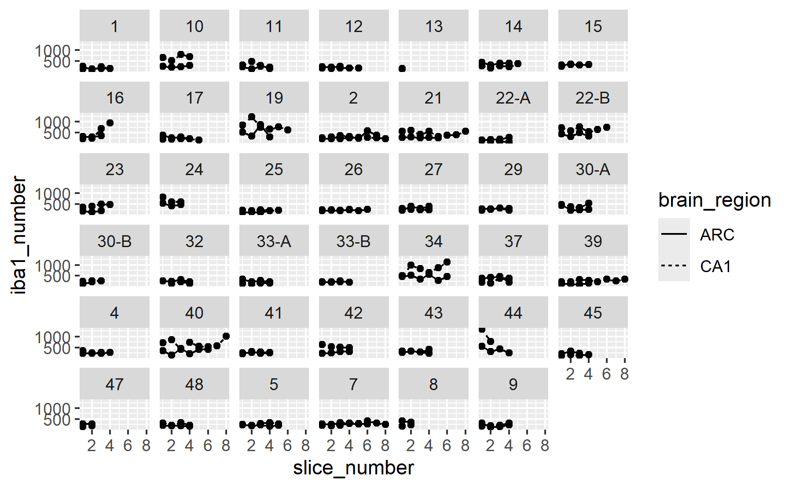
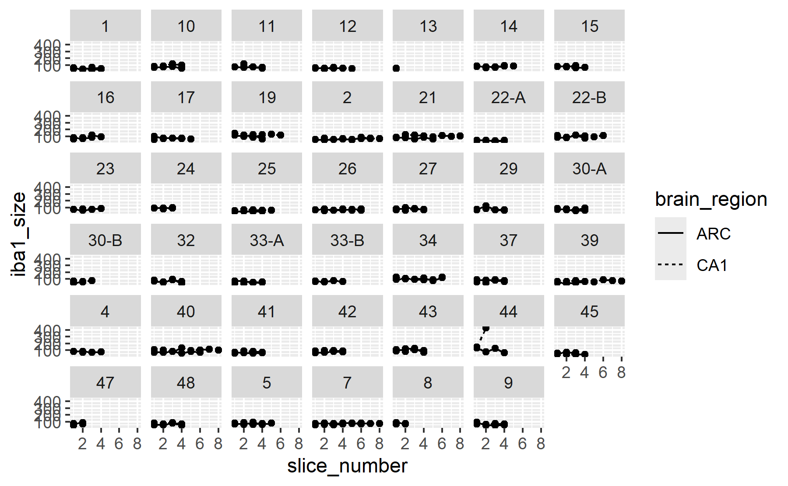
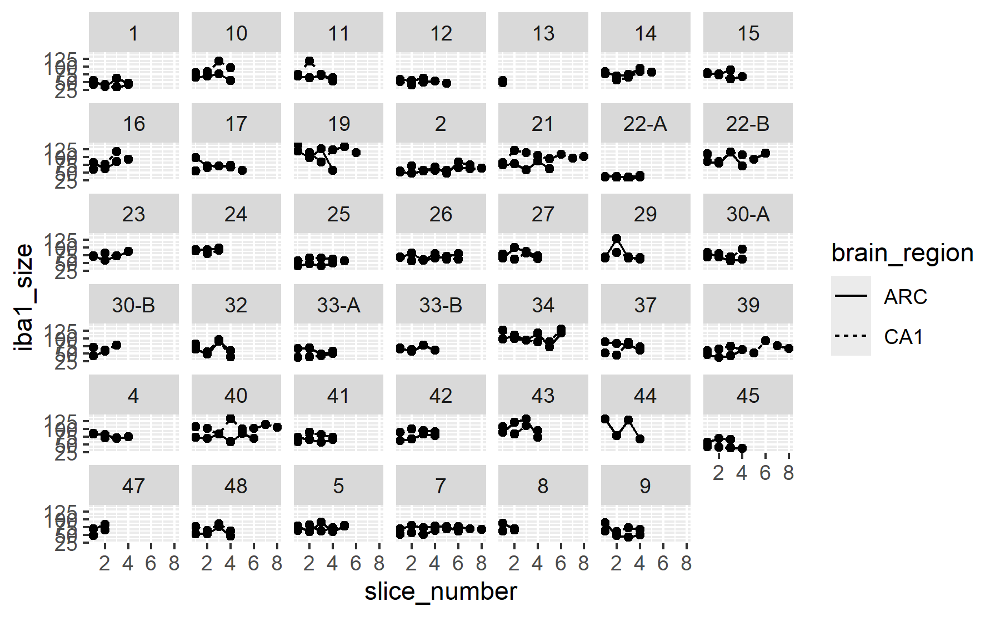
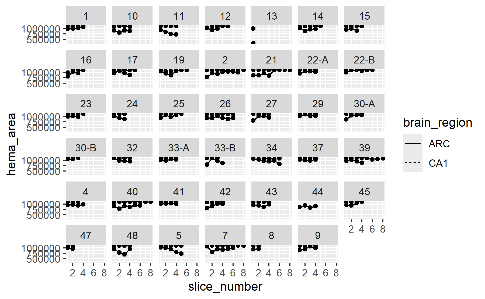
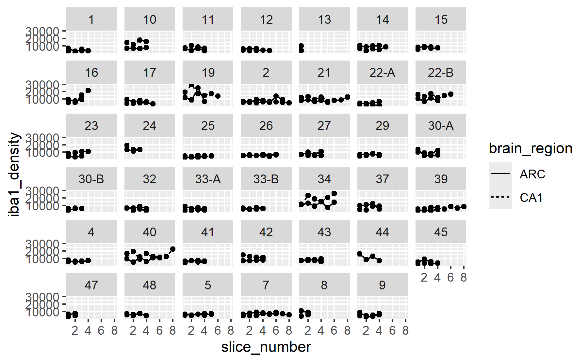

# Experiment 2 - iba1 data processing
Brent Bachman
2025-05-01

- [<span class="toc-section-number">1</span> Packages](#packages)
- [<span class="toc-section-number">2</span> Data](#data)
- [<span class="toc-section-number">3</span> Visualize](#visualize)
- [<span class="toc-section-number">4</span> Summarize](#summarize)

# Packages

``` r
library("tidyverse")
```

``` r
# install.packages("tidyverse")
```

``` r
sessionInfo()
```

    R version 4.4.2 (2024-10-31 ucrt)
    Platform: x86_64-w64-mingw32/x64
    Running under: Windows 11 x64 (build 26100)

    Matrix products: default


    locale:
    [1] LC_COLLATE=English_United States.utf8 
    [2] LC_CTYPE=English_United States.utf8   
    [3] LC_MONETARY=English_United States.utf8
    [4] LC_NUMERIC=C                          
    [5] LC_TIME=English_United States.utf8    

    time zone: America/New_York
    tzcode source: internal

    attached base packages:
    [1] stats     graphics  grDevices utils     datasets  methods   base     

    other attached packages:
     [1] lubridate_1.9.3 forcats_1.0.0   stringr_1.5.1   dplyr_1.1.4    
     [5] purrr_1.0.2     readr_2.1.5     tidyr_1.3.1     tibble_3.2.1   
     [9] ggplot2_3.5.1   tidyverse_2.0.0

    loaded via a namespace (and not attached):
     [1] gtable_0.3.5      jsonlite_1.8.8    compiler_4.4.2    tidyselect_1.2.1 
     [5] scales_1.3.0      yaml_2.3.10       fastmap_1.2.0     R6_2.5.1         
     [9] generics_0.1.3    knitr_1.48        munsell_0.5.1     pillar_1.9.0     
    [13] tzdb_0.4.0        rlang_1.1.4       utf8_1.2.4        stringi_1.8.4    
    [17] xfun_0.47         timechange_0.3.0  cli_3.6.3         withr_3.0.1      
    [21] magrittr_2.0.3    digest_0.6.37     grid_4.4.2        rstudioapi_0.16.0
    [25] hms_1.1.3         lifecycle_1.0.4   vctrs_0.6.5       evaluate_1.0.0   
    [29] glue_1.7.0        fansi_1.0.6       colorspace_2.1-1  rmarkdown_2.28   
    [33] tools_4.4.2       pkgconfig_2.0.3   htmltools_0.5.8.1

# Data

``` r
# Create a dataframe called mydata
mydata <- 
  
  # Import the data
  read_csv(
    file ="data/iba1-data/experiment-2-iba1-data.csv",
    show_col_types = FALSE
    ) |> 
  
  # Separate the slice string into components by the delimiter "_"
  separate_wider_delim(
    cols = Slice, 
    delim = "_",
    names = c("id", "brain_region", "slice_number", "signal_type")
  ) |>
  
  # Parse the slice number and signal type from the rest of the names
  mutate(
    slice_number = parse_number(slice_number),
    signal_type = parse_number(signal_type),
    .before = Count
  ) |>
  
  # Deselect variables of disinterest
  select(-"%Area")

# Show a summary of the dataframe
summary(mydata)
```

          id            brain_region        slice_number    signal_type 
     Length:692         Length:692         Min.   :1.000   Min.   :1.0  
     Class :character   Class :character   1st Qu.:2.000   1st Qu.:1.0  
     Mode  :character   Mode  :character   Median :3.000   Median :1.5  
                                           Mean   :2.864   Mean   :1.5  
                                           3rd Qu.:4.000   3rd Qu.:2.0  
                                           Max.   :8.000   Max.   :2.0  
         Count          Total Area       Average Size      
     Min.   :   1.0   Min.   :   2849   Min.   :     29.1  
     1st Qu.:   6.0   1st Qu.:  19130   1st Qu.:     70.9  
     Median : 115.5   Median : 337134   Median :    732.0  
     Mean   : 172.7   Mean   : 531917   Mean   : 183210.8  
     3rd Qu.: 273.0   3rd Qu.:1087975   3rd Qu.: 178134.5  
     Max.   :1342.0   Max.   :1113433   Max.   :1113433.4  

``` r
# Create a new dataframe called "hema_data"
hema_data <-
  
  # Copy the original dataframe
  mydata |>
  
  # Filter to include just the hematoxylin data
  filter(signal_type == "1") |>
  
  # Rename the cell counts to be hematoxylin specific
  rename(
    hema_area  = "Total Area"
  ) |>
  
  # Deselect signal type
  select(-signal_type, -"Count", -"Average Size")

# Show a summary of the dataframe
summary(hema_data)
```

          id            brain_region        slice_number     hema_area      
     Length:346         Length:346         Min.   :1.000   Min.   : 335277  
     Class :character   Class :character   1st Qu.:2.000   1st Qu.: 976607  
     Mode  :character   Mode  :character   Median :3.000   Median :1088736  
                                           Mean   :2.864   Mean   :1035571  
                                           3rd Qu.:4.000   3rd Qu.:1111825  
                                           Max.   :8.000   Max.   :1113433  

``` r
# Create a new dataframe called "iba1_data"
iba1_data <-
  
  # Copy the original dataframe
  mydata |>
  
  # Filter to include just the iba1 data
  filter(signal_type == "2") |>
  
  # Rename the cell counts to be iba1 specific
  rename(
    iba1_number  = Count,
    iba1_size    = "Average Size"
  ) |>
  
  # Deselect signal type
  select(-signal_type, -"Total Area")

# Show a summary of the dataframe
summary(iba1_data)
```

          id            brain_region        slice_number    iba1_number    
     Length:346         Length:346         Min.   :1.000   Min.   :  83.0  
     Class :character   Class :character   1st Qu.:2.000   1st Qu.: 215.5  
     Mode  :character   Mode  :character   Median :3.000   Median : 273.0  
                                           Mean   :2.864   Mean   : 328.7  
                                           3rd Qu.:4.000   3rd Qu.: 377.5  
                                           Max.   :8.000   Max.   :1342.0  
       iba1_size     
     Min.   : 29.07  
     1st Qu.: 60.27  
     Median : 70.91  
     Mean   : 75.06  
     3rd Qu.: 85.58  
     Max.   :432.39  

``` r
# Create a new dataframe called "density_data"
density_data <-
  
  # Copy the hematoxylin dataframe
  hema_data |>
  
  # Join the iba1 dataframe to the hematoxylin dataframe
  left_join(
    iba1_data, 
    by = join_by(id, brain_region, slice_number) 
    ) |>
  
  # Compute iba1 cell density (in cells per mm^3)
  mutate(
    iba1_density = iba1_number / (hema_area * 40 / 1e9)
  )

# Show a summary of the dataframe
summary(density_data)
```

          id            brain_region        slice_number     hema_area      
     Length:346         Length:346         Min.   :1.000   Min.   : 335277  
     Class :character   Class :character   1st Qu.:2.000   1st Qu.: 976607  
     Mode  :character   Mode  :character   Median :3.000   Median :1088736  
                                           Mean   :2.864   Mean   :1035571  
                                           3rd Qu.:4.000   3rd Qu.:1111825  
                                           Max.   :8.000   Max.   :1113433  
      iba1_number       iba1_size       iba1_density  
     Min.   :  83.0   Min.   : 29.07   Min.   : 1864  
     1st Qu.: 215.5   1st Qu.: 60.27   1st Qu.: 5128  
     Median : 273.0   Median : 70.91   Median : 6733  
     Mean   : 328.7   Mean   : 75.06   Mean   : 7948  
     3rd Qu.: 377.5   3rd Qu.: 85.58   3rd Qu.: 9227  
     Max.   :1342.0   Max.   :432.39   Max.   :33068  

# Visualize

``` r
# Call the iba1 dataframe
density_data |>
  
  # Plot each subject's iba1 cell number over slices to visualize potential outliers
  ggplot(
    aes(
      x = slice_number, 
      y = iba1_number, 
      linetype = brain_region
      )
    ) +
  
  # Facet by id
  facet_wrap(vars(id)) +
  
  # Plot individual data points
  geom_point() +
  
  # Plot connecting lines
  geom_line()
```

    `geom_line()`: Each group consists of only one observation.
    ℹ Do you need to adjust the group aesthetic?



``` r
# Call the iba1 dataframe
density_data |>
  
  # Plot each subject's iba1 cell size over slices to visualize potential outliers
  ggplot(
    aes(
      x = slice_number, 
      y = iba1_size, 
      linetype = brain_region
      )
    ) +
  
  # Facet by id
  facet_wrap(vars(id)) +
  
  # Plot individual data points
  geom_point() +
  
  # Plot connecting lines
  geom_line()
```

    `geom_line()`: Each group consists of only one observation.
    ℹ Do you need to adjust the group aesthetic?



Subject 44’s second CA1 slice seems much higher than their first slice;
and it seems higher than everyone else’s slices. I looked at the raw
image and subject 44 did not have any DH slices collected, so I took
images of the CA1 region of the VH. Therefore, let’s exclude subject
44’s CA1 slices.

``` r
# Identify the row number of the outlier identified above
outlier_rows <-
  density_data |>
  with(which(id == 44 & brain_region == "CA1"))

# Create a new dataframe excluding the row number of that outlier
density_data_2 <-
  density_data |>
  slice(-c(outlier_rows))

# Show a summary of the dataframe
summary(density_data_2)
```

          id            brain_region        slice_number     hema_area      
     Length:344         Length:344         Min.   :1.000   Min.   : 335277  
     Class :character   Class :character   1st Qu.:2.000   1st Qu.: 975344  
     Mode  :character   Mode  :character   Median :3.000   Median :1090663  
                                           Mean   :2.872   Mean   :1035589  
                                           3rd Qu.:4.000   3rd Qu.:1111836  
                                           Max.   :8.000   Max.   :1113433  
      iba1_number       iba1_size       iba1_density  
     Min.   :  83.0   Min.   : 29.07   Min.   : 1864  
     1st Qu.: 214.8   1st Qu.: 60.21   1st Qu.: 5118  
     Median : 272.0   Median : 70.87   Median : 6718  
     Mean   : 324.4   Mean   : 73.81   Mean   : 7843  
     3rd Qu.: 376.0   3rd Qu.: 84.79   3rd Qu.: 9119  
     Max.   :1233.0   Max.   :141.10   Max.   :29308  

Now let’s replot the cell sizes.

``` r
# Call the iba1 dataframe
density_data_2 |>
  
  # Plot each subject's iba1 cell size over slices to visualize potential outliers
  ggplot(
    aes(
      x = slice_number, 
      y = iba1_size, 
      linetype = brain_region
      )
    ) +
  
  # Facet by id
  facet_wrap(vars(id)) +
  
  # Plot individual data points
  geom_point() +
  
  # Plot connecting lines
  geom_line()
```

    `geom_line()`: Each group consists of only one observation.
    ℹ Do you need to adjust the group aesthetic?



``` r
# Call the iba1 dataframe
density_data_2 |>
  
  # Plot each subject's hematoxylin-stained area over slices to visualize potential outliers
  ggplot(
    aes(
      x = slice_number, 
      y = hema_area, 
      linetype = brain_region
      )
    ) +
  
  # Facet by id
  facet_wrap(vars(id)) +
  
  # Plot individual data points
  geom_point() +
  
  # Plot connecting lines
  geom_line()
```

    `geom_line()`: Each group consists of only one observation.
    ℹ Do you need to adjust the group aesthetic?



``` r
# Call the iba1 dataframe
density_data_2 |>
  
  # Plot each subject's iba1 cell density over slices to visualize potential outliers
  ggplot(
    aes(
      x = slice_number, 
      y = iba1_density, 
      linetype = brain_region
      )
    ) +
  
  # Facet by id
  facet_wrap(vars(id)) +
  
  # Plot individual data points
  geom_point() +
  
  # Plot connecting lines
  geom_line()
```

    `geom_line()`: Each group consists of only one observation.
    ℹ Do you need to adjust the group aesthetic?



# Summarize

Let’s summarize the data.

``` r
# Create a new dataframe called "summary_data"
summary_data <-
  
  # Copy the "density_data" dataframe
  density_data |>
  
  # Grouped by subject id and brain region, compute the mean (avg), standard deviation (SD), and coefficient of variation (CV) for the number of hematoxylin stained cells, the number of iba1+ cells, and the iba1+ cell density across slices, as well as the number of slices counted, for each subject,
  group_by(id, brain_region) |>
  summarise(
    
    # Hematoxylin cells
    hema_area_avg = mean(hema_area),
    hema_area_sd  = sd(hema_area),
    hema_area_cv  = hema_area_sd / hema_area_avg * 100,
    
    # Iba1+ cells
    iba1_number_avg = mean(iba1_number),
    iba1_number_sd  = sd(iba1_number),
    iba1_number_cv  = iba1_number_sd / iba1_number_avg * 100,
    
    # Iba1+ cell density
    iba1_density_avg = mean(iba1_density),
    iba1_density_sd  = sd(iba1_density),
    iba1_density_cv  = iba1_density_sd / iba1_density_avg * 100,
      
    # Number of slices
    slices_counted = n()
  ) |>
  ungroup()
```

    `summarise()` has grouped output by 'id'. You can override using the `.groups`
    argument.

``` r
# Show a summary of the dataframe
summary(summary_data)
```

          id            brain_region       hema_area_avg      hema_area_sd     
     Length:82          Length:82          Min.   : 335277   Min.   :   152.1  
     Class :character   Class :character   1st Qu.: 965960   1st Qu.:  2632.9  
     Mode  :character   Mode  :character   Median :1037811   Median : 25841.9  
                                           Mean   :1025105   Mean   : 36042.3  
                                           3rd Qu.:1110039   3rd Qu.: 58359.3  
                                           Max.   :1113311   Max.   :136239.8  
                                                             NA's   :2         
      hema_area_cv      iba1_number_avg  iba1_number_sd    iba1_number_cv  
     Min.   : 0.01366   Min.   : 107.5   Min.   :  5.859   Min.   : 2.353  
     1st Qu.: 0.23715   1st Qu.: 216.8   1st Qu.: 28.155   1st Qu.:12.302  
     Median : 2.43145   Median : 272.2   Median : 49.943   Median :17.434  
     Mean   : 3.74352   Mean   : 318.0   Mean   : 71.907   Mean   :20.790  
     3rd Qu.: 6.04929   3rd Qu.: 336.5   3rd Qu.: 88.927   3rd Qu.:27.482  
     Max.   :14.85534   Max.   :1063.0   Max.   :394.566   Max.   :67.599  
     NA's   :2                           NA's   :2         NA's   :2       
     iba1_density_avg iba1_density_sd   iba1_density_cv  slices_counted
     Min.   : 2414    Min.   :  133.8   Min.   : 2.654   Min.   :1.00  
     1st Qu.: 5439    1st Qu.:  739.5   1st Qu.:12.892   1st Qu.:4.00  
     Median : 6672    Median : 1235.2   Median :18.224   Median :4.00  
     Mean   : 7797    Mean   : 1798.3   Mean   :21.405   Mean   :4.22  
     3rd Qu.: 9195    3rd Qu.: 2073.7   3rd Qu.:27.210   3rd Qu.:4.75  
     Max.   :25863    Max.   :10189.7   Max.   :65.677   Max.   :8.00  
                      NA's   :2         NA's   :2                      

``` r
# Create a new dataframe called "arc_data
arc_data <-
  
  # Copy the "summary_data" dataframe
  summary_data |> 
  
  # Filter the dataframe to include only the brain region arc (arc = arcuate nucleus)
  filter(brain_region == "ARC") |>
  
  # Deselect the variable "brain_region", as it is no longer necessary
  select(-brain_region) |>
  
  # Rename the columns to be arc specific
  rename(
    
    # Hematoxylin area
    arc_hema_area_avg = hema_area_avg,
    arc_hema_area_sd  = hema_area_sd,
    arc_hema_area_cv  = hema_area_cv,
    
    # Iba1 cells
    arc_iba1_number_avg = iba1_number_avg,
    arc_iba1_number_sd  = iba1_number_sd,
    arc_iba1_number_cv  = iba1_number_cv,
    
    # Iba1 density
    arc_iba1_density_avg = iba1_density_avg,
    arc_iba1_density_sd  = iba1_density_sd,
    arc_iba1_density_cv  = iba1_density_cv,
    
    # Slices counts
    arc_slices_counted = slices_counted
  )

# Show a summary of the dataframe
summary(arc_data)
```

          id            arc_hema_area_avg arc_hema_area_sd   arc_hema_area_cv 
     Length:41          Min.   : 814132   Min.   :   625.7   Min.   : 0.0601  
     Class :character   1st Qu.: 936394   1st Qu.: 42655.3   1st Qu.: 4.3916  
     Mode  :character   Median : 972033   Median : 59254.0   Median : 6.1544  
                        Mean   : 964532   Mean   : 63678.8   Mean   : 6.7149  
                        3rd Qu.:1002501   3rd Qu.: 89837.5   3rd Qu.: 9.3499  
                        Max.   :1072152   Max.   :136239.8   Max.   :14.8553  
                                          NA's   :1          NA's   :1        
     arc_iba1_number_avg arc_iba1_number_sd arc_iba1_number_cv arc_iba1_density_avg
     Min.   :130.0       Min.   :  6.364    Min.   : 2.353     Min.   : 3444       
     1st Qu.:216.4       1st Qu.: 28.385    1st Qu.:11.287     1st Qu.: 6018       
     Median :272.5       Median : 42.937    Median :16.582     Median : 6854       
     Mean   :281.3       Mean   : 60.710    Mean   :20.828     Mean   : 7345       
     3rd Qu.:330.2       3rd Qu.: 78.195    3rd Qu.:27.972     3rd Qu.: 8702       
     Max.   :502.5       Max.   :262.316    Max.   :52.202     Max.   :13167       
                         NA's   :1          NA's   :1                              
     arc_iba1_density_sd arc_iba1_density_cv arc_slices_counted
     Min.   : 339.7      Min.   : 5.075      Min.   :1.000     
     1st Qu.: 817.1      1st Qu.:12.736      1st Qu.:4.000     
     Median :1186.2      Median :18.624      Median :4.000     
     Mean   :1660.5      Mean   :21.823      Mean   :3.951     
     3rd Qu.:2055.4      3rd Qu.:31.003      3rd Qu.:4.000     
     Max.   :8145.9      Max.   :61.868      Max.   :7.000     
     NA's   :1           NA's   :1                             

``` r
# Create a new dataframe called "ca1_data
ca1_data <-
  
  # Copy the "summary_data" dataframe
  summary_data |> 
  
  # Filter the dataframe to include only the brain region ca1 (of the hippocampus)
  filter(brain_region == "CA1") |>
  
  # Deselect the variable "brain_region", as it is no longer necessary
  select(-brain_region) |>
  
  # Rename the columns to be ca1 specific
  rename(
    
    # Hematoxylin area
    ca1_hema_area_avg = hema_area_avg,
    ca1_hema_area_sd  = hema_area_sd,
    ca1_hema_area_cv  = hema_area_cv,
    
    # Iba1 cells
    ca1_iba1_number_avg = iba1_number_avg,
    ca1_iba1_number_sd  = iba1_number_sd,
    ca1_iba1_number_cv  = iba1_number_cv,
    
    # Iba1 density
    ca1_iba1_density_avg = iba1_density_avg,
    ca1_iba1_density_sd  = iba1_density_sd,
    ca1_iba1_density_cv  = iba1_density_cv,
    
    # Slices counts
    ca1_slices_counted = slices_counted
  )

# Show a summary of the dataframe
summary(ca1_data)
```

          id            ca1_hema_area_avg ca1_hema_area_sd  ca1_hema_area_cv 
     Length:41          Min.   : 335277   Min.   :  152.1   Min.   :0.01366  
     Class :character   1st Qu.:1097987   1st Qu.:  663.5   1st Qu.:0.05964  
     Mode  :character   Median :1110081   Median : 2980.9   Median :0.26852  
                        Mean   :1085677   Mean   : 8405.9   Mean   :0.77217  
                        3rd Qu.:1112137   3rd Qu.: 8169.1   3rd Qu.:0.73996  
                        Max.   :1113311   Max.   :57409.2   Max.   :5.31340  
                                          NA's   :1         NA's   :1        
     ca1_iba1_number_avg ca1_iba1_number_sd ca1_iba1_number_cv ca1_iba1_density_avg
     Min.   : 107.5      Min.   :  5.859    Min.   : 2.612     Min.   : 2414       
     1st Qu.: 218.0      1st Qu.: 28.155    1st Qu.:13.249     1st Qu.: 5042       
     Median : 269.4      Median : 55.079    Median :17.697     Median : 6225       
     Mean   : 354.7      Mean   : 83.104    Mean   :20.752     Mean   : 8249       
     3rd Qu.: 443.5      3rd Qu.: 96.990    3rd Qu.:26.393     3rd Qu.:10066       
     Max.   :1063.0      Max.   :394.566    Max.   :67.599     Max.   :25863       
                         NA's   :1          NA's   :1                              
     ca1_iba1_density_sd ca1_iba1_density_cv ca1_slices_counted
     Min.   :  133.8     Min.   : 2.654      Min.   :1.000     
     1st Qu.:  636.2     1st Qu.:13.397      1st Qu.:4.000     
     Median : 1304.2     Median :18.224      Median :4.000     
     Mean   : 1936.2     Mean   :20.987      Mean   :4.488     
     3rd Qu.: 2175.7     3rd Qu.:26.454      3rd Qu.:5.000     
     Max.   :10189.7     Max.   :65.677      Max.   :8.000     
     NA's   :1           NA's   :1                             

``` r
# Create a new dataframe called "iba1_data_processed"
iba1_data_combined <-
  
  # Copy the "arc_data" dataframe
  arc_data |>
  
  # Join the "ca1_data" dataframe to the "arc_data" dataframe by the key subject id
  left_join(ca1_data, by = join_by(id)) |>
  
  # Arrange the output by id
  arrange(as.integer(id))
```

    Warning: There was 1 warning in `arrange()`.
    ℹ In argument: `..1 = as.integer(id)`.
    Caused by warning:
    ! NAs introduced by coercion

``` r
# Exclude the unknown subjects
iba1_data_processed <- 
  iba1_data_combined |>
  slice(-c(36:41)) |>
  mutate(id = as.numeric(id))
  
# Show a summary of the dataframe
summary(iba1_data_processed)
```

           id        arc_hema_area_avg arc_hema_area_sd arc_hema_area_cv
     Min.   : 1.00   Min.   : 814132   Min.   : 11236   Min.   : 1.098  
     1st Qu.:11.50   1st Qu.: 934154   1st Qu.: 43070   1st Qu.: 4.531  
     Median :23.00   Median : 960248   Median : 61826   Median : 6.589  
     Mean   :23.71   Mean   : 955453   Mean   : 64345   Mean   : 6.834  
     3rd Qu.:38.00   3rd Qu.: 988459   3rd Qu.: 88647   3rd Qu.: 9.207  
     Max.   :48.00   Max.   :1034564   Max.   :126148   Max.   :14.855  
                                       NA's   :1        NA's   :1       
     arc_iba1_number_avg arc_iba1_number_sd arc_iba1_number_cv arc_iba1_density_avg
     Min.   :130.0       Min.   :  6.364    Min.   : 2.353     Min.   : 3444       
     1st Qu.:222.4       1st Qu.: 26.898    1st Qu.:10.931     1st Qu.: 6150       
     Median :274.0       Median : 42.273    Median :15.204     Median : 7072       
     Mean   :284.2       Mean   : 59.215    Mean   :19.841     Mean   : 7484       
     3rd Qu.:330.3       3rd Qu.: 75.107    3rd Qu.:27.852     3rd Qu.: 8816       
     Max.   :502.5       Max.   :262.316    Max.   :52.202     Max.   :13167       
                         NA's   :1          NA's   :1                              
     arc_iba1_density_sd arc_iba1_density_cv arc_slices_counted ca1_hema_area_avg
     Min.   : 339.7      Min.   : 5.075      Min.   :1.0        Min.   : 335277  
     1st Qu.: 767.3      1st Qu.:10.084      1st Qu.:3.5        1st Qu.:1097537  
     Median :1159.5      Median :17.092      Median :4.0        Median :1109679  
     Mean   :1618.7      Mean   :20.603      Mean   :4.0        Mean   :1081232  
     3rd Qu.:2047.9      3rd Qu.:29.576      3rd Qu.:4.0        3rd Qu.:1111974  
     Max.   :8145.9      Max.   :61.868      Max.   :7.0        Max.   :1113174  
     NA's   :1           NA's   :1                                               
     ca1_hema_area_sd  ca1_hema_area_cv  ca1_iba1_number_avg ca1_iba1_number_sd
     Min.   :  152.1   Min.   :0.01366   Min.   : 135.0      Min.   : 12.48    
     1st Qu.:  783.8   1st Qu.:0.07047   1st Qu.: 225.0      1st Qu.: 32.70    
     Median : 4308.4   Median :0.38811   Median : 277.0      Median : 59.49    
     Mean   : 9536.3   Mean   :0.87663   Mean   : 363.0      Mean   : 90.41    
     3rd Qu.:10617.0   3rd Qu.:0.96506   3rd Qu.: 458.6      3rd Qu.:114.98    
     Max.   :57409.2   Max.   :5.31340   Max.   :1063.0      Max.   :394.57    
     NA's   :1         NA's   :1                             NA's   :1         
     ca1_iba1_number_cv ca1_iba1_density_avg ca1_iba1_density_sd
     Min.   : 7.24      Min.   : 3217        Min.   :  318.4    
     1st Qu.:14.06      1st Qu.: 5311        1st Qu.:  820.1    
     Median :18.17      Median : 6323        Median : 1339.8    
     Mean   :22.05      Mean   : 8481        Mean   : 2113.4    
     3rd Qu.:27.30      3rd Qu.:10357        3rd Qu.: 2604.4    
     Max.   :67.60      Max.   :25863        Max.   :10189.7    
     NA's   :1                               NA's   :1          
     ca1_iba1_density_cv ca1_slices_counted
     Min.   : 8.101      Min.   :1.000     
     1st Qu.:14.097      1st Qu.:4.000     
     Median :19.487      Median :4.000     
     Mean   :22.343      Mean   :4.571     
     3rd Qu.:27.976      3rd Qu.:5.000     
     Max.   :65.677      Max.   :8.000     
     NA's   :1                             

The mean number of ARC slices counted is 3.95; and the mean CV for ARC
iba1 cell density is 21.82%.The mean number of CA1 slices counted is
4.49; and the mean CV for CA1 iba1 cell density is 20.99%. Both CVs are
acceptable.

``` r
# Create a new dataframe
statsdata_iba1 <-
  
  # Import the current stats data frame
  read_csv(
    file ="data/experiment-2-statsdata.csv",
    show_col_types = FALSE
    ) |> 
  
  # Join the iba1 processed data to the stats data frame
  left_join(iba1_data_processed, by = join_by(id))
```

``` r
# Save the stats data frame    
write_csv(
  statsdata_iba1, 
  file = "data/experiment-2-statsdata-iba1.csv" 
  )
```
