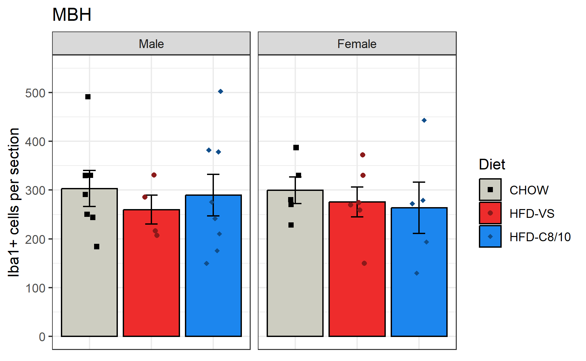
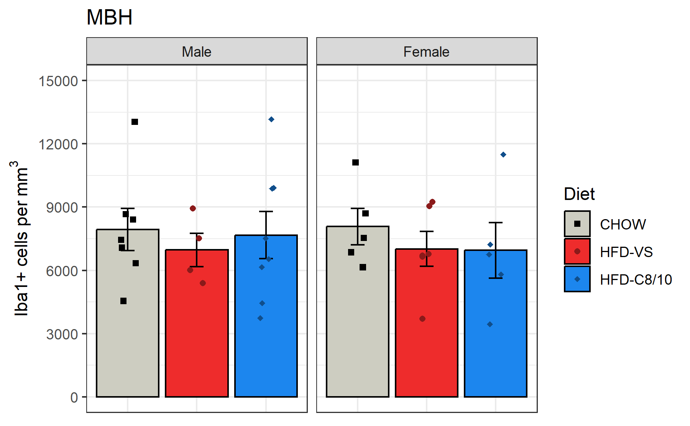
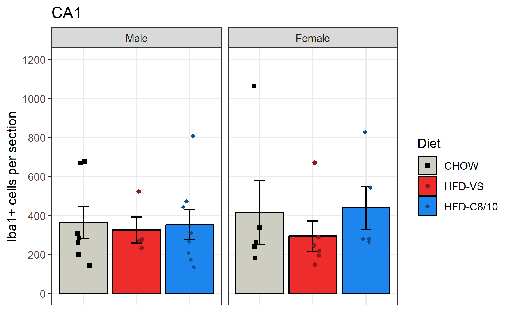
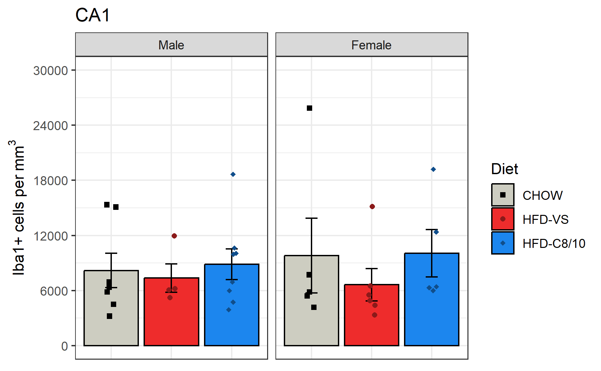
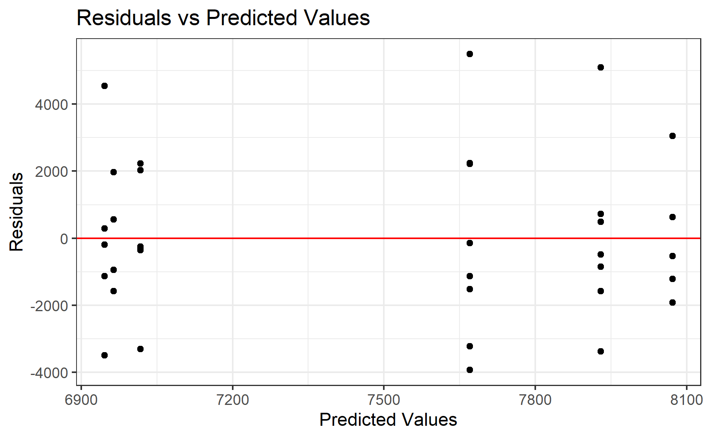
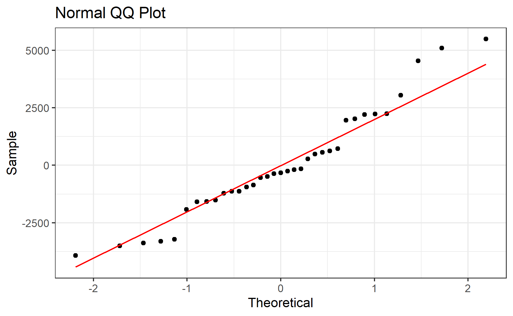
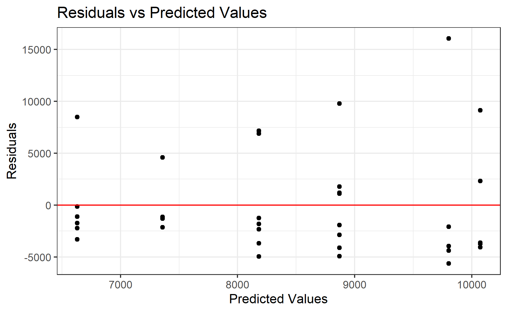
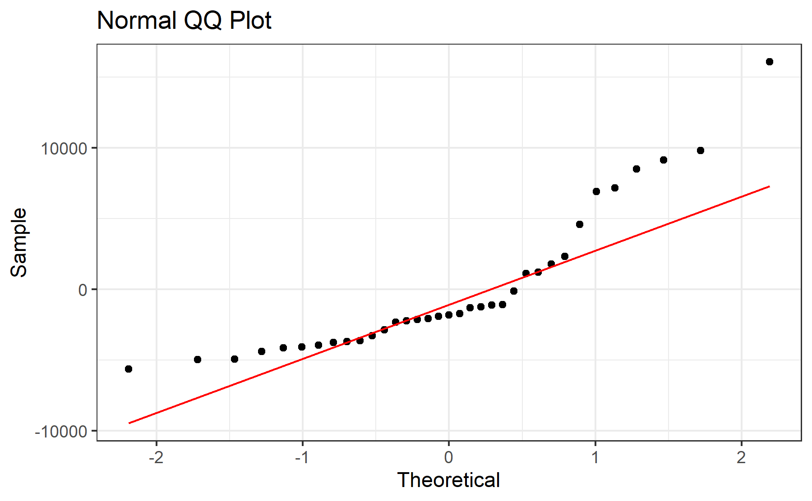
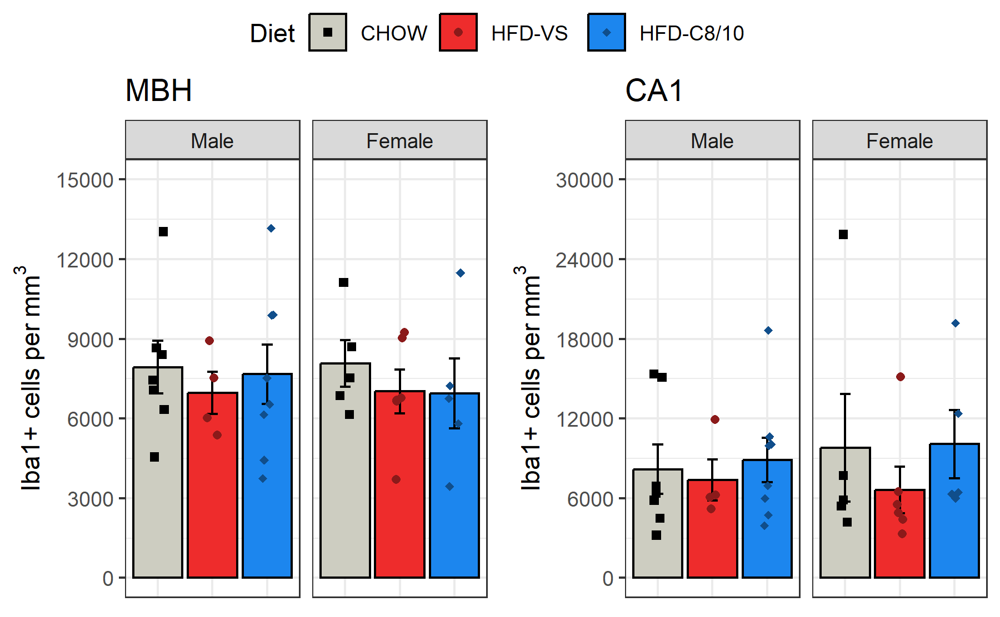

# Experiment 2 - iba1
Brent Bachman
2025-05-01

- [<span class="toc-section-number">1</span> Packages](#packages)
- [<span class="toc-section-number">2</span> Data](#data)
  - [<span class="toc-section-number">2.1</span> Import, tidy, and
    transform](#import-tidy-and-transform)
  - [<span class="toc-section-number">2.2</span> Sample
    Size](#sample-size)
  - [<span class="toc-section-number">2.3</span> Visualize](#visualize)
    - [<span class="toc-section-number">2.3.1</span> ARC
      Number](#arc-number)
    - [<span class="toc-section-number">2.3.2</span> ARC
      Density](#arc-density)
    - [<span class="toc-section-number">2.3.3</span> CA1
      Number](#ca1-number)
    - [<span class="toc-section-number">2.3.4</span> CA1
      Density](#ca1-density)
- [<span class="toc-section-number">3</span> Model 1](#model-1)
  - [<span class="toc-section-number">3.1</span>
    Assumptions](#assumptions)
    - [<span class="toc-section-number">3.1.1</span> Linearity and
      Homoskedasticity](#linearity-and-homoskedasticity)
    - [<span class="toc-section-number">3.1.2</span>
      Normality](#normality)
  - [<span class="toc-section-number">3.2</span> Omnibus
    Tests](#omnibus-tests)
  - [<span class="toc-section-number">3.3</span> Reference =
    CHOW](#reference--chow)
- [<span class="toc-section-number">4</span> Model 2](#model-2)
  - [<span class="toc-section-number">4.1</span>
    Assumptions](#assumptions-1)
    - [<span class="toc-section-number">4.1.1</span> Linearity and
      Homoskedasticity](#linearity-and-homoskedasticity-1)
    - [<span class="toc-section-number">4.1.2</span>
      Normality](#normality-1)
  - [<span class="toc-section-number">4.2</span> Omnibus
    Tests](#omnibus-tests-1)
  - [<span class="toc-section-number">4.3</span> Reference =
    CHOW](#reference--chow-1)
- [<span class="toc-section-number">5</span> Communicate](#communicate)
- [<span class="toc-section-number">6</span> References](#references)

# Packages

``` r
library("tidyverse")
library("ggpubr")
```

``` r
# install.packages("tidyverse")
# install.packages("ggpubr")
```

``` r
sessionInfo()
```

    R version 4.4.2 (2024-10-31 ucrt)
    Platform: x86_64-w64-mingw32/x64
    Running under: Windows 11 x64 (build 26100)

    Matrix products: default


    locale:
    [1] LC_COLLATE=English_United States.utf8 
    [2] LC_CTYPE=English_United States.utf8   
    [3] LC_MONETARY=English_United States.utf8
    [4] LC_NUMERIC=C                          
    [5] LC_TIME=English_United States.utf8    

    time zone: America/New_York
    tzcode source: internal

    attached base packages:
    [1] stats     graphics  grDevices utils     datasets  methods   base     

    other attached packages:
     [1] ggpubr_0.6.0    lubridate_1.9.3 forcats_1.0.0   stringr_1.5.1  
     [5] dplyr_1.1.4     purrr_1.0.2     readr_2.1.5     tidyr_1.3.1    
     [9] tibble_3.2.1    ggplot2_3.5.1   tidyverse_2.0.0

    loaded via a namespace (and not attached):
     [1] gtable_0.3.5      jsonlite_1.8.8    ggsignif_0.6.4    compiler_4.4.2   
     [5] tidyselect_1.2.1  scales_1.3.0      yaml_2.3.10       fastmap_1.2.0    
     [9] R6_2.5.1          generics_0.1.3    knitr_1.48        backports_1.5.0  
    [13] car_3.1-2         munsell_0.5.1     pillar_1.9.0      tzdb_0.4.0       
    [17] rlang_1.1.4       utf8_1.2.4        broom_1.0.6       stringi_1.8.4    
    [21] xfun_0.47         timechange_0.3.0  cli_3.6.3         withr_3.0.1      
    [25] magrittr_2.0.3    digest_0.6.37     grid_4.4.2        rstudioapi_0.16.0
    [29] hms_1.1.3         lifecycle_1.0.4   vctrs_0.6.5       rstatix_0.7.2    
    [33] evaluate_1.0.0    glue_1.7.0        abind_1.4-8       carData_3.0-5    
    [37] fansi_1.0.6       colorspace_2.1-1  rmarkdown_2.28    tools_4.4.2      
    [41] pkgconfig_2.0.3   htmltools_0.5.8.1

# Data

## Import, tidy, and transform

``` r
# Create a dataframe called mydata
mydata <- 
  
  # Import the data
  read_csv(
    file = "data/experiment-2-statsdata-iba1.csv",
    show_col_types = FALSE
    ) |>
  
  # Select the variables of interest 
  select(id, sex, diet, 
         arc_iba1_number_avg, arc_iba1_density_avg,
         ca1_iba1_number_avg, ca1_iba1_density_avg
         ) |>
  
  # Transform data
  mutate(
  
    # Recode categorical variables as factors
    id = factor(id),
    sex = factor(
      sex,
      levels = c(0, 1),
      labels = c("Male", "Female")
      ),
    diet = factor(
      diet,
      levels = c(0, 1, 2),
      labels = c("CHOW", "HFD-VS", "HFD-C8/10")
      ),
    
    # Recode sex using sum coding
    sex_sum = C(sex, sum)
    ) |>
  
  drop_na()

# View a summary of the data
summary(mydata)
```

           id         sex            diet    arc_iba1_number_avg
     1      : 1   Male  :19   CHOW     :12   Min.   :130.0      
     2      : 1   Female:16   HFD-VS   :10   1st Qu.:222.4      
     4      : 1               HFD-C8/10:13   Median :274.0      
     5      : 1                              Mean   :284.2      
     7      : 1                              3rd Qu.:330.3      
     8      : 1                              Max.   :502.5      
     (Other):29                                                 
     arc_iba1_density_avg ca1_iba1_number_avg ca1_iba1_density_avg   sex_sum  
     Min.   : 3444        Min.   : 135.0      Min.   : 3217        Male  :19  
     1st Qu.: 6150        1st Qu.: 225.0      1st Qu.: 5311        Female:16  
     Median : 7072        Median : 277.0      Median : 6323                   
     Mean   : 7484        Mean   : 363.0      Mean   : 8481                   
     3rd Qu.: 8816        3rd Qu.: 458.6      3rd Qu.:10357                   
     Max.   :13167        Max.   :1063.0      Max.   :25863                   
                                                                              

## Sample Size

Since some of the brain data was lost/unusable, let’s compute the
grouped sample sizes of the usable dataset

``` r
# Compute total sample size
mydata |> 
  summarize(
    count = n()
  )
```

    # A tibble: 1 × 1
      count
      <int>
    1    35

``` r
# Compute grouped sample sizes
mydata |>
  group_by(sex, diet) |>
  summarize(
    count = n()
  )
```

    `summarise()` has grouped output by 'sex'. You can override using the `.groups`
    argument.

    # A tibble: 6 × 3
    # Groups:   sex [2]
      sex    diet      count
      <fct>  <fct>     <int>
    1 Male   CHOW          7
    2 Male   HFD-VS        4
    3 Male   HFD-C8/10     8
    4 Female CHOW          5
    5 Female HFD-VS        6
    6 Female HFD-C8/10     5

Looks like the total sample size is 35 and the grouped sample sizes
range from 4-8 per group.

## Visualize

### ARC Number

``` r
# Create a plot object
arc_number_plot <-
  
  # Call the dataset
  mydata |>  
  
  # Plot each group's number of iba1+ cells
  ggplot(
    aes(
      x = diet, 
      y = arc_iba1_number_avg, 
      fill = diet,
      )
    ) +
  
  # Create a plot title
  ggtitle(label = "MBH") +
  
  # Facet by sex (rows)
  facet_grid(
    . ~ sex
    ) + 
  
  # Plot the observed means as bars
  stat_summary(
    fun.data = mean_se,
    geom = "bar",
    color = "black",
    position = position_dodge(0.95)
    ) +
  
  # Plot the observed standard errors as errorbars
  stat_summary(
    fun.data = mean_se,
    geom = "errorbar",
    color = "black",
    width = 0.2,
    position = position_dodge(0.95)
    ) +
  
  # Plot the individual data points
  geom_point(
    aes(
      color = diet, 
      shape = diet
      ),
    position = position_jitterdodge(
      jitter.width = 0.6,
      jitter.height = 0,
      dodge.width = 0.95
      )
    ) +
  
  # Change color title and scale
  scale_color_manual(
    name = "Diet",
    values = c(
      "CHOW"      = "black",
      "HFD-VS"    = "firebrick4",
      "HFD-C8/10" = "dodgerblue4"
      )
    ) +
  
  # Change fill title and scale
  scale_fill_manual(
    name = "Diet",
    values = c(
      "CHOW"      = "ivory3",
      "HFD-VS"    = "firebrick2",
      "HFD-C8/10" = "dodgerblue2"
      )
    ) +
  
  # Change shape title and scale
  scale_shape_manual(
    name = "Diet",
    values = c(
      "CHOW"      = 15,
      "HFD-VS"    = 16,
      "HFD-C8/10" = 18
      )
    ) +
  
   # Change y-axis title and scale
  scale_y_continuous(
    name = "Iba1+ cells per section",
    limits = c(0, 550),
    breaks = seq(from = 0, to = 500, by = 100)
    ) +
  
  # Change overall plot theme
  theme_bw() + 
  
  # Remove x-axis tick labels
  theme(
    axis.title.x = element_blank(),
    axis.text.x  = element_blank(),
    axis.ticks.x = element_blank()
    )

# Show the plot
arc_number_plot
```



### ARC Density

``` r
# Create a plot object
arc_density_plot <-
  
  # Call the dataset
  mydata |>  
  
  # Plot each group's iba1+ cell density
  ggplot(
    aes(
      x = diet, 
      y = arc_iba1_density_avg, 
      fill = diet,
      )
    ) +
  
  # Create a plot title
  ggtitle(label = "MBH") +
  
  # Facet by sex (rows)
  facet_grid(
    . ~ sex
    ) + 
  
  # Plot the observed means as bars
  stat_summary(
    fun.data = mean_se,
    geom = "bar",
    color = "black",
    position = position_dodge(0.95)
    ) +
  
  # Plot the observed standard errors as errorbars
  stat_summary(
    fun.data = mean_se,
    geom = "errorbar",
    color = "black",
    width = 0.2,
    position = position_dodge(0.95)
    ) +
  
  # Plot the individual data points
  geom_point(
    aes(
      color = diet, 
      shape = diet
      ),
    position = position_jitterdodge(
      jitter.width = 0.6,
      jitter.height = 0,
      dodge.width = 0.95
      )
    ) +
  
  # Change color title and scale
  scale_color_manual(
    name = "Diet",
    values = c(
      "CHOW"      = "black",
      "HFD-VS"    = "firebrick4",
      "HFD-C8/10" = "dodgerblue4"
      )
    ) +
  
  # Change fill title and scale
  scale_fill_manual(
    name = "Diet",
    values = c(
      "CHOW"      = "ivory3",
      "HFD-VS"    = "firebrick2",
      "HFD-C8/10" = "dodgerblue2"
      )
    ) +
  
  # Change shape title and scale
  scale_shape_manual(
    name = "Diet",
    values = c(
      "CHOW"      = 15,
      "HFD-VS"    = 16,
      "HFD-C8/10" = 18
      )
    ) +
  
  # Change y-axis title and scale
  scale_y_continuous(
    name = bquote('Iba1+ cells per' ~ mm^3),
    limits = c(0, 15000),
    breaks = seq(from = 0, to = 15000, by = 3000)
    ) +
  
  # Change overall plot theme
  theme_bw() + 
  
  # Remove x-axis tick labels
  theme(
    axis.title.x = element_blank(),
    axis.text.x  = element_blank(),
    axis.ticks.x = element_blank()
    )

# Show the plot
arc_density_plot
```



### CA1 Number

``` r
# Create a plot object
ca1_number_plot <-
  
  # Call the dataset
  mydata |>  
  
  # Plot each group's number of iba1+ cells
  ggplot(
    aes(
      x = diet, 
      y = ca1_iba1_number_avg, 
      fill = diet,
      )
    ) +
  
  # Create a plot title
  ggtitle(label = "CA1") +
  
  # Facet by sex (rows)
  facet_grid(
    . ~ sex
    ) + 
  
  # Plot the observed means as bars
  stat_summary(
    fun.data = mean_se,
    geom = "bar",
    color = "black",
    position = position_dodge(0.95)
    ) +
  
  # Plot the observed standard errors as errorbars
  stat_summary(
    fun.data = mean_se,
    geom = "errorbar",
    color = "black",
    width = 0.2,
    position = position_dodge(0.95)
    ) +
  
  # Plot the individual data points
  geom_point(
    aes(
      color = diet, 
      shape = diet
      ),
    position = position_jitterdodge(
      jitter.width = 0.6,
      jitter.height = 0,
      dodge.width = 0.95
      )
    ) +
  
  # Change color title and scale
  scale_color_manual(
    name = "Diet",
    values = c(
      "CHOW"      = "black",
      "HFD-VS"    = "firebrick4",
      "HFD-C8/10" = "dodgerblue4"
      )
    ) +
  
  # Change fill title and scale
  scale_fill_manual(
    name = "Diet",
    values = c(
      "CHOW"      = "ivory3",
      "HFD-VS"    = "firebrick2",
      "HFD-C8/10" = "dodgerblue2"
      )
    ) +
  
  # Change shape title and scale
  scale_shape_manual(
    name = "Diet",
    values = c(
      "CHOW"      = 15,
      "HFD-VS"    = 16,
      "HFD-C8/10" = 18
      )
    ) +
  
   # Change y-axis title and scale
  scale_y_continuous(
    name = "Iba1+ cells per section",
    limits = c(0, 1200),
    breaks = seq(from = 0, to = 1200, by = 200)
    ) +
  
  # Change overall plot theme
  theme_bw() + 
  
  # Remove x-axis tick labels
  theme(
    axis.title.x = element_blank(),
    axis.text.x  = element_blank(),
    axis.ticks.x = element_blank()
    )

# Show the plot
ca1_number_plot
```



### CA1 Density

``` r
# Create a plot object
ca1_density_plot <-
  
  # Call the dataset
  mydata |>  
  
  # Plot each group's iba1+ cell density
  ggplot(
    aes(
      x = diet, 
      y = ca1_iba1_density_avg, 
      fill = diet,
      )
    ) +
  
  # Create a plot title
  ggtitle(label = "CA1") +
  
  # Facet by sex (rows)
  facet_grid(
    . ~ sex
    ) + 
  
  # Plot the observed means as bars
  stat_summary(
    fun.data = mean_se,
    geom = "bar",
    color = "black",
    position = position_dodge(0.95)
    ) +
  
  # Plot the observed standard errors as errorbars
  stat_summary(
    fun.data = mean_se,
    geom = "errorbar",
    color = "black",
    width = 0.2,
    position = position_dodge(0.95)
    ) +
  
  # Plot the individual data points
  geom_point(
    aes(
      color = diet, 
      shape = diet
      ),
    position = position_jitterdodge(
      jitter.width = 0.4,
      jitter.height = 0,
      dodge.width = 0.95
      )
    ) +
  
  # Change color title and scale
  scale_color_manual(
    name = "Diet",
    values = c(
      "CHOW"      = "black",
      "HFD-VS"    = "firebrick4",
      "HFD-C8/10" = "dodgerblue4"
      )
    ) +
  
  # Change fill title and scale
  scale_fill_manual(
    name = "Diet",
    values = c(
      "CHOW"      = "ivory3",
      "HFD-VS"    = "firebrick2",
      "HFD-C8/10" = "dodgerblue2"
      )
    ) +
  
  # Change shape title and scale
  scale_shape_manual(
    name = "Diet",
    values = c(
      "CHOW"      = 15,
      "HFD-VS"    = 16,
      "HFD-C8/10" = 18
      )
    ) +
  
  # Change y-axis title and scale
  scale_y_continuous(
    name = bquote('Iba1+ cells per' ~ mm^3),
    limits = c(0, 30000),
    breaks = seq(from = 0, to = 30000, by = 6000)
    ) +
  
  # Change overall plot theme
  theme_bw() + 
  
  # Remove x-axis tick labels
  theme(
    axis.title.x = element_blank(),
    axis.text.x  = element_blank(),
    axis.ticks.x = element_blank()
    )

# Show the plot
ca1_density_plot
```



# Model 1

To test the effects of sex, diet, and their interaction on iba1+ cell
density in the ARC, a multiple linear regression model will be built
with the predictors sex (sum-coded: male = 1, female = -1), diet
(treatment coded: CHOW = 0; HFD-VS and HFD-C8/10 = 1), and the
interaction between sex and diet.

``` r
# Build the model
model1 <- lm(
  arc_iba1_density_avg ~ sex_sum * diet,
  data = mydata
)
```

## Assumptions

Before I run any statistical tests, let’s check how well the model
satisfies the assumptions.

First, I need to add the fitted and residual values to the data.

``` r
# Add the fitted and residual values to the dataset
model1_fits <- 
  mydata |>
  mutate(
    fits = c(fitted(model1)),
    resids = c(residuals(model1))
  )
```

### Linearity and Homoskedasticity

Next, I will create a residuals plot to check for linearity and
homoskedasticity.

``` r
# Create a residuals plot to check for linearity and homoskedasticity
model1_residuals_plot <-
  model1_fits |>
  ggplot(
    aes(x = fits, y = resids)
  ) +
  
  # Plot individual data points
  geom_point() +
  
  # Plot a horizontal line at y = 0
  geom_hline(yintercept = 0, col = "red") + 
  
  # Change aesthetics
  labs(
    title = "Residuals vs Predicted Values",
    x = "Predicted Values",
    y = "Residuals"
  ) +
  theme_bw() 

# Show the plot
model1_residuals_plot
```



The data seem to be linear and homoskedastic.

### Normality

Next, I will create a QQ plot to check for normality.

``` r
# Create a QQ plot to check for normality
model1_qq_plot <-
  model1_fits |>
  ggplot(
    aes(sample = resids)
  ) +
  
  # Plot points and qq line
  geom_qq() +
  geom_qq_line(col = "red") +
  
  # Change aesthestics
  labs(
    title = "Normal QQ Plot",
    x = "Theoretical",
    y = "Sample"
  ) +
  theme_bw() 

# Show the plot
model1_qq_plot
```



The data seem to be approximately normally distributed.

## Omnibus Tests

With the model built, let’s perform omnibus tests for the effects of
each predictor using the function “anova()”. This function uses type I
sum of squares. Thus, it will produce F test statistics for the effects
of each predictor entered sequentially (i.e., the residual effect of
each predictor after accounting for the effects of all the other
predictors entered in the model before it).

``` r
# Perform omnibus F tests
model1 |> anova()
```

    Analysis of Variance Table

    Response: arc_iba1_density_avg
                 Df    Sum Sq Mean Sq F value Pr(>F)
    sex_sum       1    742636  742636  0.1141 0.7379
    diet          2   5145273 2572636  0.3954 0.6770
    sex_sum:diet  2   1339707  669853  0.1029 0.9025
    Residuals    29 188702434 6506980               

There were not significant effects of sex, $F(1, 29) = 0.11, p = .738$,
diet, $F(2, 29) = 0.40, p = .677$, or an interaction between sex and
diet, $F(2, 29) = 0.10, p = .903$.

## Reference = CHOW

Let’s take a look at the summary output.

``` r
# Produce summary output
model1 |> summary()
```


    Call:
    lm(formula = arc_iba1_density_avg ~ sex_sum * diet, data = mydata)

    Residuals:
        Min      1Q  Median      3Q     Max 
    -3929.6 -1368.8  -324.6  1347.0  5496.3 

    Coefficients:
                           Estimate Std. Error t value Pr(>|t|)    
    (Intercept)             8000.82     746.82  10.713 1.35e-11 ***
    sex_sum1                 -71.07     746.82  -0.095    0.925    
    dietHFD-VS             -1009.96    1111.55  -0.909    0.371    
    dietHFD-C8/10           -692.48    1042.32  -0.664    0.512    
    sex_sum1:dietHFD-VS       44.40    1111.55   0.040    0.968    
    sex_sum1:dietHFD-C8/10   432.98    1042.32   0.415    0.681    
    ---
    Signif. codes:  0 '***' 0.001 '**' 0.01 '*' 0.05 '.' 0.1 ' ' 1

    Residual standard error: 2551 on 29 degrees of freedom
    Multiple R-squared:  0.03689,   Adjusted R-squared:  -0.1292 
    F-statistic: 0.2221 on 5 and 29 DF,  p-value: 0.95

The model did not explain a significant portion of the variance in iba1+
cell density in the ARC,
$F(5, 29) = 0.22, R^2 = 0.04, R^2_{adj} = -0.13, p = .950$.

# Model 2

To test the effects of sex, diet, and their interaction on iba1+ cell
density in the CA1 region, a multiple linear regression model will be
built with the predictors sex (sum-coded: male = 1, female = -1), diet
(treatment coded: CHOW = 0; HFD-VS and HFD-C8/10 = 1), and the
interaction between sex and diet.

``` r
# Build the model
model2 <- lm(
  ca1_iba1_density_avg ~ sex_sum * diet,
  data = mydata
)
```

## Assumptions

Before I run any statistical tests, let’s check how well the model
satisfies the assumptions.

First, I need to add the fitted and residual values to the data.

``` r
# Add the fitted and residual values to the dataset
model2_fits <- 
  mydata |>
  mutate(
    fits = c(fitted(model2)),
    resids = c(residuals(model2))
  )
```

### Linearity and Homoskedasticity

Next, I will create a residuals plot to check for linearity and
homoskedasticity.

``` r
# Create a residuals plot to check for linearity and homoskedasticity
model2_residuals_plot <-
  model2_fits |>
  ggplot(
    aes(x = fits, y = resids)
  ) +
  
  # Plot individual data points
  geom_point() +
  
  # Plot a horizontal line at y = 0
  geom_hline(yintercept = 0, col = "red") + 
  
  # Change aesthetics
  labs(
    title = "Residuals vs Predicted Values",
    x = "Predicted Values",
    y = "Residuals"
  ) +
  theme_bw() 

# Show the plot
model2_residuals_plot
```



The data seem to be linear and homoskedastic.

### Normality

Next, I will create a QQ plot to check for normality.

``` r
# Create a QQ plot to check for normality
model2_qq_plot <-
  model2_fits |>
  ggplot(
    aes(sample = resids)
  ) +
  
  # Plot points and qq line
  geom_qq() +
  geom_qq_line(col = "red") +
  
  # Change aesthestics
  labs(
    title = "Normal QQ Plot",
    x = "Theoretical",
    y = "Sample"
  ) +
  theme_bw() 

# Show the plot
model2_qq_plot
```



The data seem to be approximately normally distributed.

## Omnibus Tests

Let’s perform omnibus tests for the effects of each predictor.

``` r
# Run omnibus tests
model2 |> anova()
```

    Analysis of Variance Table

    Response: ca1_iba1_density_avg
                 Df    Sum Sq  Mean Sq F value Pr(>F)
    sex_sum       1   1382902  1382902  0.0453 0.8329
    diet          2  39389189 19694594  0.6455 0.5318
    sex_sum:diet  2   8073738  4036869  0.1323 0.8766
    Residuals    29 884844271 30511871               

There were not significant effects of sex, $F(1, 29) = 0.05, p = .833$,
diet, $F(2, 29) = 0.646, p = .532$, or an interaction between sex and
diet, $F(2, 29) = 0.132, p = .877$.

## Reference = CHOW

Let’s take a look at the summary output.

``` r
# Produce summary output
model2 |> summary()
```


    Call:
    lm(formula = ca1_iba1_density_avg ~ sex_sum * diet, data = mydata)

    Residuals:
       Min     1Q Median     3Q    Max 
     -5624  -3662  -1810   1487  16059 

    Coefficients:
                           Estimate Std. Error t value Pr(>|t|)    
    (Intercept)              8993.4     1617.2   5.561 5.34e-06 ***
    sex_sum1                 -810.4     1617.2  -0.501    0.620    
    dietHFD-VS              -1999.1     2407.0  -0.831    0.413    
    dietHFD-C8/10             477.9     2257.1   0.212    0.834    
    sex_sum1:dietHFD-VS      1174.8     2407.0   0.488    0.629    
    sex_sum1:dietHFD-C8/10    208.9     2257.1   0.093    0.927    
    ---
    Signif. codes:  0 '***' 0.001 '**' 0.01 '*' 0.05 '.' 0.1 ' ' 1

    Residual standard error: 5524 on 29 degrees of freedom
    Multiple R-squared:  0.05231,   Adjusted R-squared:  -0.1111 
    F-statistic: 0.3202 on 5 and 29 DF,  p-value: 0.8967

The model did not explain a significant portion of the variance in iba1+
cell density in the CA1 region,
$F(5, 29) = 0.32, R^2 = 0.05, R^2_{adj} = -0.11, p = .897$.

# Communicate

Let’s combine the plots

``` r
# Combine the plots for each brain region into a single, multi-panel plot
arranged_plot <- 
  ggarrange(
    arc_density_plot, ca1_density_plot,
    nrow = 1, ncol = 2,
    # labels = c("A", "B", "C", "D"),
    common.legend = T
  )

# Show the plot
arranged_plot
```



Now let’s save the plots.

``` r
# Save the ...

# MBH density plot
ggsave(
  plot = arc_density_plot,
  filename = "output/experiment-2/07-iba1/01-MBH-density-plot.tiff",
  width = 6, height = 3.708, units = "in", dpi = 300
)

# MBH residuals plot
ggsave(
  plot = model1_residuals_plot,
  filename = "output/experiment-2/07-iba1/02-MBH-residuals-plot.tiff",
  width = 6, height = 3.708, units = "in", dpi = 300
)

# MBH qq plot
ggsave(
  plot = model1_qq_plot,
  filename = "output/experiment-2/07-iba1/03-MBH-qq-plot.tiff",
  width = 6, height = 3.708, units = "in", dpi = 300
)

# CA1 plot
ggsave(
  plot = ca1_density_plot,
  filename = "output/experiment-2/07-iba1/04-CA1-density-plot.tiff",
  width = 6, height = 3.708, units = "in", dpi = 300
)

# CA1 residuals plot
ggsave(
  plot = model2_residuals_plot,
  filename = "output/experiment-2/07-iba1/05-CA1-residuals-plot.tiff",
  width = 6, height = 3.708, units = "in", dpi = 300
)

# CA1 qq plot
ggsave(
  plot = model2_qq_plot,
  filename = "output/experiment-2/07-iba1/06-CA1-qq-plot.tiff",
  width = 6, height = 3.708, units = "in", dpi = 300
)

# arranged plot - 300 dpi
ggsave(
  plot = arranged_plot,
  filename = "output/experiment-2/07-iba1/07-arranged-plot-300.tiff",
  width = 6, height = 3.708, units = "in", dpi = 300
)

# arranged plot - 1200 dpi
ggsave(
  plot = arranged_plot,
  filename = "output/experiment-2/07-iba1/08-arranged-plot-1200.tiff",
  width = 6, height = 3.708, units = "in", dpi = 1200
)
```

# References
