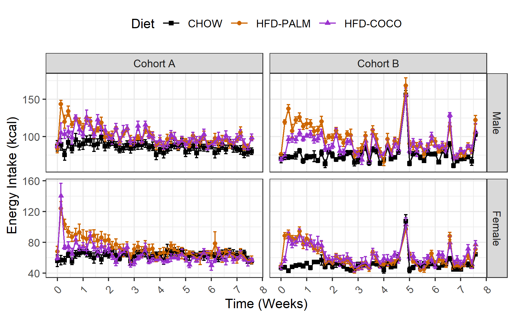
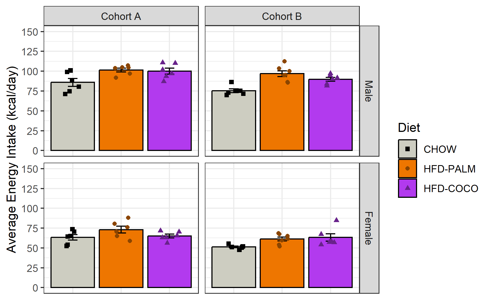
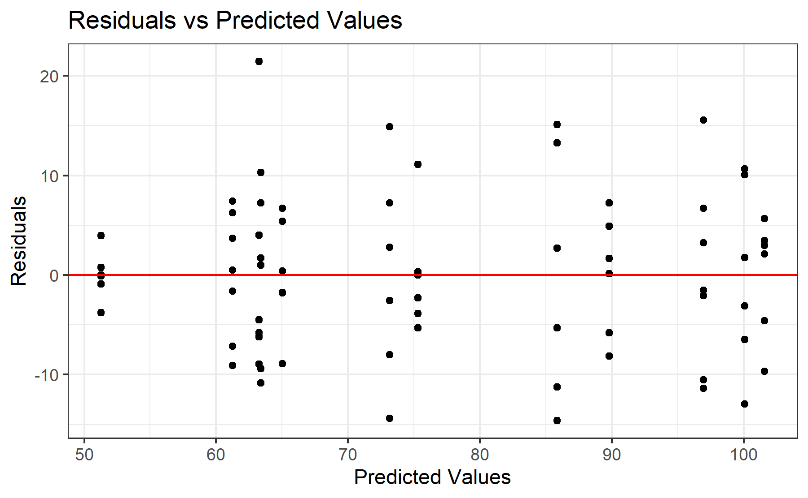
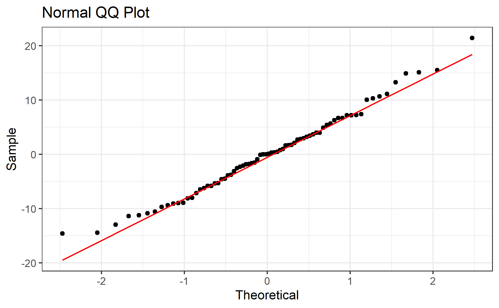

# Experiment 3 - Energy Intake
Brent Bachman
2025-05-01

- [<span class="toc-section-number">1</span> Packages](#packages)
- [<span class="toc-section-number">2</span> Data](#data)
  - [<span class="toc-section-number">2.1</span> Import, tidy, and
    transform](#import-tidy-and-transform)
  - [<span class="toc-section-number">2.2</span> Visualize - Line
    Plot](#visualize---line-plot)
- [<span class="toc-section-number">3</span> Summarize](#summarize)
  - [<span class="toc-section-number">3.1</span> Visualize - Bar
    Plot](#visualize---bar-plot)
- [<span class="toc-section-number">4</span> Model](#model)
  - [<span class="toc-section-number">4.1</span>
    Assumptions](#assumptions)
    - [<span class="toc-section-number">4.1.1</span> Linearity and
      Homoskedasticity](#linearity-and-homoskedasticity)
    - [<span class="toc-section-number">4.1.2</span>
      Normality](#normality)
  - [<span class="toc-section-number">4.2</span> Omnibus
    Tests](#omnibus-tests)
  - [<span class="toc-section-number">4.3</span> Summary, Referece =
    CHOW](#summary-referece--chow)
  - [<span class="toc-section-number">4.4</span> Summary, Reference =
    HFD-PALM](#summary-reference--hfd-palm)
- [<span class="toc-section-number">5</span> Communicate](#communicate)
- [<span class="toc-section-number">6</span> References](#references)

# Packages

``` r
library("tidyverse")
```

``` r
# install.packages("tidyverse")
```

``` r
sessionInfo()
```

    R version 4.4.2 (2024-10-31 ucrt)
    Platform: x86_64-w64-mingw32/x64
    Running under: Windows 11 x64 (build 26100)

    Matrix products: default


    locale:
    [1] LC_COLLATE=English_United States.utf8 
    [2] LC_CTYPE=English_United States.utf8   
    [3] LC_MONETARY=English_United States.utf8
    [4] LC_NUMERIC=C                          
    [5] LC_TIME=English_United States.utf8    

    time zone: America/New_York
    tzcode source: internal

    attached base packages:
    [1] stats     graphics  grDevices utils     datasets  methods   base     

    other attached packages:
     [1] lubridate_1.9.3 forcats_1.0.0   stringr_1.5.1   dplyr_1.1.4    
     [5] purrr_1.0.2     readr_2.1.5     tidyr_1.3.1     tibble_3.2.1   
     [9] ggplot2_3.5.1   tidyverse_2.0.0

    loaded via a namespace (and not attached):
     [1] gtable_0.3.5      jsonlite_1.8.8    compiler_4.4.2    tidyselect_1.2.1 
     [5] scales_1.3.0      yaml_2.3.10       fastmap_1.2.0     R6_2.5.1         
     [9] generics_0.1.3    knitr_1.48        munsell_0.5.1     pillar_1.9.0     
    [13] tzdb_0.4.0        rlang_1.1.4       utf8_1.2.4        stringi_1.8.4    
    [17] xfun_0.47         timechange_0.3.0  cli_3.6.3         withr_3.0.1      
    [21] magrittr_2.0.3    digest_0.6.37     grid_4.4.2        rstudioapi_0.16.0
    [25] hms_1.1.3         lifecycle_1.0.4   vctrs_0.6.5       evaluate_1.0.0   
    [29] glue_1.7.0        fansi_1.0.6       colorspace_2.1-1  rmarkdown_2.28   
    [33] tools_4.4.2       pkgconfig_2.0.3   htmltools_0.5.8.1

# Data

## Import, tidy, and transform

``` r
# Create a dataframe
mydata <- 
  
  # Import the data
  read_csv(
    file ="data/experiment-3-statsdata.csv",
    show_col_types = FALSE
    ) |>
  
  # Select the variables of interest 
  # EI = energy intake
  select(id, age, cohort, sex, diet, EI_0:EI_53) |>
  
  # Divide cohort B's energy intake values on day 34 by 2 (since they were recorded over two days) 
  # mutate(
  #   EI_34 = if_else(cohort == 1, EI_34/2, EI_34)
  #   ) |>
  
  # Tidy data
  pivot_longer(
    cols = starts_with("EI"),
    names_to = "day",
    values_to = "energy_intake",
    values_drop_na = TRUE
    ) |>
  
  # Transform data
  mutate(
  
    # Recode categorical variables as factors
    id = factor(id),
    cohort = factor(
      cohort, 
      levels = c(0, 1),
      labels = c("Cohort A", "Cohort B")
    ),
    sex = factor(
      sex,
      levels = c(0, 1),
      labels = c("Male", "Female")
      ),
    diet = factor(
      diet,
      levels = c(0, 1, 2),
      labels = c("CHOW", "HFD-PALM", "HFD-COCO")
      ),
    
    # Recode sex and cohort using sum coding
    sex_sum    = C(sex, sum),
    cohort_sum = C(cohort, sum),
    
    # Compute time in weeks
    day = parse_number(day),
    week = day/7,
    .before = energy_intake
    ) |>
  
  # Drop na values
  drop_na()

# View a summary of the data
summary(mydata)
```

           id            age             cohort         sex             diet     
     1      :  54   Min.   :109.0   Cohort A:1944   Male  :1979   CHOW    :1284  
     2      :  54   1st Qu.:110.0   Cohort B:2014   Female:1979   HFD-PALM:1390  
     3      :  54   Median :151.0                                 HFD-COCO:1284  
     4      :  54   Mean   :131.6                                                
     5      :  54   3rd Qu.:152.0                                                
     6      :  54   Max.   :154.0                                                
     (Other):3634                                                                
          day          sex_sum        cohort_sum        week       energy_intake   
     Min.   : 0.00   Male  :1979   Cohort A:1944   Min.   :0.000   Min.   : 23.03  
     1st Qu.:13.00   Female:1979   Cohort B:2014   1st Qu.:1.857   1st Qu.: 58.80  
     Median :26.00                                 Median :3.714   Median : 74.71  
     Mean   :26.44                                 Mean   :3.777   Mean   : 77.13  
     3rd Qu.:40.00                                 3rd Qu.:5.714   3rd Qu.: 92.10  
     Max.   :53.00                                 Max.   :7.571   Max.   :212.20  
                                                                                   

``` r
# Compute the mean and SD of each cohort's age
mydata |>
  group_by(cohort) |>
  summarize(
    age_m  = mean(age),
    age_sd = sd(age)
  )
```

    # A tibble: 2 × 3
      cohort   age_m age_sd
      <fct>    <dbl>  <dbl>
    1 Cohort A  110.  0.575
    2 Cohort B  152.  1.14 

## Visualize - Line Plot

``` r
# Create a line plot of each group's daily energy intake over time
line_plot <-
  mydata |>  
  ggplot(
    aes(
      x = week, 
      y = energy_intake, 
      color = diet, 
      shape = diet
      )
    ) +
  
  # Facet by sex and cohort
  facet_grid(
    sex ~ cohort,
    scales = "free_y"
    ) + 
  
  # Plot the observed means as points
  stat_summary(
    fun = mean,
    geom = "point"
    ) +
  
  # Plot the observed standard errors as errorbars
  stat_summary(
    fun.data = mean_se,
    geom = "errorbar"
    ) +
  
  # Plot connecting lines
  stat_summary(
    fun = mean,
    geom = "line"
    ) +
  
  # Change color title and scale
  scale_color_manual(
    name = "Diet",
    values = c(
      "CHOW"      = "black",
      "HFD-PALM"  = "darkorange3",
      "HFD-COCO"  = "darkorchid3"
      )
    ) +
  
  # Change shape title and scale
  scale_shape_manual(
    name = "Diet",
    values = c(
      "CHOW"      = 15,
      "HFD-PALM"  = 16,
      "HFD-COCO"  = 17
      )
    ) +
  
  # Change y-axis title
  labs(y = "Energy Intake (kcal)") +
  
  # Change x-axis title and scale
  scale_x_continuous(
    name = "Time (Weeks)",
    breaks = seq(from = 0, to = 8, by = 1)) +
  
  # Change overall plot theme
  theme_bw() + 
  
  # Rotate and adjust the x-axis tick labels
  theme(
    axis.text.x = element_text(
      angle = 45,
      vjust = 0.5,
      hjust = 0.5
      ),
    legend.position = "top"
    )

# Show the plot
line_plot
```



In both cohorts, the data for CHOW seems pretty flat over time. However,
the data for HFD-PALM and, to a lesser degree, HFD-COCO, seem to spike
on day 1 then slowly decrease over time. (There is also a peak for all
groups around week 5 in cohort B; this is because data was not collected
the day before, so those energy intake values are computed over two
days).

# Summarize

``` r
# Create a new dataframe
model_data <- 
  
  # Copy the original dataframe
  mydata |>
  
  # Keep just one observation per subject
  distinct(
    id, 
    .keep_all = TRUE
  ) |>
  
  # Deselect variables of disinterest
  select(-day, -week, -energy_intake) |>
  
  # Join that dataframe to a new dataframe
  left_join(
    
    # Copy the original dataframe
    mydata |>
  
    # filter the dataframe to include only the dietary intervention
    filter(day > 0) |>

    # Compute each subject's average energy intake across the dietary intervention
    group_by(id) |>
    summarize(
      average_energy_intake = mean(energy_intake)
    ) |>
    ungroup(),
  
  # join by the key of subject id
  by = join_by(id)
  )

# Show a summary of the data
summary(model_data)
```

           id          age             cohort       sex           diet   
     1      : 1   Min.   :109.0   Cohort A:36   Male  :37   CHOW    :24  
     2      : 1   1st Qu.:110.0   Cohort B:38   Female:37   HFD-PALM:26  
     3      : 1   Median :151.0                             HFD-COCO:24  
     4      : 1   Mean   :131.8                                          
     5      : 1   3rd Qu.:152.0                                          
     6      : 1   Max.   :154.0                                          
     (Other):68                                                          
       sex_sum      cohort_sum average_energy_intake
     Male  :37   Cohort A:36   Min.   : 47.51       
     Female:37   Cohort B:38   1st Qu.: 63.24       
                               Median : 74.16       
                               Mean   : 77.29       
                               3rd Qu.: 93.19       
                               Max.   :112.47       
                                                    

## Visualize - Bar Plot

Let’s visualize each group’s average energy intake across days 1 to 53.

``` r
# Create a bar plot each group's average energy intake across the entire dietary intervention
bar_plot <-
  model_data |>  
  ggplot(
    aes(
      x     = diet, 
      y     = average_energy_intake, 
      color = diet, 
      fill  = diet,
      shape = diet
      )
    ) +
  
  # Facet by cohort and sex
  facet_grid(
    sex ~ cohort,
    # scales = "free_y"
    ) + 
  
  # Plot the observed means as points
  stat_summary(
    fun = mean,
    geom = "bar",
    color = "black",
    ) +
  
  # Plot the observed standard errors as errorbars
  stat_summary(
    fun.data = mean_se,
    geom = "errorbar",
    color = "black",
    width = 0.2
    ) +
  
  # Plot individual data points
  geom_point(
    position = position_jitter(
      width = 0.2
    )
  ) +
  
  # Change color title and scale
  scale_color_manual(
    name = "Diet",
    values = c(
      "CHOW"      = "black",
      "HFD-PALM"  = "darkorange4",
      "HFD-COCO"  = "darkorchid4"
      )
    ) +
  
  # Change fill title and scale
  scale_fill_manual(
    name = "Diet",
    values = c(
      "CHOW"     = "ivory3",
      "HFD-PALM" = "darkorange2",
      "HFD-COCO" = "darkorchid2"
      )
    ) +
  
  # Change shape title and scale
  scale_shape_manual(
    name = "Diet",
    values = c(
      "CHOW"      = 15,
      "HFD-PALM"  = 16,
      "HFD-COCO"  = 17
      )
    ) +
  
  # Change x-axis title
  labs(x = "Diet") +
  
  # Change y-axis title and scale
  scale_y_continuous(
    name = "Average Energy Intake (kcal/day)",
    limits = c(0, 150),
    breaks = seq(from = 0, to =  150, by = 25)
  ) +
  
  # Change overall plot theme
  theme_bw() + 
  
  # Remove x-axis title, text, and tick labels
  theme(
    axis.title.x = element_blank(),
    axis.text.x  = element_blank(),
    axis.ticks.x = element_blank()
    )

# Show the plot
bar_plot
```



Consistent with the earlier visualization, average energy intake seems
to be greater for HFD-PALM and, perhaps to a *slightly* lesser degree,
HFD-COCO, in both sexes in both cohorts.

# Model

To test the effects of sex, diet, and their interaction on average
energy intake across the dietary intervention, a multiple linear
regression model will be built with the predictors sex (sum-coded: male
= 1 and female = -1), diet (treatment-coded: CHOW = 0; HFD-PALM and
HFD-COCO = 1), cohort (treatment-coded: Cohort A = 0 and Cohort B = 1),
as well as the two- and three-way interactions between each predictor.

``` r
# Build the model
model <- 
  lm(
    average_energy_intake ~ cohort_sum * sex_sum * diet, 
    data = model_data
  )
```

## Assumptions

Before I run any statistical tests, let’s check how well the model
satisfies the assumptions.

First, I need to add the fitted and residual values to the data.

``` r
# Add the fitted and residual values to the dataset
model_fits <- 
  model_data |>
  mutate(
    fits   = c(fitted(model)),
    resids = c(residuals(model))
  )
```

### Linearity and Homoskedasticity

Next, I will create a residuals plot to check for linearity and
homoskedasticity.

``` r
# Create a residuals plot to check for linearity and homoskedasticity
residuals_plot <-
  model_fits |>
  ggplot(
    aes(x = fits, y = resids)
  ) +
  
  # Plot individual data points
  geom_point() +
  
  # Plot a horizontal line at y = 0
  geom_hline(yintercept = 0, col = "red") + 
  
  # Change aesthetics
  labs(
    title = "Residuals vs Predicted Values",
    x = "Predicted Values",
    y = "Residuals"
  ) +
  theme_bw() 

# Show the plot
residuals_plot
```



The data seem to be evenly distributed along the horizontal axis,
indicating that the data are approximately linear; and the data seem to
deviate along the y-axes (i.e., from the horizontal red line) evenly
across the x-axis, indicating that the data are homoskedastic.

### Normality

Next, I will create a QQ plot to check for normality.

``` r
# Create a QQ plot to check for normality
qq_plot <-
  model_fits |>
  ggplot(
    aes(sample = resids)
  ) +
  
  # Plot boxplots
  geom_qq() +
  geom_qq_line(col = "red") +
  
  # Change aesthestics
  labs(
    title = "Normal QQ Plot",
    x = "Theoretical",
    y = "Sample"
  ) +
  theme_bw() 

# Show the plot
qq_plot
```



The data seem to fall mostly along the red line, indicating that the
data are approximately normally distributed.

## Omnibus Tests

With the model built, let’s perform omnibus tests for the effects of
each predictor using the function “anova()”. This function uses type I
sum of squares. Thus, it will produce F test statistics for the effects
of each predictor entered sequentially (i.e., the residual effect of
each predictor after accounting for the effects of all the other
predictors entered in the model before it).

``` r
# Perform omnibus tests
model |> anova()
```

    Analysis of Variance Table

    Response: average_energy_intake
                            Df  Sum Sq Mean Sq  F value    Pr(>F)    
    cohort_sum               1  1249.9  1249.9  18.0389 7.387e-05 ***
    sex_sum                  1 15433.2 15433.2 222.7429 < 2.2e-16 ***
    diet                     2  2703.4  1351.7  19.5087 2.678e-07 ***
    cohort_sum:sex_sum       1     1.0     1.0   0.0143    0.9053    
    cohort_sum:diet          2    84.6    42.3   0.6108    0.5462    
    sex_sum:diet             2   288.8   144.4   2.0840    0.1331    
    cohort_sum:sex_sum:diet  2   197.7    98.9   1.4270    0.2478    
    Residuals               62  4295.8    69.3                       
    ---
    Signif. codes:  0 '***' 0.001 '**' 0.01 '*' 0.05 '.' 0.1 ' ' 1

When predicting average energy intake over the course of the dietary
intervention, there were significant effects of cohort,
$F(1, 62) = 24.42, p < .001$, sex, $F(1, 62) = 222.04, p < .001$, and
diet, $F(2, 62) = 19.83, p < .001$. However, after controlling for these
predictors, there were not significant effects of the two-way
interactions between cohort and sex, $F(1, 62) = 0.00, p = .980$, cohort
and diet, $F(2, 62) = 0.63, p = .539$, or sex and diet,
$F(2, 62) = 2.08, p = .134$, or of the three-way interaction between
cohort, sex, and diet, $F(2, 62) = 1.42, p = .249$.

## Summary, Referece = CHOW

Let’s probe these effects by producing the summary output.

``` r
# Produce summary output
model |> summary()
```


    Call:
    lm(formula = average_energy_intake ~ cohort_sum * sex_sum * diet, 
        data = model_data)

    Residuals:
         Min       1Q   Median       3Q      Max 
    -14.5919  -5.6779   0.0782   4.6766  21.4372 

    Coefficients:
                                      Estimate Std. Error t value Pr(>|t|)    
    (Intercept)                        68.9543     1.6991  40.583  < 2e-16 ***
    cohort_sum1                         5.6635     1.6991   3.333  0.00145 ** 
    sex_sum1                           11.6238     1.6991   6.841 4.05e-09 ***
    dietHFD-PALM                       14.2639     2.3596   6.045 9.34e-08 ***
    dietHFD-COCO                       10.5871     2.4029   4.406 4.25e-05 ***
    cohort_sum1:sex_sum1               -0.3854     1.6991  -0.227  0.82133    
    cohort_sum1:dietHFD-PALM           -1.5292     2.3596  -0.648  0.51933    
    cohort_sum1:dietHFD-COCO           -2.6445     2.4029  -1.101  0.27535    
    sex_sum1:dietHFD-PALM               4.4004     2.3596   1.865  0.06693 .  
    sex_sum1:dietHFD-COCO               3.7692     2.4029   1.569  0.12183    
    cohort_sum1:sex_sum1:dietHFD-PALM  -1.4335     2.3596  -0.607  0.54574    
    cohort_sum1:sex_sum1:dietHFD-COCO   2.5168     2.4029   1.047  0.29898    
    ---
    Signif. codes:  0 '***' 0.001 '**' 0.01 '*' 0.05 '.' 0.1 ' ' 1

    Residual standard error: 8.324 on 62 degrees of freedom
    Multiple R-squared:  0.8229,    Adjusted R-squared:  0.7915 
    F-statistic: 26.19 on 11 and 62 DF,  p-value: < 2.2e-16

Overall, the model explained 83% of the variance in average energy
intake; and, after adjusting for the number of predictors, it explained
80%, $F(11, 62) = 26.76, R^2 = 0.83, R^2_{adj} = 0.80, p < .001$.

Within the male CHOW subjects, cohort B consumed significantly less
energy on average per day than cohort A
($B = -12.59, SE = 3.37, p < .001$), probably because they were slightly
older ($M_{A} = 110, SD_{A} = 0.58, M_{B} = 152, SD_{B} = 1.14$).
However, the difference between the two cohort’s CHOW groups was not
significantly different between the sexes
($B = 0.54, SE = 3.37, p = .874$); across the sexes, the difference
between the two cohorts was not significantly different in either
HFD-PALM ($B = 3.05, SE = 4.68, p = .517$) or HFD-COCO
($B = 5.31, SE = 4.77, p = .270$) relative to CHOW; and the magnitude of
the cohort differences (or lack thereof) for both HFD-PALM
($B = 2.76, SE = 4.68, p = .558$) and HFD-COCO
($B = 5.06, SE = 4.77, p = .293$) relative to CHOW was not significantly
different between the sexes. These results indicate that the cohorts
consumed significantly different amounts of energy on average per day
across the entire dietary intervention, but the difference is consistent
across sex and diet groups.

Across cohorts and across the sexes, both HFD-PALM
($B = 14.26, SE = 2.34, p < .001$) and HFD-COCO
($B = 10.60, SE = 2.38, p < .001$) consumed significantly more energy on
average per day than CHOW. The magnitude of the difference between
HFD-PALM and CHOW did not significantly interact with cohort
($B = -1.52, SE = 2.34, p = .517$), sex
($B = 4.35, SE = 2.34, p = .068$), or cohort and sex
($B = -1.38, SE = 2.34, p = .558$). The magnitude of the difference
between HFD-COCO and CHOW also did not significantly interact with
cohort ($B = -2.65, SE = 2.38, p = .270$), sex
($B = 3.76, SE = 2.38, p = .120$), or cohort and sex
($B = 2.53, SE = 2.38, p = .293$).

## Summary, Reference = HFD-PALM

To compare HFD-COCO with HFD-PALM, let’s relevel the diet variable to
make HFD-PALM the reference group, then refit the model and produce the
summary output. (There is no need to rerun the omnibus tests, as the
“total” effects are already captured, and thus the output would be
identical).

``` r
# Relevel factors to change reference group to HFD-VS
data_palm <- 
  model_data |>
  mutate(
    diet = fct_relevel(diet, "HFD-PALM"), # relevel diet
  )

# Build the model
model_palm <- 
  model |>
  update(
    data = data_palm
  )

# Produce the summary output
model_palm |> summary()
```


    Call:
    lm(formula = average_energy_intake ~ cohort_sum * sex_sum * diet, 
        data = data_palm)

    Residuals:
         Min       1Q   Median       3Q      Max 
    -14.5919  -5.6779   0.0782   4.6766  21.4372 

    Coefficients:
                                      Estimate Std. Error t value Pr(>|t|)    
    (Intercept)                        83.2182     1.6373  50.827  < 2e-16 ***
    cohort_sum1                         4.1343     1.6373   2.525   0.0141 *  
    sex_sum1                           16.0242     1.6373   9.787 3.41e-14 ***
    dietCHOW                          -14.2639     2.3596  -6.045 9.34e-08 ***
    dietHFD-COCO                       -3.6768     2.3596  -1.558   0.1243    
    cohort_sum1:sex_sum1               -1.8188     1.6373  -1.111   0.2709    
    cohort_sum1:dietCHOW                1.5292     2.3596   0.648   0.5193    
    cohort_sum1:dietHFD-COCO           -1.1153     2.3596  -0.473   0.6381    
    sex_sum1:dietCHOW                  -4.4004     2.3596  -1.865   0.0669 .  
    sex_sum1:dietHFD-COCO              -0.6312     2.3596  -0.268   0.7900    
    cohort_sum1:sex_sum1:dietCHOW       1.4335     2.3596   0.607   0.5457    
    cohort_sum1:sex_sum1:dietHFD-COCO   3.9503     2.3596   1.674   0.0991 .  
    ---
    Signif. codes:  0 '***' 0.001 '**' 0.01 '*' 0.05 '.' 0.1 ' ' 1

    Residual standard error: 8.324 on 62 degrees of freedom
    Multiple R-squared:  0.8229,    Adjusted R-squared:  0.7915 
    F-statistic: 26.19 on 11 and 62 DF,  p-value: < 2.2e-16

Across cohorts and across the sexes, although HFD-COCO consumed less
energy on average per day than HFD-PALM, this difference was not
statistically significant ($B = -3.66, SE = 2.34, p = .123$); and the
difference between HFD-COCO and HFD-PALM (or lack thereof) did not
significantly interact with cohort ($B = -1.13, SE = 2.34, p = .631$),
sex ($B = -0.59, SE = 2.34, p = .803$), or sex and cohort
($B = 3.91, SE = 2.34, p = .100$).

and although the magnitude of this difference (or lack thereof) was
smaller in males than females, this difference was also not
statistically significant ($B = 3.32, SE = 3.37, p = .329$).

# Communicate

Let’s save the plots.

``` r
# Save the ...

# line plot
ggsave(
  plot = line_plot,
  filename = "output/experiment-3/01-energy-intake/01-line-plot.tiff",
  width = 6, height = 3.708, units = "in", dpi = 300
)

# bar plot
ggsave(
  plot = bar_plot,
  filename = "output/experiment-3/01-energy-intake/02-bar-plot.tiff",
  width = 6, height = 3.708, units = "in", dpi = 300
)

# residuals plot
ggsave(
  plot = residuals_plot,
  filename = "output/experiment-3/01-energy-intake/03-residuals-plot.tiff",
  width = 6, height = 3.708, units = "in", dpi = 300
)

# qq plot
ggsave(
  plot = qq_plot,
  filename = "output/experiment-3/01-energy-intake/04-qq-plot.tiff",
  width = 6, height = 3.708, units = "in", dpi = 300
)
```

``` r
# Save the bar plot as an rds file to be imported later and arranged into a single multi-panel plot with all the body composition data
saveRDS(
  bar_plot,
  file = "output/experiment-3/05-body-comp-figure/01-energy-intake.rds"
)
```

# References
