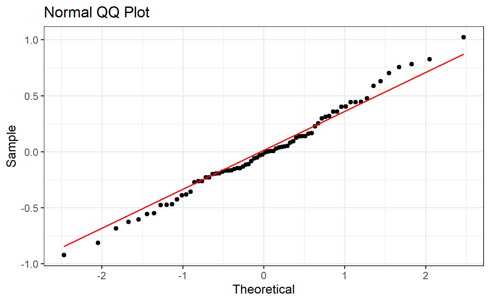

# Experiment 3 - Body Weight
Brent Bachman
2025-05-01

- [<span class="toc-section-number">1</span> Packages](#packages)
- [<span class="toc-section-number">2</span> Data](#data)
  - [<span class="toc-section-number">2.1</span> Import, tidy, and
    transform](#import-tidy-and-transform)
  - [<span class="toc-section-number">2.2</span> Visualize - line
    plot](#visualize---line-plot)
- [<span class="toc-section-number">3</span> Summarize](#summarize)
  - [<span class="toc-section-number">3.1</span> Visualize - bar
    plot](#visualize---bar-plot)
- [<span class="toc-section-number">4</span> Model](#model)
  - [<span class="toc-section-number">4.1</span>
    Assumptions](#assumptions)
    - [<span class="toc-section-number">4.1.1</span> Linearity and
      Homoskedasticity](#linearity-and-homoskedasticity)
    - [<span class="toc-section-number">4.1.2</span>
      Normality](#normality)
  - [<span class="toc-section-number">4.2</span> Omnibus
    Tests](#omnibus-tests)
  - [<span class="toc-section-number">4.3</span> Summary, Reference =
    CHOW](#summary-reference--chow)
  - [<span class="toc-section-number">4.4</span> Summary, Reference =
    HFD-PALM](#summary-reference--hfd-palm)
- [<span class="toc-section-number">5</span> Communicate](#communicate)
- [<span class="toc-section-number">6</span> References](#references)

# Packages

``` r
library("tidyverse")
```

``` r
# install.packages("tidyverse")
```

``` r
sessionInfo()
```

    R version 4.4.2 (2024-10-31 ucrt)
    Platform: x86_64-w64-mingw32/x64
    Running under: Windows 11 x64 (build 26100)

    Matrix products: default


    locale:
    [1] LC_COLLATE=English_United States.utf8 
    [2] LC_CTYPE=English_United States.utf8   
    [3] LC_MONETARY=English_United States.utf8
    [4] LC_NUMERIC=C                          
    [5] LC_TIME=English_United States.utf8    

    time zone: America/New_York
    tzcode source: internal

    attached base packages:
    [1] stats     graphics  grDevices utils     datasets  methods   base     

    other attached packages:
     [1] lubridate_1.9.3 forcats_1.0.0   stringr_1.5.1   dplyr_1.1.4    
     [5] purrr_1.0.2     readr_2.1.5     tidyr_1.3.1     tibble_3.2.1   
     [9] ggplot2_3.5.1   tidyverse_2.0.0

    loaded via a namespace (and not attached):
     [1] gtable_0.3.5      jsonlite_1.8.8    compiler_4.4.2    tidyselect_1.2.1 
     [5] scales_1.3.0      yaml_2.3.10       fastmap_1.2.0     R6_2.5.1         
     [9] generics_0.1.3    knitr_1.48        munsell_0.5.1     pillar_1.9.0     
    [13] tzdb_0.4.0        rlang_1.1.4       utf8_1.2.4        stringi_1.8.4    
    [17] xfun_0.47         timechange_0.3.0  cli_3.6.3         withr_3.0.1      
    [21] magrittr_2.0.3    digest_0.6.37     grid_4.4.2        rstudioapi_0.16.0
    [25] hms_1.1.3         lifecycle_1.0.4   vctrs_0.6.5       evaluate_1.0.0   
    [29] glue_1.7.0        fansi_1.0.6       colorspace_2.1-1  rmarkdown_2.28   
    [33] tools_4.4.2       pkgconfig_2.0.3   htmltools_0.5.8.1

# Data

## Import, tidy, and transform

``` r
# Create a dataframe
mydata <- 
  
  # Import the data
  read_csv(
    file ="data/experiment-3-statsdata.csv",
    show_col_types = FALSE
    ) |>
  
  # Select the variables of interest 
  # BW = body weight
  select(id, cohort, sex, diet, BW_0:BW_53) |>
  
  # Tidy data
  pivot_longer(
    cols = starts_with("BW"),
    names_to = "day",
    values_to = "body_weight",
    values_drop_na = TRUE
    ) |>
  
  # Transform data
  mutate(
  
    # Recode categorical variables as factors
    id = factor(id),
    cohort = factor(
      cohort, 
      levels = c(0, 1),
      labels = c("Cohort A", "Cohort B")
    ),
    sex = factor(
      sex,
      levels = c(0, 1),
      labels = c("Male", "Female")
      ),
    diet = factor(
      diet,
      levels = c(0, 1, 2),
      labels = c("CHOW", "HFD-PALM", "HFD-COCO")
      ),
    
    # Recode cohort and sex using sum coding
   cohort_sum = C(cohort, sum),
   sex_sum    = C(sex, sum),
    
    # Compute time in weeks
    day = parse_number(day),
    week = day/7,
    .before = body_weight
    ) |>
  
  # Drop na values
  drop_na()

# View a summary of the data
summary(mydata)
```

           id            cohort         sex             diet           day       
     1      :  54   Cohort A:1944   Male  :1979   CHOW    :1284   Min.   : 0.00  
     2      :  54   Cohort B:2014   Female:1979   HFD-PALM:1390   1st Qu.:13.00  
     3      :  54                                 HFD-COCO:1284   Median :26.00  
     4      :  54                                                 Mean   :26.44  
     5      :  54                                                 3rd Qu.:40.00  
     6      :  54                                                 Max.   :53.00  
     (Other):3634                                                                
        cohort_sum     sex_sum          week        body_weight   
     Cohort A:1944   Male  :1979   Min.   :0.000   Min.   :249.5  
     Cohort B:2014   Female:1979   1st Qu.:1.857   1st Qu.:316.2  
                                   Median :3.714   Median :443.2  
                                   Mean   :3.777   Mean   :449.3  
                                   3rd Qu.:5.714   3rd Qu.:573.0  
                                   Max.   :7.571   Max.   :760.9  
                                                                  

## Visualize - line plot

``` r
# Create a line plot of each group's body weight over time
line_plot <-
  
  # Call the dataframe
  mydata |> 
  
  # Initialize plot parameters
  ggplot(
    aes(
      x = week, 
      y = body_weight, 
      color = diet, 
      shape = diet
      )
    ) +
  
  # Facet by sex and cohort
  facet_grid(
    sex ~ cohort,
    scales = "free_y"
    ) + 
  
  # Plot the observed means as points
  stat_summary(
    fun = mean,
    geom = "point"
    ) +
  
  # Plot the observed standard errors as errorbars
  stat_summary(
    fun.data = mean_se,
    geom = "errorbar"
    ) +
  
  # Plot connecting lines
  stat_summary(
    fun = mean,
    geom = "line"
    ) +
  
  # Change color title and scale
  scale_color_manual(
    name = "Diet",
    values = c(
      "CHOW"      = "black",
      "HFD-PALM"  = "darkorange3",
      "HFD-COCO"  = "darkorchid3"
      )
    ) +
  
  # Change shape title and scale
  scale_shape_manual(
    name = "Diet",
    values = c(
      "CHOW"      = 15,
      "HFD-PALM"  = 16,
      "HFD-COCO"  = 17
      )
    ) +
  
  # Change y-axis title and scale
  labs(y = "Body Weight (g)") +
  
  # Change x-axis title and scale
  scale_x_continuous(
    name = "Time (Weeks)",
    breaks = seq(from = 0, to = 8, by = 1)) +
  
  # Change overall plot theme
  theme_bw() + 
  
  # Rotate and adjust the x-axis tick labels
  theme(
    axis.text.x = element_text(
      angle = 45,
      vjust = 0.5,
      hjust = 0.5
      ),
    legend.position = "top"
    )

# Show the plot
line_plot
```


In both cohorts, the data seem to increase over time across groups.
However, it seems to increase at a faster rate for both HFD groups.

# Summarize

Let’s compute each subject’s body weight slope over the course of the
dietary intervention.

``` r
# Create a new data frame
model_data <-
  
  # Copy the original dataframe
  mydata |>
  
  # Filter the data to include only days 0 or 53
  filter(day == 0 | day == 53) |>

  # Compute each subject's body weight slope
  group_by(id) |>
  mutate(
    body_weight_slope = 
      (body_weight - lag(body_weight)) / (day - lag(day))
  ) |>
  ungroup() |> 
  
  # Select only the relevant columns
  select(
    id, cohort, cohort_sum, sex, sex_sum, diet, body_weight_slope
  ) |>
  
  # Drop na values
  drop_na(body_weight_slope)

# Show a summary of the data
summary(model_data)
```

           id          cohort      cohort_sum     sex       sex_sum         diet   
     1      : 1   Cohort A:36   Cohort A:36   Male  :37   Male  :37   CHOW    :24  
     2      : 1   Cohort B:38   Cohort B:38   Female:37   Female:37   HFD-PALM:26  
     3      : 1                                                       HFD-COCO:24  
     4      : 1                                                                    
     5      : 1                                                                    
     6      : 1                                                                    
     (Other):68                                                                    
     body_weight_slope
     Min.   :-0.1208  
     1st Qu.: 0.7406  
     Median : 1.2142  
     Mean   : 1.3678  
     3rd Qu.: 1.9019  
     Max.   : 3.3623  
                      

## Visualize - bar plot

Let’s visualize the model data.

``` r
# Create a bar plot of each group's body weight slope
bar_plot <-
  
  # Call the dataset
  model_data |>  
  
  # Plot each group's average energy intake
  ggplot(
    aes(
      x     = diet, 
      y     = body_weight_slope, 
      color = diet, 
      fill  = diet,
      shape = diet
      )
    ) +
  
  # Facet by sex (rows)
  facet_grid(
    sex ~ cohort
    ) + 
  
  # Plot the observed means as points
  stat_summary(
    fun = mean,
    geom = "bar",
    color = "black",
    ) +
  
  # Plot the observed standard errors as errorbars
  stat_summary(
    fun.data = mean_se,
    geom = "errorbar",
    color = "black",
    width = 0.2
    ) +
  
  # Plot individual data points
  geom_point(
    position = position_jitter(
      width = 0.2
    )
  ) +
  
  # Change color title and scale
  scale_color_manual(
    name = "Diet",
    values = c(
      "CHOW"      = "black",
      "HFD-PALM"  = "darkorange4",
      "HFD-COCO"  = "darkorchid4"
      )
    ) +
  
  # Change fill title and scale
  scale_fill_manual(
    name = "Diet",
    values = c(
      "CHOW"     = "ivory3",
      "HFD-PALM" = "darkorange2",
      "HFD-COCO" = "darkorchid2"
      )
    ) +
  
  # Change shape title and scale
  scale_shape_manual(
    name = "Diet",
    values = c(
      "CHOW"      = 15,
      "HFD-PALM"  = 16,
      "HFD-COCO"  = 17
      )
    ) +
  
  # Change x-axis title
  labs(x = "Diet") +
  
  # Change y-axis title and scale
  scale_y_continuous(
    name = "Body Weight Slope (g/day)",
    limits = c(-1, 4), 
    breaks = seq(from = -1, to =  4, by = 1)
  ) +
  
  # Change overall plot theme
  theme_bw() + 
  
  # Remove x-axis title, text, and tick labels
  theme(
    axis.title.x = element_blank(),
    axis.text.x  = element_blank(),
    axis.ticks.x = element_blank()
    )

# Show the plot
bar_plot
```


Consistent with the earlier visualization, body weight slope seems to be
greater for HFD-PALM and, perhaps to a *slightly* lesser degree,
HFD-COCO, in both sexes in both cohorts.

# Model

To test the effects of sex, diet, and their interaction on body weight
slope across the dietary intervention, a multiple linear regression
model will be built with the predictors sex (sum-coded: male = 1 and
female = -1), diet (treatment-coded: CHOW = 0; HFD-PALM and HFD-COCO =
1), cohort (treatment-coded: Cohort A = 0 and Cohort B = 1), as well as
the two- and three-way interactions between each predictor.

``` r
# Build the model
model <- 
  lm(
    body_weight_slope ~ cohort_sum * sex_sum * diet, 
    data = model_data
  )
```

## Assumptions

Before I run any statistical tests, let’s check how well the model
satisfies the assumptions.

First, I need to add the fitted and residual values to the data.

``` r
# Add the fitted and residual values to the dataset
model_fits <- 
  model_data |>
  mutate(
    fits = c(fitted(model)),
    resids = c(residuals(model))
  )
```

### Linearity and Homoskedasticity

Next, I will create a residuals plot to check for linearity and
homoskedasticity.

``` r
# Create a residuals plot to check for linearity and homoskedasticity
residuals_plot <-
  model_fits |>
  ggplot(
    aes(x = fits, y = resids)
  ) +
  
  # Plot individual data points
  geom_point() +
  
  # Plot a horizontal line at y = 0
  geom_hline(yintercept = 0, col = "red") + 
  
  # Change aesthetics
  labs(
    title = "Residuals vs Predicted Values",
    x = "Predicted Values",
    y = "Residuals"
  ) +
  theme_bw() 

# Show the plot
residuals_plot
```


The data seem to be evenly distributed along the horizontal axis,
indicating that the data are approximately linear; and the data seem to
deviate along the y-axes (i.e., from the horizontal red line) evenly
across the x-axis, indicating that the data are homoskedastic.

### Normality

Next, I will create a QQ plot to check for normality.

``` r
# Create a QQ plot to check for normality
qq_plot <-
  model_fits |>
  ggplot(
    aes(sample = resids)
  ) +
  
  # Plot boxplots
  geom_qq() +
  geom_qq_line(col = "red") +
  
  # Change aesthestics
  labs(
    title = "Normal QQ Plot",
    x = "Theoretical",
    y = "Sample"
  ) +
  theme_bw() 

# Show the plot
qq_plot
```



The data seem to fall mostly along the red line, indicating that the
data are approximately normally distributed.

## Omnibus Tests

With the model built, let’s perform omnibus tests for the effects of
each predictor using the function “anova()”. This function uses type I
sum of squares. Thus, it will produce F test statistics for the effects
of each predictor entered sequentially (i.e., the residual effect of
each predictor after accounting for the effects of all the other
predictors entered in the model before it).

``` r
# Perform omnibus tests
model |> anova()
```

    Analysis of Variance Table

    Response: body_weight_slope
                            Df  Sum Sq Mean Sq F value    Pr(>F)    
    cohort_sum               1  4.6680  4.6680 25.3740 4.350e-06 ***
    sex_sum                  1 14.3334 14.3334 77.9126 1.474e-12 ***
    diet                     2 16.7665  8.3832 45.5692 6.707e-13 ***
    cohort_sum:sex_sum       1  0.0090  0.0090  0.0487 0.8260162    
    cohort_sum:diet          2  0.2311  0.1156  0.6282 0.5369081    
    sex_sum:diet             2  2.9109  1.4554  7.9114 0.0008706 ***
    cohort_sum:sex_sum:diet  2  0.9465  0.4733  2.5725 0.0844746 .  
    Residuals               62 11.4060  0.1840                      
    ---
    Signif. codes:  0 '***' 0.001 '**' 0.01 '*' 0.05 '.' 0.1 ' ' 1

When predicting body weight slope over the course of the dietary
intervention, there were significant effects of cohort,
$F(1, 62) = 25.37, p < .001$, sex, $F(1, 62) = 77.91, p < .001$, diet,
$F(2, 62) = 45.57, p < .001$; there were *not* significant effects of
the two-way interactions between cohort and sex,
$F(1, 62) = 0.05, p = .826$, or cohort and diet,
$F(2, 62) = 0.63, p = .537$; there was a significant two-way interaction
between sex and diet, $F(2, 62) = 7.91, p < .001$; and there was *not* a
significant three-way interaction between cohort, sex, and diet,
$F(2, 62) = 1.43, p = .248$.

## Summary, Reference = CHOW

Let’s probe these effects by producing the summary output.

``` r
# Produce summary output
model |> summary()
```


    Call:
    lm(formula = body_weight_slope ~ cohort_sum * sex_sum * diet, 
        data = model_data)

    Residuals:
         Min       1Q   Median       3Q      Max 
    -0.92201 -0.22123 -0.01619  0.24788  1.02233 

    Coefficients:
                                      Estimate Std. Error t value Pr(>|t|)    
    (Intercept)                        0.69599    0.08755   7.949 4.84e-11 ***
    cohort_sum1                        0.34300    0.08755   3.918 0.000226 ***
    sex_sum1                           0.16014    0.08755   1.829 0.072193 .  
    dietHFD-PALM                       1.08806    0.12159   8.949 9.09e-13 ***
    dietHFD-COCO                       0.91116    0.12382   7.359 5.13e-10 ***
    cohort_sum1:sex_sum1              -0.05071    0.08755  -0.579 0.564571    
    cohort_sum1:dietHFD-PALM          -0.12108    0.12159  -0.996 0.323197    
    cohort_sum1:dietHFD-COCO          -0.11761    0.12382  -0.950 0.345866    
    sex_sum1:dietHFD-PALM              0.45520    0.12159   3.744 0.000399 ***
    sex_sum1:dietHFD-COCO              0.36399    0.12382   2.940 0.004610 ** 
    cohort_sum1:sex_sum1:dietHFD-PALM -0.02250    0.12159  -0.185 0.853819    
    cohort_sum1:sex_sum1:dietHFD-COCO  0.22925    0.12382   1.851 0.068863 .  
    ---
    Signif. codes:  0 '***' 0.001 '**' 0.01 '*' 0.05 '.' 0.1 ' ' 1

    Residual standard error: 0.4289 on 62 degrees of freedom
    Multiple R-squared:  0.7775,    Adjusted R-squared:  0.7381 
    F-statistic:  19.7 on 11 and 62 DF,  p-value: 2.805e-16

Overall, the model explained 78% of the variance in body weight slope
across the dietary intervention; and, after adjusting for the number of
predictors, it explained 74%,
$F(11, 62) = 19.70, R^2 = 0.78, R^2_{adj} = 0.74, p < .001$.

Across cohorts and across the sexes, HFD-PALM gained significantly more
body weight per day than CHOW ($B = 1.09, SE = 0.12, p < .001$); and the
magnitude of the difference between HFD-PALM and CHOW was significantly
greater in males than females ($B = 0.46, SE = 0.12, p < .001$). The
magnitude of the difference between HFD-PALM and CHOW did not, however,
significantly interact with cohort ($B = -0.12, SE = 0.12, p = .323$) or
with cohort and sex ($B = 0.02, SE = .12, p = .854$). Similarly,
HFD-COCO also gained significantly more body weight per day than CHOW
($B = 0.91, SE = 0.12, p < .001$); and the magnitidue of the difference
between HFD-COCO and CHOW was significantly greater in males than
females ($B = 0.36, SE = 0.12, p = .005$). The magnitude of the
difference between HFD-COCO and CHOW did not, however, significantly
interact with cohort ($B = -0.12, SE = 0.12, p = .346$) or cohort and
sex ($B = 0.23, SE = 0.12, p = .069$).

## Summary, Reference = HFD-PALM

To compare HFD-COCO with HFD-PALM, let’s relevel the diet variable to
make HFD-PALM the reference group, then refit the model and produce the
summary output. (There is no need to rerun the omnibus tests, as the
“total” effects are already captured, and thus the output would be
identical).

``` r
# Relevel factors to change reference group to HFD-VS
data_palm <- 
  model_data |>
  mutate(
    diet = fct_relevel(diet, "HFD-PALM"), # relevel diet
  )

# Build the model
model_palm <- 
  model |>
  update(
    data = data_palm
  )

# Produce the summary output
model_palm |> summary()
```


    Call:
    lm(formula = body_weight_slope ~ cohort_sum * sex_sum * diet, 
        data = data_palm)

    Residuals:
         Min       1Q   Median       3Q      Max 
    -0.92201 -0.22123 -0.01619  0.24788  1.02233 

    Coefficients:
                                      Estimate Std. Error t value Pr(>|t|)    
    (Intercept)                        1.78405    0.08437  21.146  < 2e-16 ***
    cohort_sum1                        0.22192    0.08437   2.630 0.010742 *  
    sex_sum1                           0.61534    0.08437   7.294 6.66e-10 ***
    dietCHOW                          -1.08806    0.12159  -8.949 9.09e-13 ***
    dietHFD-COCO                      -0.17690    0.12159  -1.455 0.150735    
    cohort_sum1:sex_sum1              -0.07320    0.08437  -0.868 0.388918    
    cohort_sum1:dietCHOW               0.12108    0.12159   0.996 0.323197    
    cohort_sum1:dietHFD-COCO           0.00347    0.12159   0.029 0.977321    
    sex_sum1:dietCHOW                 -0.45520    0.12159  -3.744 0.000399 ***
    sex_sum1:dietHFD-COCO             -0.09121    0.12159  -0.750 0.456008    
    cohort_sum1:sex_sum1:dietCHOW      0.02250    0.12159   0.185 0.853819    
    cohort_sum1:sex_sum1:dietHFD-COCO  0.25174    0.12159   2.070 0.042578 *  
    ---
    Signif. codes:  0 '***' 0.001 '**' 0.01 '*' 0.05 '.' 0.1 ' ' 1

    Residual standard error: 0.4289 on 62 degrees of freedom
    Multiple R-squared:  0.7775,    Adjusted R-squared:  0.7381 
    F-statistic:  19.7 on 11 and 62 DF,  p-value: 2.805e-16

Across cohorts and across the sexes, although HFD-COCO gained less body
weight per day than HFD-PALM, this difference was not statistically
significant ($B = -0.18, SE = 0.12, p = .151$); and the magnitude of the
difference between HFD-COCO and HFD-PALM (or lack thereof) did not
significantly interact with cohort ($B = 0.00, SE = 0.12, p = .977$) or
sex ($B = -0.09, SE = 0.12, p = .456$). There was, however, a
significant three-way interaction between the comparison between
HFD-COCO and HFD-PALM, cohort, and sex
($B = 0.25, SE = 0.12, p = .043$).

or cohort and sex (\$B = )

although the magnitude of this difference was greater in males than
females, this difference was also not statistically significant
($B = 0.16, SE = 0.18, p = .363$).

# Communicate

Let’s save the plots.

``` r
# Save the ...

# line plot
ggsave(
  plot = line_plot,
  filename = "output/experiment-3/02-body-weight/01-line-plot.tiff",
  width = 6, height = 3.708, units = "in", dpi = 300
)

# bar plot
ggsave(
  plot = bar_plot,
  filename = "output/experiment-3/02-body-weight/02-bar-plot.tiff",
  width = 6, height = 3.708, units = "in", dpi = 300
)

# residuals plot
ggsave(
  plot = residuals_plot,
  filename = "output/experiment-3/02-body-weight/03-residuals-plot.tiff",
  width = 6, height = 3.708, units = "in", dpi = 300
)

# qq plot
ggsave(
  plot = qq_plot,
  filename = "output/experiment-3/02-body-weight/04-qq-plot.tiff",
  width = 6, height = 3.708, units = "in", dpi = 300
)
```

``` r
# Save the bar plot as an rds file to be imported later and arranged into a single multi-panel plot with all the body composition data
saveRDS(
  bar_plot,
  file = "output/experiment-3/05-body-comp-figure/02-body-weight.rds"
)
```

# References
