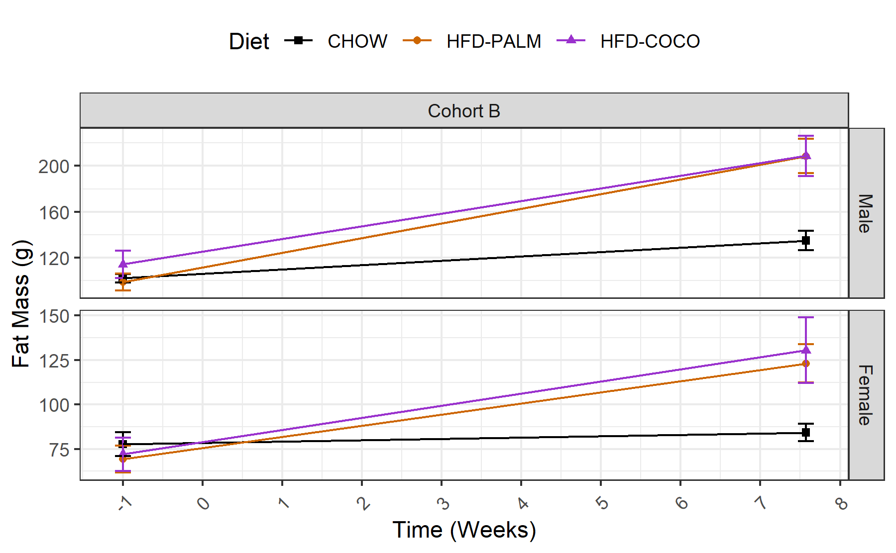
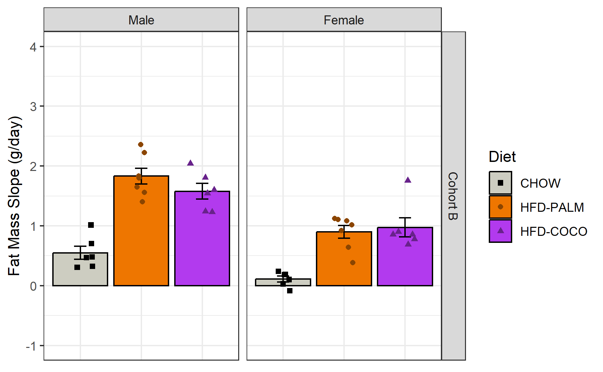
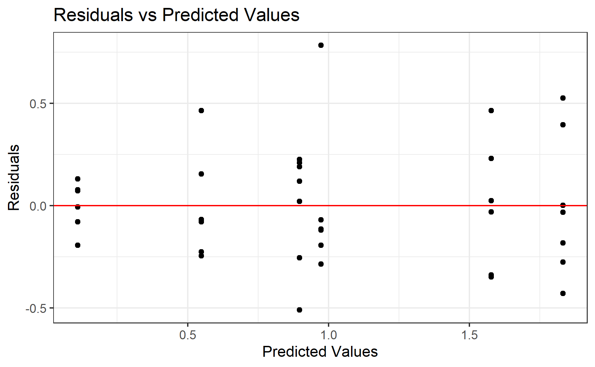
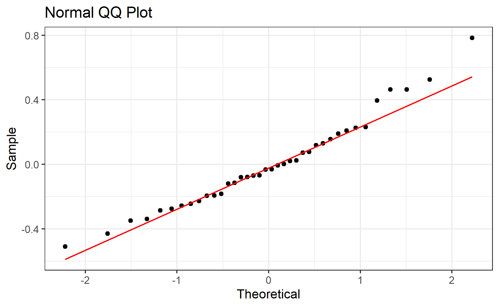

# Experiment 3 - Fat Mass
Brent Bachman
2025-05-01

- [<span class="toc-section-number">1</span> Packages](#packages)
- [<span class="toc-section-number">2</span> Data](#data)
  - [<span class="toc-section-number">2.1</span> Import, tidy, and
    transform](#import-tidy-and-transform)
  - [<span class="toc-section-number">2.2</span> Visualize - line
    plot](#visualize---line-plot)
- [<span class="toc-section-number">3</span> Summary](#summary)
  - [<span class="toc-section-number">3.1</span> Visualize - bar
    plot](#visualize---bar-plot)
- [<span class="toc-section-number">4</span> Model](#model)
  - [<span class="toc-section-number">4.1</span>
    Assumptions](#assumptions)
    - [<span class="toc-section-number">4.1.1</span> Linearity and
      Homoskedasticity](#linearity-and-homoskedasticity)
    - [<span class="toc-section-number">4.1.2</span>
      Normality](#normality)
  - [<span class="toc-section-number">4.2</span> Omnibus
    Tests](#omnibus-tests)
  - [<span class="toc-section-number">4.3</span> Summary, Reference =
    CHOW](#summary-reference--chow)
  - [<span class="toc-section-number">4.4</span> Summary, Reference =
    HFD-PALM](#summary-reference--hfd-palm)
- [<span class="toc-section-number">5</span> Communicate](#communicate)
- [<span class="toc-section-number">6</span> References](#references)

# Packages

``` r
library("tidyverse")
```

``` r
# install.packages("tidyverse")
```

``` r
sessionInfo()
```

    R version 4.4.2 (2024-10-31 ucrt)
    Platform: x86_64-w64-mingw32/x64
    Running under: Windows 11 x64 (build 26100)

    Matrix products: default


    locale:
    [1] LC_COLLATE=English_United States.utf8 
    [2] LC_CTYPE=English_United States.utf8   
    [3] LC_MONETARY=English_United States.utf8
    [4] LC_NUMERIC=C                          
    [5] LC_TIME=English_United States.utf8    

    time zone: America/New_York
    tzcode source: internal

    attached base packages:
    [1] stats     graphics  grDevices utils     datasets  methods   base     

    other attached packages:
     [1] lubridate_1.9.3 forcats_1.0.0   stringr_1.5.1   dplyr_1.1.4    
     [5] purrr_1.0.2     readr_2.1.5     tidyr_1.3.1     tibble_3.2.1   
     [9] ggplot2_3.5.1   tidyverse_2.0.0

    loaded via a namespace (and not attached):
     [1] gtable_0.3.5      jsonlite_1.8.8    compiler_4.4.2    tidyselect_1.2.1 
     [5] scales_1.3.0      yaml_2.3.10       fastmap_1.2.0     R6_2.5.1         
     [9] generics_0.1.3    knitr_1.48        munsell_0.5.1     pillar_1.9.0     
    [13] tzdb_0.4.0        rlang_1.1.4       utf8_1.2.4        stringi_1.8.4    
    [17] xfun_0.47         timechange_0.3.0  cli_3.6.3         withr_3.0.1      
    [21] magrittr_2.0.3    digest_0.6.37     grid_4.4.2        rstudioapi_0.16.0
    [25] hms_1.1.3         lifecycle_1.0.4   vctrs_0.6.5       evaluate_1.0.0   
    [29] glue_1.7.0        fansi_1.0.6       colorspace_2.1-1  rmarkdown_2.28   
    [33] tools_4.4.2       pkgconfig_2.0.3   htmltools_0.5.8.1

# Data

## Import, tidy, and transform

``` r
# Create a dataframe
mydata <- 
  
  # Import the data
  read_csv(
    file ="data/experiment-3-statsdata.csv",
    show_col_types = FALSE
    ) |>
  
  # Select the variables of interest 
  # BW = body weigh
  select(id, cohort, sex, diet, FM_m7, FM_53) |>
  
  # Tidy data
  pivot_longer(
    cols = starts_with("FM"),
    names_to = "day",
    values_to = "fat_mass",
    values_drop_na = TRUE
    ) |>
  
  # Transform data
  mutate(
  
    # Recode categorical variables as factors
    id = factor(id),
    cohort = factor(
      cohort, 
      levels = c(0, 1),
      labels = c("Cohort A", "Cohort B")
    ),
    sex = factor(
      sex,
      levels = c(0, 1),
      labels = c("Male", "Female")
      ),
    diet = factor(
      diet,
      levels = c(0, 1, 2),
      labels = c("CHOW", "HFD-PALM", "HFD-COCO")
      ),
    
    # Recode sex using sum coding
    sex_sum = C(sex, sum),
    
    # Compute time in weeks
    day = parse_number(day),
    day = if_else(
      day == 7,
      -7, 
      53
      ),
    week = day/7,
    .before = fat_mass
    ) |>
  
  # Drop na values
  drop_na()

# View a summary of the data
summary(mydata)
```

           id          cohort       sex           diet         day       sex_sum  
     37     : 2   Cohort A: 0   Male  :38   CHOW    :24   Min.   :-7   Male  :38  
     38     : 2   Cohort B:76   Female:38   HFD-PALM:28   1st Qu.:-7   Female:38  
     39     : 2                             HFD-COCO:24   Median :23              
     40     : 2                                           Mean   :23              
     41     : 2                                           3rd Qu.:53              
     42     : 2                                           Max.   :53              
     (Other):64                                                                   
          week           fat_mass     
     Min.   :-1.000   Min.   : 46.35  
     1st Qu.:-1.000   1st Qu.: 82.11  
     Median : 3.286   Median :106.24  
     Mean   : 3.286   Mean   :118.97  
     3rd Qu.: 7.571   3rd Qu.:137.04  
     Max.   : 7.571   Max.   :277.04  
                                      

## Visualize - line plot

``` r
# Create a line plot of each group's fat mass over time
line_plot <-
  
  # Call the dataset
  mydata |>  
  
  # Initialize plot parameters
  ggplot(
    aes(
      x = week, 
      y = fat_mass, 
      color = diet, 
      shape = diet
      )
    ) +
  
  # Facet by sex and cohort
  facet_grid(
    sex ~ cohort,
    scales = "free_y"
    ) + 
  
  # Plot the observed means as points
  stat_summary(
    fun = mean,
    geom = "point"
    ) +
  
  # Plot the observed standard errors as errorbars
  stat_summary(
    fun.data = mean_se,
    geom = "errorbar",
    width = 0.2
    ) +
  
  # Plot connecting lines
  stat_summary(
    fun = mean,
    geom = "line"
    ) +
  
  # Change color title and scale
  scale_color_manual(
    name = "Diet",
    values = c(
      "CHOW"      = "black",
      "HFD-PALM"  = "darkorange3",
      "HFD-COCO"  = "darkorchid3"
      )
    ) +
  
  # Change shape title and scale
  scale_shape_manual(
    name = "Diet",
    values = c(
      "CHOW"      = 15,
      "HFD-PALM"  = 16,
      "HFD-COCO"  = 17
      )
    ) +
  
  # Change y-axis title and scale
  labs(y = "Fat Mass (g)") +
  
  # Change x-axis title and scale
  scale_x_continuous(
    name = "Time (Weeks)",
    breaks = seq(from = -1, to = 8, by = 1)) +
  
  # Change overall plot theme
  theme_bw() + 
  
  # Rotate and adjust the x-axis tick labels
  theme(
    axis.text.x = element_text(
      angle = 45,
      vjust = 0.5,
      hjust = 0.5
      ),
    legend.position = "top"
    )

# Show the plot
line_plot
```



In both cohorts, the data seem to increase over time across groups.
However, it seems to increase at a faster rate for both HFD groups.

# Summary

First, let’s calculate each subject’s fat mass slope across the dietary
intervention.

``` r
# Create a new data frame
model_data <-
  
  # Copy the original dataframe
  mydata |>

  # Compute each subject's fat mass slope
  group_by(id) |>
  mutate(
    fat_slope = 
      (fat_mass - lag(fat_mass)) / (day - lag(day))
  ) |>
  ungroup() |> 
  
  # Select only the relevant columns
  select(
    id, cohort, sex, sex_sum, diet, fat_slope
  ) |>
  
  # Drop na values
  drop_na(fat_slope)

# Show a summary of the data
summary(model_data)
```

           id          cohort       sex       sex_sum         diet   
     37     : 1   Cohort A: 0   Male  :19   Male  :19   CHOW    :12  
     38     : 1   Cohort B:38   Female:19   Female:19   HFD-PALM:14  
     39     : 1                                         HFD-COCO:12  
     40     : 1                                                      
     41     : 1                                                      
     42     : 1                                                      
     (Other):32                                                      
       fat_slope       
     Min.   :-0.08508  
     1st Qu.: 0.47291  
     Median : 0.96567  
     Mean   : 1.00942  
     3rd Qu.: 1.55421  
     Max.   : 2.35788  
                       

## Visualize - bar plot

Let’s visualize the model data.

``` r
# Create a plot object
bar_plot <-
  
  # Call the dataset
  model_data |>  
  
  # Plot each group's average energy intake
  ggplot(
    aes(
      x     = diet, 
      y     = fat_slope, 
      color = diet, 
      fill  = diet,
      shape = diet
      )
    ) +
  
  # Facet by sex (rows)
  facet_grid(
    cohort ~ sex
    ) + 
  
  # Plot the observed means as points
  stat_summary(
    fun = mean,
    geom = "bar",
    color = "black",
    ) +
  
  # Plot the observed standard errors as errorbars
  stat_summary(
    fun.data = mean_se,
    geom = "errorbar",
    color = "black",
    width = 0.2
    ) +
  
  # Plot individual data points
  geom_point(
    position = position_jitter(
      width = 0.2
    )
  ) +
  
  # Change color title and scale
  scale_color_manual(
    name = "Diet",
    values = c(
      "CHOW"      = "black",
      "HFD-PALM"  = "darkorange4",
      "HFD-COCO"  = "darkorchid4"
      )
    ) +
  
  # Change fill title and scale
  scale_fill_manual(
    name = "Diet",
    values = c(
      "CHOW"     = "ivory3",
      "HFD-PALM" = "darkorange2",
      "HFD-COCO" = "darkorchid2"
      )
    ) +
  
  # Change shape title and scale
  scale_shape_manual(
    name = "Diet",
    values = c(
      "CHOW"      = 15,
      "HFD-PALM"  = 16,
      "HFD-COCO"  = 17
      )
    ) +
  
  # Change x-axis title
  labs(x = "Diet") +
  
  # Change y-axis title and scale
  scale_y_continuous(
    name = "Fat Mass Slope (g/day)",
    limits = c(-1, 4), 
    breaks = seq(from = -1, to =  4, by = 1)
  ) +
  
  # Change overall plot theme
  theme_bw() + 
  
  # Remove x-axis title, text, and tick labels
  theme(
    axis.title.x = element_blank(),
    axis.text.x  = element_blank(),
    axis.ticks.x = element_blank()
    )

# Show the plot
bar_plot
```



Consistent with the earlier visualization, fat mass slope seems to be
greater for HFD-PALM and, perhaps to a *slightly* lesser degree,
HFD-COCO, in both sexes in both cohorts.

# Model

To test the effects of sex, diet, and their interaction on the linear
slope of fat mass across the dietary intervention, a multiple linear
regression model will be built with the predictors sex (sum-coded: male
= 1 and female = -1), diet (treatment-coded: CHOW = 0; HFD-PALM and
HFD-COCO = 1), and the interaction between sex and diet.

``` r
# Build the model
model <- lm(
  fat_slope ~ sex_sum * diet, 
  data = model_data
  )
```

## Assumptions

Before I run any statistical tests, let’s check how well the model
satisfies the assumptions.

First, I need to add the fitted and residual values to the data.

``` r
# Add the fitted and residual values to the dataset
model_fits <- 
  model_data |>
  mutate(
    fits = c(fitted(model)),
    resids = c(residuals(model))
  )
```

### Linearity and Homoskedasticity

Next, I will create a residuals plot to check for linearity and
homoskedasticity.

``` r
# Create a residuals plot to check for linearity and homoskedasticity
residuals_plot <-
  model_fits |>
  ggplot(
    aes(x = fits, y = resids)
  ) +
  
  # Plot individual data points
  geom_point() +
  
  # Plot a horizontal line at y = 0
  geom_hline(yintercept = 0, col = "red") + 
  
  # Change aesthetics
  labs(
    title = "Residuals vs Predicted Values",
    x = "Predicted Values",
    y = "Residuals"
  ) +
  theme_bw() 

# Show the plot
residuals_plot
```



The data seem to be evenly distributed along the horizontal axis,
indicating that the data are approximately linear; and the data seem to
deviate along the y-axes (i.e., from the horizontal red line) evenly
across the x-axis, indicating that the data are homoskedastic.

### Normality

Next, I will create a QQ plot to check for normality.

``` r
# Create a QQ plot to check for normality
qq_plot <-
  model_fits |>
  ggplot(
    aes(sample = resids)
  ) +
  
  # Plot boxplots
  geom_qq() +
  geom_qq_line(col = "red") +
  
  # Change aesthestics
  labs(
    title = "Normal QQ Plot",
    x = "Theoretical",
    y = "Sample"
  ) +
  theme_bw() 

# Show the plot
qq_plot
```



The data seem to fall mostly along the red line, indicating that the
data are approximately normally distributed.

## Omnibus Tests

With the model built, let’s perform omnibus tests for the effects of
each predictor using the function “anova()”. This function uses type I
sum of squares. Thus, it will produce F test statistics for the effects
of each predictor entered sequentially (i.e., the residual effect of
each predictor after accounting for the effects of all the other
predictors entered in the model before it).

``` r
# Perform omnibus tests
model |> anova()
```

    Analysis of Variance Table

    Response: fat_slope
                 Df Sum Sq Mean Sq F value    Pr(>F)    
    sex_sum       1 4.3218  4.3218 47.5887 8.283e-08 ***
    diet          2 8.1643  4.0822 44.9498 5.086e-10 ***
    sex_sum:diet  2 0.4184  0.2092  2.3034    0.1163    
    Residuals    32 2.9061  0.0908                      
    ---
    Signif. codes:  0 '***' 0.001 '**' 0.01 '*' 0.05 '.' 0.1 ' ' 1

When predicting fat mass slope across the dietary intervention, there
were significant effects of sex, $F(1, 32) = 47.59, p < .001$, and diet,
$F(2, 32) = 44.95, p < .001$, but not an interaction between sex and
diet, $F(2, 32) = 2.30, p = .116$.

## Summary, Reference = CHOW

Let’s probe these effects by producing the summary output.

``` r
# Produce summary output
model |> summary()
```


    Call:
    lm(formula = fat_slope ~ sex_sum * diet, data = model_data)

    Residuals:
        Min      1Q  Median      3Q     Max 
    -0.5097 -0.1943 -0.0320  0.1489  0.7836 

    Coefficients:
                          Estimate Std. Error t value Pr(>|t|)    
    (Intercept)            0.32929    0.08699   3.785 0.000638 ***
    sex_sum1               0.21976    0.08699   2.526 0.016679 *  
    dietHFD-PALM           1.03520    0.11855   8.732 5.61e-10 ***
    dietHFD-COCO           0.94601    0.12303   7.689 9.15e-09 ***
    sex_sum1:dietHFD-PALM  0.24794    0.11855   2.091 0.044515 *  
    sex_sum1:dietHFD-COCO  0.08277    0.12303   0.673 0.505939    
    ---
    Signif. codes:  0 '***' 0.001 '**' 0.01 '*' 0.05 '.' 0.1 ' ' 1

    Residual standard error: 0.3014 on 32 degrees of freedom
    Multiple R-squared:  0.8162,    Adjusted R-squared:  0.7875 
    F-statistic: 28.42 on 5 and 32 DF,  p-value: 6.879e-11

Overall, the model explained 82% of the variance in fat mass slope
across the dietary intervention; and, after adjusting for the number of
predictors, it explained 79%,
$F(5, 32) = 28.42, R^2 = 0.82, R^2_{adj} = 0.79, p < .001$.

Across the sexes, both HFD-PALM ($B = 1.04, SE = 0.12, p < .001$) and
HFD-COCO ($B = 0.95, SE = 0.12, p  <.001$) gained significantly more fat
mass per day than CHOW. The magnitude of the difference between CHOW and
HFD-PALM ($B = 0.25, SE = 0.12, p = .045$) but not HFD-COCO
($B = 0.08, SE = 0.12, p = .506$) was significantly greater in males
than females.

## Summary, Reference = HFD-PALM

To compare HFD-COCO with HFD-PALM, let’s relevel the diet variable to
make HFD-PALM the reference group, then refit the model and produce the
summary output. (There is no need to rerun the omnibus tests, as the
“total” effects are already captured, and thus the output would be
identical).

``` r
# Relevel factors to change reference group to HFD-VS
data_palm <- 
  model_data |>
  mutate(
    diet = fct_relevel(diet, "HFD-PALM"), # relevel diet
  )

# Build the model
model_palm <- 
  model |>
  update(
    data = data_palm
  )

# Produce the summary output
model_palm |> summary()
```


    Call:
    lm(formula = fat_slope ~ sex_sum * diet, data = data_palm)

    Residuals:
        Min      1Q  Median      3Q     Max 
    -0.5097 -0.1943 -0.0320  0.1489  0.7836 

    Coefficients:
                          Estimate Std. Error t value Pr(>|t|)    
    (Intercept)            1.36449    0.08054  16.942  < 2e-16 ***
    sex_sum1               0.46770    0.08054   5.807 1.90e-06 ***
    dietCHOW              -1.03520    0.11855  -8.732 5.61e-10 ***
    dietHFD-COCO          -0.08919    0.11855  -0.752   0.4574    
    sex_sum1:dietCHOW     -0.24794    0.11855  -2.091   0.0445 *  
    sex_sum1:dietHFD-COCO -0.16518    0.11855  -1.393   0.1731    
    ---
    Signif. codes:  0 '***' 0.001 '**' 0.01 '*' 0.05 '.' 0.1 ' ' 1

    Residual standard error: 0.3014 on 32 degrees of freedom
    Multiple R-squared:  0.8162,    Adjusted R-squared:  0.7875 
    F-statistic: 28.42 on 5 and 32 DF,  p-value: 6.879e-11

Across the sexes, although HFD-COCO gained less fat mass per day than
HFD-PALM, this difference was not statistically significant
($B = -0.09, SE = 0.12, p = .457$); and although the magnitude of this
difference was greater in males than females, this difference was also
not statistically significant ($B = -0.17, SE = 0.12, p = .173$).

# Communicate

Let’s save the plots.

``` r
# Save the ...

# line plot
ggsave(
  plot = line_plot,
  filename = "output/experiment-3/03-fat-mass/01-line-plot.tiff",
  width = 6, height = 3.708, units = "in", dpi = 300
)

# bar plot
ggsave(
  plot = bar_plot,
  filename = "output/experiment-3/03-fat-mass/02-bar-plot.tiff",
  width = 6, height = 3.708, units = "in", dpi = 300
)

# residuals plot
ggsave(
  plot = residuals_plot,
  filename = "output/experiment-3/03-fat-mass/03-residuals-plot.tiff",
  width = 6, height = 3.708, units = "in", dpi = 300
)

# qq plot
ggsave(
  plot = qq_plot,
  filename = "output/experiment-3/03-fat-mass/04-qq-plot.tiff",
  width = 6, height = 3.708, units = "in", dpi = 300
)
```

``` r
# Save the bar plot as an rds file to be imported later and arranged into a single multi-panel plot with all the body composition data
saveRDS(
  bar_plot,
  file = "output/experiment-3/05-body-comp-figure/03-fat-mass.rds"
)
```

# References
