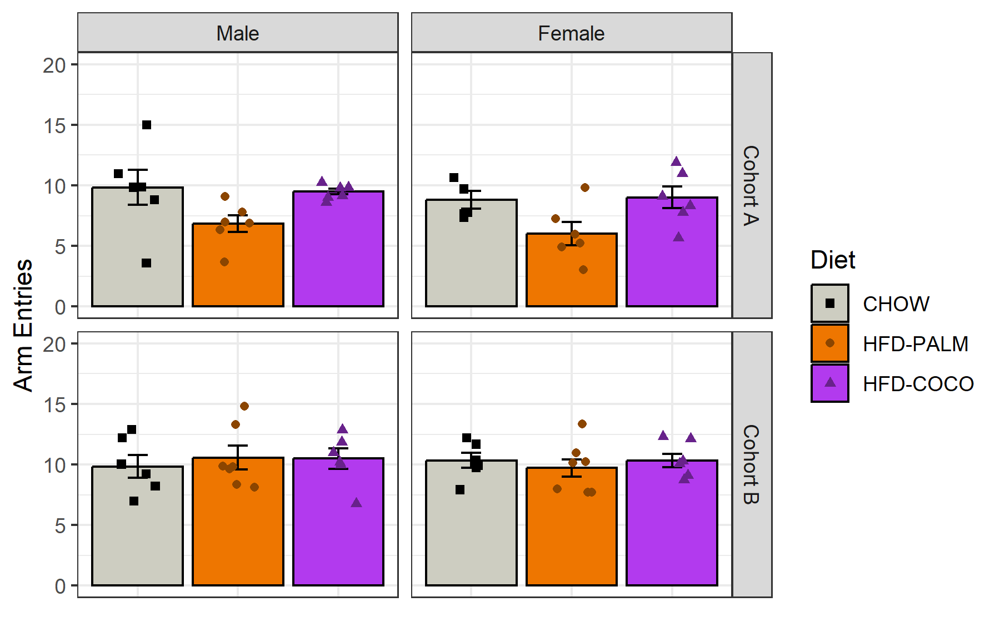
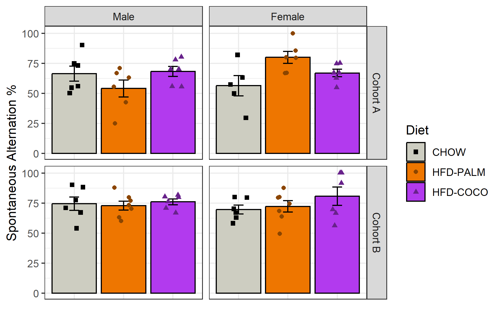
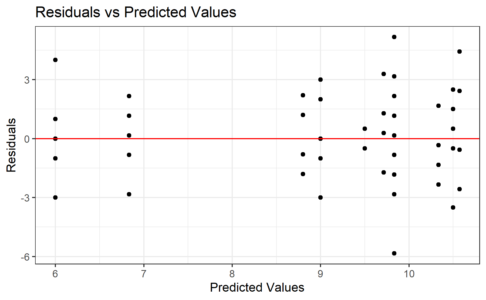
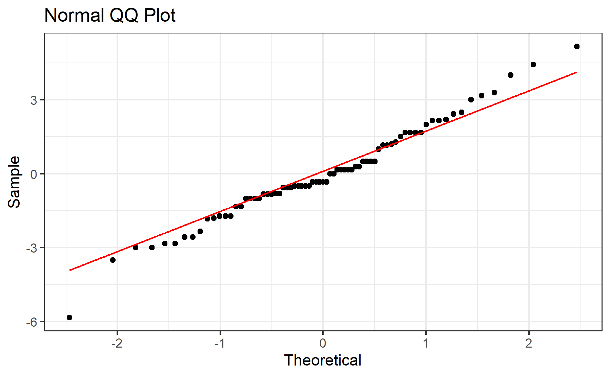
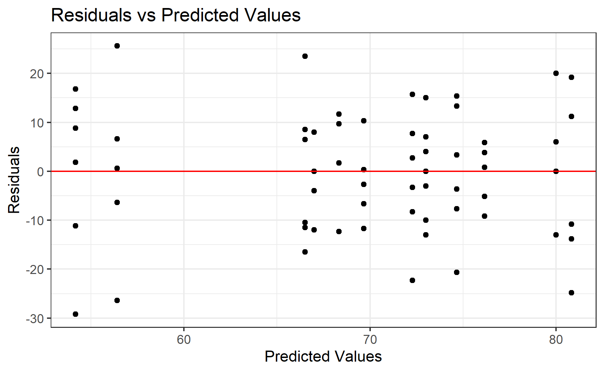
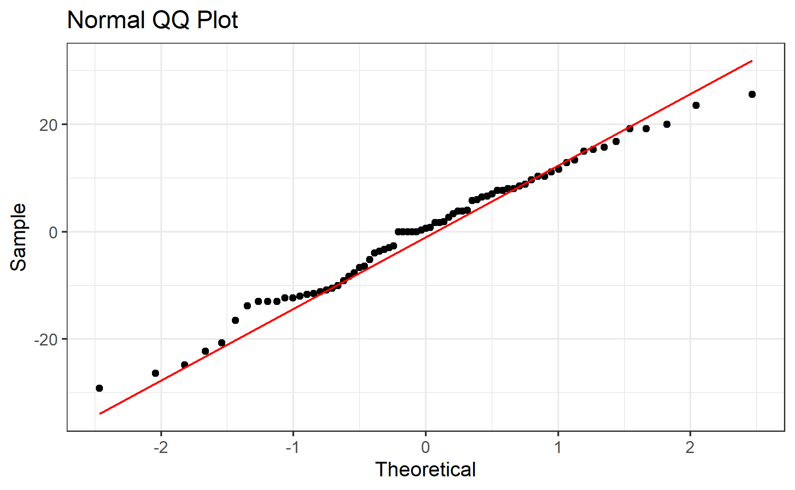
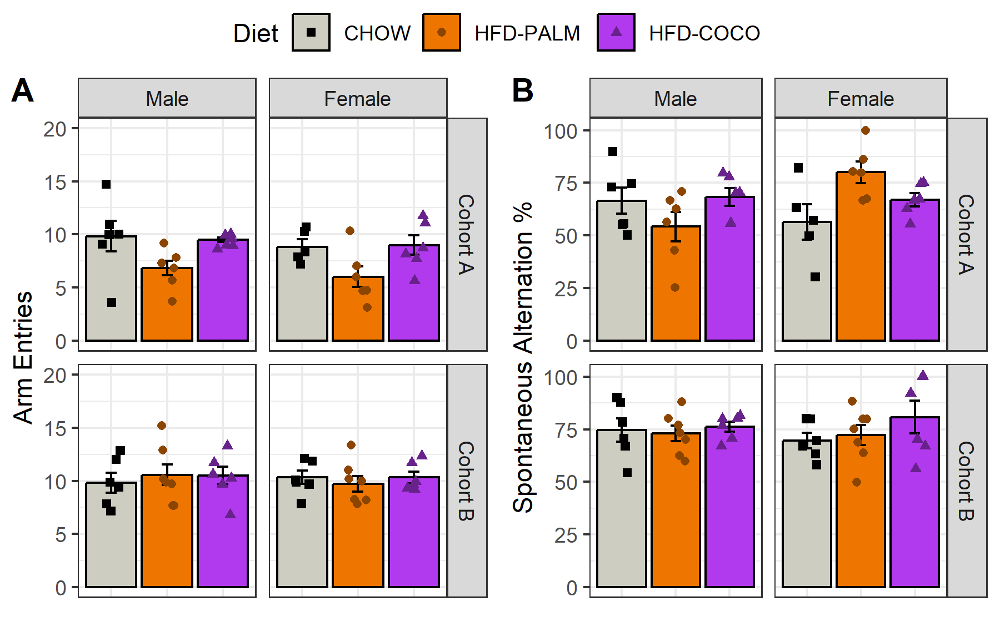

# Experiment 3 - Y-Maze
Brent Bachman
2025-05-02

- [<span class="toc-section-number">1</span> Packages](#packages)
- [<span class="toc-section-number">2</span> Data](#data)
  - [<span class="toc-section-number">2.1</span> Import, tidy, and
    transform](#import-tidy-and-transform)
  - [<span class="toc-section-number">2.2</span> Visualize](#visualize)
    - [<span class="toc-section-number">2.2.1</span> Arm
      Entries](#arm-entries)
    - [<span class="toc-section-number">2.2.2</span> Spontaneous
      Alternations](#spontaneous-alternations)
- [<span class="toc-section-number">3</span> Model 1](#model-1)
  - [<span class="toc-section-number">3.1</span>
    Assumptions](#assumptions)
    - [<span class="toc-section-number">3.1.1</span> Linearity and
      Homoskedasticity](#linearity-and-homoskedasticity)
    - [<span class="toc-section-number">3.1.2</span>
      Normality](#normality)
  - [<span class="toc-section-number">3.2</span> Omnibus
    Tests](#omnibus-tests)
  - [<span class="toc-section-number">3.3</span> Summary, Reference =
    CHOW](#summary-reference--chow)
  - [<span class="toc-section-number">3.4</span> Summary, Reference =
    HFD-PALM](#summary-reference--hfd-palm)
- [<span class="toc-section-number">4</span> Model 2](#model-2)
  - [<span class="toc-section-number">4.1</span>
    Assumptions](#assumptions-1)
    - [<span class="toc-section-number">4.1.1</span> Linearity and
      Homoskedasticity](#linearity-and-homoskedasticity-1)
    - [<span class="toc-section-number">4.1.2</span>
      Normality](#normality-1)
  - [<span class="toc-section-number">4.2</span> Omnibus
    Tests](#omnibus-tests-1)
  - [<span class="toc-section-number">4.3</span> Summary, Reference =
    CHOW](#summary-reference--chow-1)
  - [<span class="toc-section-number">4.4</span> Summary, Reference =
    HFD-PALM](#summary-reference--hfd-palm-1)
  - [<span class="toc-section-number">4.5</span> Summary, Reference =
    Male](#summary-reference--male)
  - [<span class="toc-section-number">4.6</span> Summary, Reference =
    Female](#summary-reference--female)
- [<span class="toc-section-number">5</span> Communicate](#communicate)
- [<span class="toc-section-number">6</span> References](#references)

# Packages

``` r
library("tidyverse")
library("ggpubr")
library("lsr")
```

``` r
# install.packages("tidyverse")
# install.packages("ggpubr")
# install.packages("lsr")
```

``` r
sessionInfo()
```

    R version 4.4.2 (2024-10-31 ucrt)
    Platform: x86_64-w64-mingw32/x64
    Running under: Windows 11 x64 (build 26100)

    Matrix products: default


    locale:
    [1] LC_COLLATE=English_United States.utf8 
    [2] LC_CTYPE=English_United States.utf8   
    [3] LC_MONETARY=English_United States.utf8
    [4] LC_NUMERIC=C                          
    [5] LC_TIME=English_United States.utf8    

    time zone: America/New_York
    tzcode source: internal

    attached base packages:
    [1] stats     graphics  grDevices utils     datasets  methods   base     

    other attached packages:
     [1] lsr_0.5.2       ggpubr_0.6.0    lubridate_1.9.3 forcats_1.0.0  
     [5] stringr_1.5.1   dplyr_1.1.4     purrr_1.0.2     readr_2.1.5    
     [9] tidyr_1.3.1     tibble_3.2.1    ggplot2_3.5.1   tidyverse_2.0.0

    loaded via a namespace (and not attached):
     [1] gtable_0.3.5      jsonlite_1.8.8    ggsignif_0.6.4    compiler_4.4.2   
     [5] tidyselect_1.2.1  scales_1.3.0      yaml_2.3.10       fastmap_1.2.0    
     [9] R6_2.5.1          generics_0.1.3    knitr_1.48        backports_1.5.0  
    [13] car_3.1-2         munsell_0.5.1     pillar_1.9.0      tzdb_0.4.0       
    [17] rlang_1.1.4       utf8_1.2.4        broom_1.0.6       stringi_1.8.4    
    [21] xfun_0.47         timechange_0.3.0  cli_3.6.3         withr_3.0.1      
    [25] magrittr_2.0.3    digest_0.6.37     grid_4.4.2        rstudioapi_0.16.0
    [29] hms_1.1.3         lifecycle_1.0.4   vctrs_0.6.5       rstatix_0.7.2    
    [33] evaluate_1.0.0    glue_1.7.0        abind_1.4-8       carData_3.0-5    
    [37] fansi_1.0.6       colorspace_2.1-1  rmarkdown_2.28    tools_4.4.2      
    [41] pkgconfig_2.0.3   htmltools_0.5.8.1

# Data

## Import, tidy, and transform

``` r
# Create a dataframe called mydata
mydata <- 
  
  # Import the data
  read_csv(
    file ="data/experiment-3-statsdata.csv",
    show_col_types = FALSE
    ) |>
  
  # Select the variables of interest 
  # ei = energy intake
  select(id, sex, diet, cohort, arm_entries, spontaneous_alternations) |>
  
  # Transform data
  mutate(
  
    # Recode categorical variables as factors
    id = factor(id),
    cohort = factor(
      cohort,
      levels = c(0, 1),
      labels = c("Cohort A", "Cohort B")
      ),
    sex = factor(
      sex,
      levels = c(0, 1),
      labels = c("Male", "Female")
      ),
    diet = factor(
      diet,
      levels = c(0, 1, 2),
      labels = c("CHOW", "HFD-PALM", "HFD-COCO")
      ),
    
    # Recode cohort and sex using sum coding
    cohort_sum = C(cohort, sum),
    sex_sum    = C(sex, sum)
    ) |>
  
  drop_na()

# View a summary of the data
summary(mydata)
```

           id         sex           diet         cohort    arm_entries    
     1      : 1   Male  :37   CHOW    :23   Cohort A:35   Min.   : 3.000  
     2      : 1   Female:36   HFD-PALM:26   Cohort B:38   1st Qu.: 8.000  
     3      : 1               HFD-COCO:24                 Median :10.000  
     5      : 1                                           Mean   : 9.301  
     6      : 1                                           3rd Qu.:10.000  
     7      : 1                                           Max.   :15.000  
     (Other):67                                                           
     spontaneous_alternations    cohort_sum   sex_sum  
     Min.   : 25.00           Cohort A:35   Male  :37  
     1st Qu.: 63.00           Cohort B:38   Female:36  
     Median : 70.00                                    
     Mean   : 70.18                                    
     3rd Qu.: 80.00                                    
     Max.   :100.00                                    
                                                       

## Visualize

### Arm Entries

Let’s plot the number of total arm entries.

``` r
# Create a plot object
arm_entries_plot <-
  
  # Call the dataset
  mydata |>  
  
  # Plot each gorup's number of total arm entries
  ggplot(
    aes(
      x = diet, 
      y = arm_entries, 
      color = diet, 
      fill  = diet,
      shape = diet
      )
    ) +
  
  # Facet by cohort and sex
  facet_grid(
    cohort ~ sex
    ) + 
  
  # Plot the observed means as bars
  stat_summary(
    fun = mean,
    geom = "bar",
    color = "black",
    ) +
  
  # Plot the observed standard errors as errorbars
  stat_summary(
    fun.data = mean_se,
    geom = "errorbar",
    color = "black",
    width = 0.2
    ) +
  
  # Plot individual data points
  geom_point(
    position = position_jitter(
      width = 0.2
    )
  ) +
  
  # Change color title and scale
  scale_color_manual(
    name = "Diet",
    values = c(
      "CHOW"      = "black",
      "HFD-PALM"  = "darkorange4",
      "HFD-COCO"  = "darkorchid4"
      )
    ) +
  
  # Change fill title and scale
  scale_fill_manual(
    name = "Diet",
    values = c(
      "CHOW"     = "ivory3",
      "HFD-PALM" = "darkorange2",
      "HFD-COCO" = "darkorchid2"
      )
    ) +
  
  # Change shape title and scale
  scale_shape_manual(
    name = "Diet",
    values = c(
      "CHOW"      = 15,
      "HFD-PALM"  = 16,
      "HFD-COCO"  = 17
      )
    ) +
  
  # Change y-axis title and scale
  scale_y_continuous(
    name = "Arm Entries",
    limits = c(0, 20),
    breaks = seq(from = 0, to = 20, by = 5)
    ) +
  
  # Remove x-axis title
  labs(x = "") +
  
  # Change overall plot theme
  theme_bw() + 
  
  # Rotate and adjust the x-axis tick labels
  theme(
    axis.title.x = element_blank(),
    axis.text.x  = element_blank(),
    axis.ticks.x = element_blank()
    )

# Show the plot
arm_entries_plot
```



### Spontaneous Alternations

Now let’s plot the percentage of spontaneous alternations.

``` r
# Create a plot object
spon_alt_plot <-
  
  # Call the dataset
  mydata |>  
  
  # Plot each group's spontaneous alternation percentage
  ggplot(
    aes(
      x     = diet, 
      y     = spontaneous_alternations, 
      color = diet, 
      fill  = diet,
      shape = diet
      )
    ) +
  
  # Facet by sex
  facet_grid(
    cohort ~ sex,
    ) + 
  
  # Plot the observed means as points
  stat_summary(
    fun = mean,
    geom = "bar",
    color = "black",
    ) +
  
  # Plot the observed standard errors as errorbars
  stat_summary(
    fun.data = mean_se,
    geom = "errorbar",
    color = "black",
    width = 0.2
    ) +
  
  # Plot individual data points
  geom_point(
    position = position_jitter(
      width = 0.2
    )
  ) +
  
  # Change color title and scale
  scale_color_manual(
    name = "Diet",
    values = c(
      "CHOW"      = "black",
      "HFD-PALM"  = "darkorange4",
      "HFD-COCO"  = "darkorchid4"
      )
    ) +
  
  # Change fill title and scale
  scale_fill_manual(
    name = "Diet",
    values = c(
      "CHOW"     = "ivory3",
      "HFD-PALM" = "darkorange2",
      "HFD-COCO" = "darkorchid2"
      )
    ) +
  
  # Change shape title and scale
  scale_shape_manual(
    name = "Diet",
    values = c(
      "CHOW"      = 15,
      "HFD-PALM"  = 16,
      "HFD-COCO"  = 17
      )
    ) +
  
  # Change x-axis title
  labs(x = "Diet") +
  
  # Change y-axis title and scale
  scale_y_continuous(
    name = "Spontaneous Alternation %",
    limits = c(0, 101),
    breaks = seq(from = 0, to = 100, by = 25)
  ) +
  
  # Change overall plot theme
  theme_bw() + 
  
  # Remove x-axis tick labels
  theme(
    axis.title.x = element_blank(),
    axis.text.x  = element_blank(),
    axis.ticks.x = element_blank()
    )

# Show the plot
spon_alt_plot
```



# Model 1

To test the effects of cohort, sex, diet, and their interactions on the
number of total arm entries in the y-maze, a multiple linear regression
model will be built with the following predictors: cohort
(treatment-coded: Cohort A = 0 and Cohort B = 1), sex (sum-coded: male =
1, female = -1), diet (treatment coded: CHOW = 0; HFD-PALM and HFD-COCO
= 1), and all the two- and three-way interactions between these
predictors.

``` r
# Build the model
model1 <- lm(
  arm_entries ~ cohort_sum * sex_sum * diet,
  data = mydata
)
```

## Assumptions

Before I run any statistical tests, let’s check how well the model
satisfies the assumptions.

First, I need to add the fitted and residual values to the data.

``` r
# Add the fitted and residual values to the dataset
model1_fits <- 
  mydata |>
  mutate(
    fits = c(fitted(model1)),
    resids = c(residuals(model1))
  )
```

### Linearity and Homoskedasticity

Next, I will create a residuals plot to check for linearity and
homoskedasticity.

``` r
# Create a residuals plot to check for linearity and homoskedasticity
model1_residuals_plot <-
  model1_fits |>
  ggplot(
    aes(x = fits, y = resids)
  ) +
  
  # Plot individual data points
  geom_point() +
  
  # Plot a horizontal line at y = 0
  geom_hline(yintercept = 0, col = "red") + 
  
  # Change aesthetics
  labs(
    title = "Residuals vs Predicted Values",
    x = "Predicted Values",
    y = "Residuals"
  ) +
  theme_bw() 

# Show the plot
model1_residuals_plot
```



The data seem to be linear and homoskedastic.

### Normality

Next, I will create a QQ plot to check for normality.

``` r
# Create a QQ plot to check for normality
model1_qq_plot <-
  model1_fits |>
  ggplot(
    aes(sample = resids)
  ) +
  
  # Plot points and qq line
  geom_qq() +
  geom_qq_line(col = "red") +
  
  # Change aesthestics
  labs(
    title = "Normal QQ Plot",
    x = "Theoretical",
    y = "Sample"
  ) +
  theme_bw() 

# Show the plot
model1_qq_plot
```



The data seem to be approximately normally distributed.

## Omnibus Tests

With the model built, let’s perform omnibus tests for the effects of
each predictor using the function “anova()”. This function uses type I
sum of squares. Thus, it will produce F test statistics for the effects
of each predictor entered sequentially (i.e., the residual effect of
each predictor after accounting for the effects of all the other
predictors entered in the model before it).

``` r
# Perform omnibus F tests
model1 |> anova()
```

    Analysis of Variance Table

    Response: arm_entries
                            Df  Sum Sq Mean Sq F value    Pr(>F)    
    cohort_sum               1  65.511  65.511 14.6859 0.0003027 ***
    sex_sum                  1   4.785   4.785  1.0726 0.3044390    
    diet                     2  33.641  16.820  3.7707 0.0285753 *  
    cohort_sum:sex_sum       1   1.673   1.673  0.3750 0.5425758    
    cohort_sum:diet          2  32.248  16.124  3.6146 0.0328443 *  
    sex_sum:diet             2   1.424   0.712  0.1596 0.8528333    
    cohort_sum:sex_sum:diet  2   1.979   0.989  0.2218 0.8017468    
    Residuals               61 272.110   4.461                      
    ---
    Signif. codes:  0 '***' 0.001 '**' 0.01 '*' 0.05 '.' 0.1 ' ' 1

When predicting the number of total arm entries in the y-maze, there was
a significant effect of cohort, $F(1, 61) = 14.69, p < .001$. There was
*not* a significant effect of sex, $F(1, 61) = 1.07, p = .304$. There
was a significant effect of diet, $F(2, 61) = 3.77, p = .029$. There was
*not* a significant interaction between cohort and sex,
$F(1, 61) = 0.38, p = .543$. There was a significant interaction between
cohort and diet, $F(2, 61) = 3.62, p = .033$. There was *not* a
significant interaction between sex and diet,
$F(2, 61) = 0.16, p = .853$. There was *not* a significant three-way
interaction between cohort, sex, and diet, $F(2, 61) = 0.22, p = .802$.

## Summary, Reference = CHOW

Let’s take a look at the summary output.

``` r
# Produce summary output
model1 |> summary()
```


    Call:
    lm(formula = arm_entries ~ cohort_sum * sex_sum * diet, data = mydata)

    Residuals:
        Min      1Q  Median      3Q     Max 
    -5.8333 -1.0000 -0.3333  1.2000  5.1667 

    Coefficients:
                                      Estimate Std. Error t value Pr(>|t|)    
    (Intercept)                        9.70000    0.44177  21.957   <2e-16 ***
    cohort_sum1                       -0.38333    0.44177  -0.868   0.3889    
    sex_sum1                           0.13333    0.44177   0.302   0.7638    
    dietHFD-PALM                      -1.42024    0.60643  -2.342   0.0225 *  
    dietHFD-COCO                       0.13333    0.61727   0.216   0.8297    
    cohort_sum1:sex_sum1               0.38333    0.44177   0.868   0.3889    
    cohort_sum1:dietHFD-PALM          -1.47976    0.60643  -2.440   0.0176 *  
    cohort_sum1:dietHFD-COCO          -0.20000    0.61727  -0.324   0.7470    
    sex_sum1:dietHFD-PALM              0.28929    0.60643   0.477   0.6350    
    sex_sum1:dietHFD-COCO              0.03333    0.61727   0.054   0.9571    
    cohort_sum1:sex_sum1:dietHFD-PALM -0.38929    0.60643  -0.642   0.5233    
    cohort_sum1:sex_sum1:dietHFD-COCO -0.30000    0.61727  -0.486   0.6287    
    ---
    Signif. codes:  0 '***' 0.001 '**' 0.01 '*' 0.05 '.' 0.1 ' ' 1

    Residual standard error: 2.112 on 61 degrees of freedom
    Multiple R-squared:  0.3417,    Adjusted R-squared:  0.223 
    F-statistic: 2.879 on 11 and 61 DF,  p-value: 0.004151

The model explained 34% of the variation in the number of total arm
entries in the y-maze; and, after accounting for the number of
predictors in the model, it accounted for 22%,
$F(11, 61) = 2.88, p = .004$.

Across cohort and sex, HFD-PALM performed significantly less total arm
entries than CHOW ($B = -1.42, SE = 0.61, p = .023$). However, the
magnitude of the difference between HFD-PALM and CHOW was significantly
greater in Cohort A ($B = -1.48, SE = 0.61, p = .018$). (Indeed, the
sign of the difference was flipped in Cohort B). The magnitude of the
difference between HFD-PALM and CHOW did not significantly interact with
sex ($B = 0.29, SE = 0.61, p = .635$) or cohort and sex
($B = -0.39, SE = 0.61, p = .523$). Across cohort and sex, HFD-COCO did
not perform a significantly different number of total arm entries than
CHOW ($B = 0.13, SE = 0.62, p = .830$); and the magnitude of the
difference between HFD-COCO and CHOW (or lack thereof) did not
significantly interact with cohort ($B = -0.20, SE = 0.62, p = .747$),
sex ($B = 0.03, SE = 0.62, p = .957$), or cohort and sex
($B = -0.30, SE = 0.62, p = .629$).

## Summary, Reference = HFD-PALM

To compare HFD-COCO with HFD-PALM, let’s relevel the diet variable to
make HFD-PALM the reference group, then refit the model and produce the
summary output. (There is no need to rerun the omnibus tests, as the
“total” effects are already captured, and thus the output would be
identical).

``` r
# Relevel factors to change reference group to HFD-VS
mydata_palm <- 
  mydata |>
  mutate(
    diet = fct_relevel(diet, "HFD-PALM"), # relevel diet
  )

# Build the model
model1_palm <- 
  model1 |>
  update(
    data = mydata_palm
  )

# Produce the summary output
model1_palm |> summary()
```


    Call:
    lm(formula = arm_entries ~ cohort_sum * sex_sum * diet, data = mydata_palm)

    Residuals:
        Min      1Q  Median      3Q     Max 
    -5.8333 -1.0000 -0.3333  1.2000  5.1667 

    Coefficients:
                                       Estimate Std. Error t value Pr(>|t|)    
    (Intercept)                        8.279762   0.415441  19.930  < 2e-16 ***
    cohort_sum1                       -1.863095   0.415441  -4.485 3.29e-05 ***
    sex_sum1                           0.422619   0.415441   1.017   0.3130    
    dietCHOW                           1.420238   0.606425   2.342   0.0225 *  
    dietHFD-COCO                       1.553571   0.598714   2.595   0.0118 *  
    cohort_sum1:sex_sum1              -0.005952   0.415441  -0.014   0.9886    
    cohort_sum1:dietCHOW               1.479762   0.606425   2.440   0.0176 *  
    cohort_sum1:dietHFD-COCO           1.279762   0.598714   2.138   0.0366 *  
    sex_sum1:dietCHOW                 -0.289286   0.606425  -0.477   0.6350    
    sex_sum1:dietHFD-COCO             -0.255952   0.598714  -0.428   0.6705    
    cohort_sum1:sex_sum1:dietCHOW      0.389286   0.606425   0.642   0.5233    
    cohort_sum1:sex_sum1:dietHFD-COCO  0.089286   0.598714   0.149   0.8819    
    ---
    Signif. codes:  0 '***' 0.001 '**' 0.01 '*' 0.05 '.' 0.1 ' ' 1

    Residual standard error: 2.112 on 61 degrees of freedom
    Multiple R-squared:  0.3417,    Adjusted R-squared:  0.223 
    F-statistic: 2.879 on 11 and 61 DF,  p-value: 0.004151

Across cohort and sex, HFD-COCO performed significantly more total arm
entries than HFD-PALM ($B = 1.55, SE = 0.60, p = .012$). The magnitude
of the difference between HFD-COCO and HFD-PALM was significantly
greater in Cohort A ($B = 1.28, SE = 0.60, p = .037$). The magnitude of
the difference between HFD-COCO and HFD-PALM did not significantly
interact with sex ($B = -0.26, SE = 0.60, p = .671$) or cohort and sex
($B = 0.09, SE = 0.60, p = .882$).

# Model 2

To test the effects of cohort, sex, diet, and their interactions on the
percentage of spontaneous alternations in the y-maze, a multiple linear
regression model will be built with the following predictors: cohort
(treatment-coded: Cohort A = 0 and Cohort B = 1), sex (sum-coded: male =
1, female = -1), diet (treatment coded: CHOW = 0; HFD-PALM and HFD-COCO
= 1), and all the two- and three-way interactions between these
predictors.

``` r
# Build the model
model2 <- lm(
  spontaneous_alternations ~ cohort * sex_sum * diet,
  data = mydata
)
```

## Assumptions

Before I run any statistical tests, let’s check how well the model
satisfies the assumptions.

First, I need to add the fitted and residual values to the data.

``` r
# Add the fitted and residual values to the dataset
model2_fits <- 
  mydata |>
  mutate(
    fits = c(fitted(model2)),
    resids = c(residuals(model2))
  )
```

### Linearity and Homoskedasticity

Next, I will create a residuals plot to check for linearity and
homoskedasticity.

``` r
# Create a residuals plot to check for linearity and homoskedasticity
model2_residuals_plot <-
  model2_fits |>
  ggplot(
    aes(x = fits, y = resids)
  ) +
  
  # Plot individual data points
  geom_point() +
  
  # Plot a horizontal line at y = 0
  geom_hline(yintercept = 0, col = "red") + 
  
  # Change aesthetics
  labs(
    title = "Residuals vs Predicted Values",
    x = "Predicted Values",
    y = "Residuals"
  ) +
  theme_bw() 

# Show the plot
model2_residuals_plot
```



The data seem to be linear and homoskedastic.

### Normality

Next, I will create a QQ plot to check for normality.

``` r
# Create a QQ plot to check for normality
model2_qq_plot <-
  model2_fits |>
  ggplot(
    aes(sample = resids)
  ) +
  
  # Plot points and qq line
  geom_qq() +
  geom_qq_line(col = "red") +
  
  # Change aesthestics
  labs(
    title = "Normal QQ Plot",
    x = "Theoretical",
    y = "Sample"
  ) +
  theme_bw() 

# Show the plot
model2_qq_plot
```



The data seem to be approximately normally distributed.

## Omnibus Tests

Let’s perform omnibus tests for the effects of each predictor.

``` r
# Run omnibus tests
model2 |> anova()
```

    Analysis of Variance Table

    Response: spontaneous_alternations
                        Df  Sum Sq Mean Sq F value   Pr(>F)   
    cohort               1  1374.2 1374.25  7.9635 0.006434 **
    sex_sum              1   107.7  107.71  0.6242 0.432556   
    diet                 2   420.2  210.08  1.2174 0.303102   
    cohort:sex_sum       1   146.5  146.47  0.8488 0.360523   
    cohort:diet          2   101.0   50.50  0.2926 0.747347   
    sex_sum:diet         2  1110.5  555.27  3.2177 0.046934 * 
    cohort:sex_sum:diet  2  1073.9  536.97  3.1116 0.051666 . 
    Residuals           61 10526.6  172.57                    
    ---
    Signif. codes:  0 '***' 0.001 '**' 0.01 '*' 0.05 '.' 0.1 ' ' 1

When predicting the percentage of spontaneous alternations in the
y-maze, there *was* a significant main effect of cohort,
$F(1, 61) = 7.96, p = .006$; there *was not* a significant main effect
of sex, $F(1, 61) = 0.62, p = .433$; there *was not* a significant main
effect of diet, $F(2, 61) = 1.22, p = .303$; there *was not* a
significant two-way interaction between cohort and sex,
$F(1, 61) = 0.85, p = .361$; there *was not* a significant two-way
interaction between cohort and diet, $F(2, 61) = 0.29, p = .747$; there
*was* a significant two-way interaction between sex and diet,
$(2, 61) = 3.22, p = .047$; and there *was not* a significant three-way
interaction between cohort, sex, and diet, $F(2, 61) = 3.11, p = .052$.

The three-way interaction was trending towards significance. Let’s
compute its effect size.

``` r
# Compute effect size
model2 |> etaSquared()
```

                             eta.sq eta.sq.part
    cohort              0.096619744 0.120028412
    sex_sum             0.006654078 0.009306295
    diet                0.027683817 0.037611939
    cohort:sex_sum      0.010477422 0.014575628
    cohort:diet         0.007289004 0.010185249
    sex_sum:diet        0.074729801 0.095430121
    cohort:sex_sum:diet 0.072267188 0.092576490

## Summary, Reference = CHOW

Let’s take a look at the summary output.

``` r
# Produce summary output
model2 |> summary()
```


    Call:
    lm(formula = spontaneous_alternations ~ cohort * sex_sum * diet, 
        data = mydata)

    Residuals:
       Min     1Q Median     3Q    Max 
    -29.17 -10.00   0.60   8.00  25.60 

    Coefficients:
                                         Estimate Std. Error t value Pr(>|t|)    
    (Intercept)                           61.4500     3.9773  15.450  < 2e-16 ***
    cohortCohort B                        10.7167     5.4954   1.950  0.05576 .  
    sex_sum1                               5.0500     3.9773   1.270  0.20901    
    dietHFD-PALM                           5.6333     5.4954   1.025  0.30936    
    dietHFD-COCO                           6.2167     5.4954   1.131  0.26238    
    cohortCohort B:sex_sum1               -2.5500     5.4954  -0.464  0.64428    
    cohortCohort B:dietHFD-PALM           -5.1571     7.5436  -0.684  0.49679    
    cohortCohort B:dietHFD-COCO            0.1167     7.6786   0.015  0.98793    
    sex_sum1:dietHFD-PALM                -17.9667     5.4954  -3.269  0.00177 ** 
    sex_sum1:dietHFD-COCO                 -4.3833     5.4954  -0.798  0.42817    
    cohortCohort B:sex_sum1:dietHFD-PALM  15.8238     7.5436   2.098  0.04009 *  
    cohortCohort B:sex_sum1:dietHFD-COCO  -0.4500     7.6786  -0.059  0.95346    
    ---
    Signif. codes:  0 '***' 0.001 '**' 0.01 '*' 0.05 '.' 0.1 ' ' 1

    Residual standard error: 13.14 on 61 degrees of freedom
    Multiple R-squared:  0.2916,    Adjusted R-squared:  0.1639 
    F-statistic: 2.283 on 11 and 61 DF,  p-value: 0.02067

The model explained 29% of the variance in the percentage of spontaneous
alternations in the y-maze; and, after adjusting for the number of
predictors, it accounted for 16%, $F(11, 61) = 2.28, p = .021$.

Across cohort and sex, HFD-PALM did not exhibit a significantly
different y-maze spontaneous alternation percentage than CHOW
($B = 5.63, SE = 5.50, p = .309$). However, although the difference
between HFD-PALM and CHOW did not significantly interact with cohort
($B = -5.16, SE = 7.54, p = .497$), it was significantly more-negative
in males than females ($B = -17.97, SE = 5.50, p = .002$); and this
effect was attenuated in Cohort B ($B = 15.82, SE = 7.54, p = .040$).
Across cohort and sex, HFD-COCO did not exhibit a significantly
different y-maze spontaneous alternation percentage than CHOW
($B = 6.22, SE = 5.45, p = .262$); and this difference (or lack thereof)
did not significantly interact with either cohort
($B = 0.12, SE = 7.68, p = .988$), sex
($B = -4.38, SE = 5.50, p = .428$), or cohort and sex
($B = -0.45, SE = 7.68, p = .954$).

## Summary, Reference = HFD-PALM

To compare HFD-COCO with HFD-PALM, let’s relevel the diet variable to
make HFD-PALM the reference group, then refit the model and produce the
summary output. (There is no need to rerun the omnibus tests, as the
“total” effects are already captured, and thus the output would be
identical).

``` r
# Relevel factors to change reference group to HFD-VS
mydata_palm <- 
  mydata |>
  mutate(
    diet = fct_relevel(diet, "HFD-PALM"), # relevel diet
  )

# Build the model
model2_palm <- 
  model2 |>
  update(
    data = mydata_palm
  )

# Produce the summary output
model2_palm |> summary()
```


    Call:
    lm(formula = spontaneous_alternations ~ cohort * sex_sum * diet, 
        data = mydata_palm)

    Residuals:
       Min     1Q Median     3Q    Max 
    -29.17 -10.00   0.60   8.00  25.60 

    Coefficients:
                                         Estimate Std. Error t value Pr(>|t|)    
    (Intercept)                           67.0833     3.7922  17.690  < 2e-16 ***
    cohortCohort B                         5.5595     5.1679   1.076  0.28626    
    sex_sum1                             -12.9167     3.7922  -3.406  0.00117 ** 
    dietCHOW                              -5.6333     5.4954  -1.025  0.30936    
    dietHFD-COCO                           0.5833     5.3630   0.109  0.91374    
    cohortCohort B:sex_sum1               13.2738     5.1679   2.569  0.01268 *  
    cohortCohort B:dietCHOW                5.1571     7.5436   0.684  0.49679    
    cohortCohort B:dietHFD-COCO            5.2738     7.4477   0.708  0.48157    
    sex_sum1:dietCHOW                     17.9667     5.4954   3.269  0.00177 ** 
    sex_sum1:dietHFD-COCO                 13.5833     5.3630   2.533  0.01390 *  
    cohortCohort B:sex_sum1:dietCHOW     -15.8238     7.5436  -2.098  0.04009 *  
    cohortCohort B:sex_sum1:dietHFD-COCO -16.2738     7.4477  -2.185  0.03273 *  
    ---
    Signif. codes:  0 '***' 0.001 '**' 0.01 '*' 0.05 '.' 0.1 ' ' 1

    Residual standard error: 13.14 on 61 degrees of freedom
    Multiple R-squared:  0.2916,    Adjusted R-squared:  0.1639 
    F-statistic: 2.283 on 11 and 61 DF,  p-value: 0.02067

Across cohort and sex, HFD-COCO did not exhibit a significantly
different y-maze spontaneous alternation percentage than HFD-PALM
($B = 0.58, SE = 5.36, p = .914$). The difference between HFD-COCO and
HFD-PALM was significantly more-positive in males than females
($B = 13.58, SE = 5.36, p = .014$); and this effect was attenuated in
Cohort B ($B = -16.27, SE = 7.45, p = .033$).

## Summary, Reference = Male

To directly test whether spontaneous alternation percentage was reduced
in Cohort A Male HFD-PALM relative to CHOW, let’s rebuild the model with
sex variable treatment coded with male as the reference group.

``` r
# Rebuild the model with sex as treatment-coded with male as the reference group
model2_male <- lm(
  spontaneous_alternations ~ cohort * sex * diet,
  data = mydata
)

model2_male |> summary()
```


    Call:
    lm(formula = spontaneous_alternations ~ cohort * sex * diet, 
        data = mydata)

    Residuals:
       Min     1Q Median     3Q    Max 
    -29.17 -10.00   0.60   8.00  25.60 

    Coefficients:
                                          Estimate Std. Error t value Pr(>|t|)    
    (Intercept)                            66.5000     5.3630  12.400  < 2e-16 ***
    cohortCohort B                          8.1667     7.5844   1.077  0.28582    
    sexFemale                             -10.1000     7.9545  -1.270  0.20901    
    dietHFD-PALM                          -12.3333     7.5844  -1.626  0.10907    
    dietHFD-COCO                            1.8333     7.5844   0.242  0.80980    
    cohortCohort B:sexFemale                5.1000    10.9908   0.464  0.64428    
    cohortCohort B:dietHFD-PALM            10.6667    10.5326   1.013  0.31519    
    cohortCohort B:dietHFD-COCO            -0.3333    10.7259  -0.031  0.97531    
    sexFemale:dietHFD-PALM                 35.9333    10.9908   3.269  0.00177 ** 
    sexFemale:dietHFD-COCO                  8.7667    10.9908   0.798  0.42817    
    cohortCohort B:sexFemale:dietHFD-PALM -31.6476    15.0872  -2.098  0.04009 *  
    cohortCohort B:sexFemale:dietHFD-COCO   0.9000    15.3572   0.059  0.95346    
    ---
    Signif. codes:  0 '***' 0.001 '**' 0.01 '*' 0.05 '.' 0.1 ' ' 1

    Residual standard error: 13.14 on 61 degrees of freedom
    Multiple R-squared:  0.2916,    Adjusted R-squared:  0.1639 
    F-statistic: 2.283 on 11 and 61 DF,  p-value: 0.02067

Within Cohort A Males, alhough HFD-PALM performed less % spontaneous
alternations than CHOW, this difference was not statistically
significant ($B = -12.33, SE = 7.58, p = 0.11$).

## Summary, Reference = Female

To directly test whether spontaneous alternation percentage was
increased in Cohort A female HFD-PALM relative to CHOW, let’s rebuild
the model with the sex variable treatment coded with female as the
reference group.

``` r
# Relevel factors to change reference group to Female
mydata_female <- 
  mydata |>
  mutate(
    sex = fct_relevel(sex, "Female"), # relevel diet
  )

# Build the model
model2_female<- 
  model2_male |>
  update(
    data = mydata_female
  )

# Produce the summary output
model2_female |> summary()
```


    Call:
    lm(formula = spontaneous_alternations ~ cohort * sex * diet, 
        data = mydata_female)

    Residuals:
       Min     1Q Median     3Q    Max 
    -29.17 -10.00   0.60   8.00  25.60 

    Coefficients:
                                        Estimate Std. Error t value Pr(>|t|)    
    (Intercept)                          56.4000     5.8748   9.600 8.29e-14 ***
    cohortCohort B                       13.2667     7.9545   1.668  0.10048    
    sexMale                              10.1000     7.9545   1.270  0.20901    
    dietHFD-PALM                         23.6000     7.9545   2.967  0.00429 ** 
    dietHFD-COCO                         10.6000     7.9545   1.333  0.18763    
    cohortCohort B:sexMale               -5.1000    10.9908  -0.464  0.64428    
    cohortCohort B:dietHFD-PALM         -20.9810    10.8023  -1.942  0.05672 .  
    cohortCohort B:dietHFD-COCO           0.5667    10.9908   0.052  0.95905    
    sexMale:dietHFD-PALM                -35.9333    10.9908  -3.269  0.00177 ** 
    sexMale:dietHFD-COCO                 -8.7667    10.9908  -0.798  0.42817    
    cohortCohort B:sexMale:dietHFD-PALM  31.6476    15.0872   2.098  0.04009 *  
    cohortCohort B:sexMale:dietHFD-COCO  -0.9000    15.3572  -0.059  0.95346    
    ---
    Signif. codes:  0 '***' 0.001 '**' 0.01 '*' 0.05 '.' 0.1 ' ' 1

    Residual standard error: 13.14 on 61 degrees of freedom
    Multiple R-squared:  0.2916,    Adjusted R-squared:  0.1639 
    F-statistic: 2.283 on 11 and 61 DF,  p-value: 0.02067

Within Cohort A Females, HFD-PALM exhibited a significantly greater
spontaneous alternation percentage in the y-maze than CHOW
($B = 23.60, SE = 7.96, p = .004$).

# Communicate

``` r
# Arrange both plots into a single, multi-panel figure
arranged_plot <- 
  ggarrange(
    arm_entries_plot,
    spon_alt_plot,
    nrow = 1,
    ncol = 2,
    labels = c("A", "B"),
    common.legend = TRUE
  )

# Show the plot
arranged_plot
```



Now, let’s save all the plots.

``` r
# Save the ...

# arm entries plot
ggsave(
  plot = arm_entries_plot,
  filename = "output/experiment-3/06-y-maze/01-arm-entries.tiff",
  width = 6, height = 3.708, units = "in", dpi = 300
)

# arm entries residuals plot
ggsave(
  plot = model1_residuals_plot,
  filename = "output/experiment-3/06-y-maze/02-arm-entries-residuals-plot.tiff",
  width = 6, height = 3.708, units = "in", dpi = 300
)

# arm entries qq plot
ggsave(
  plot = model1_qq_plot,
  filename = "output/experiment-3/06-y-maze/03-arm-entries-qq-plot.tiff",
  width = 6, height = 3.708, units = "in", dpi = 300
)

# spontaneous alternations plot
ggsave(
  plot = spon_alt_plot,
  filename = "output/experiment-3/06-y-maze/04-spontaneous-alternations-plot.tiff",
  width = 6, height = 3.708, units = "in", dpi = 300
)

# spontaneous alternations residuals plot
ggsave(
  plot = model2_residuals_plot,
  filename = "output/experiment-3/06-y-maze/05-spontaneous-alternation-residuals-plot.tiff",
  width = 6, height = 3.708, units = "in", dpi = 300
)

# spontaneous alternations qq plot
ggsave(
  plot = model2_qq_plot,
  filename = "output/experiment-3/06-y-maze/06-spontaneous-alternation-qq-plot.tiff",
  width = 6, height = 3.708, units = "in", dpi = 300
)

# arranged plot - 300 dpi
ggsave(
  plot = arranged_plot,
  filename = "output/experiment-3/06-y-maze/07-y-maze-arranged-plot-300.tiff",
  width = 6, height = 3.708, units = "in", dpi = 300
)

# arranged plot - 1200 dpi
ggsave(
  plot = arranged_plot,
  filename = "output/experiment-3/06-y-maze/08-y-maze-arranged-plot-1200.tiff",
  width = 6, height = 3.708, units = "in", dpi = 300
)
```

# References
