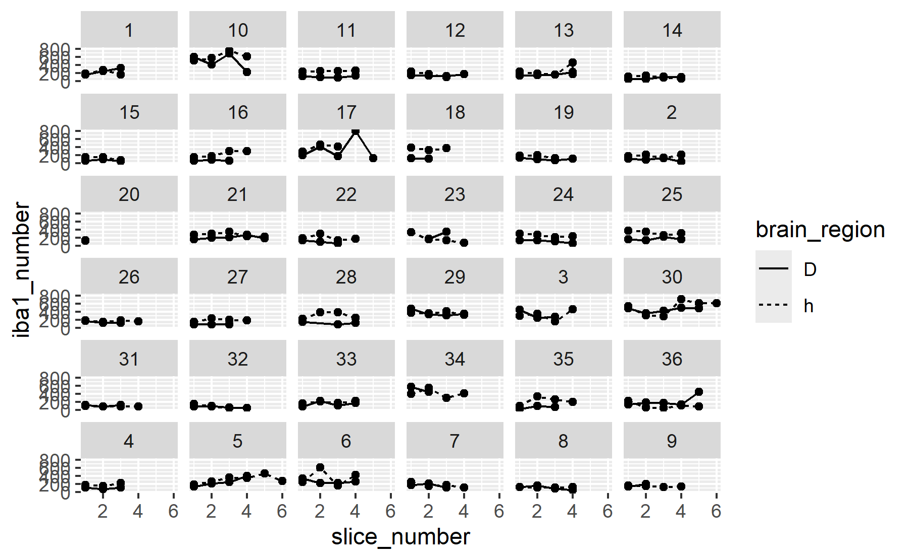
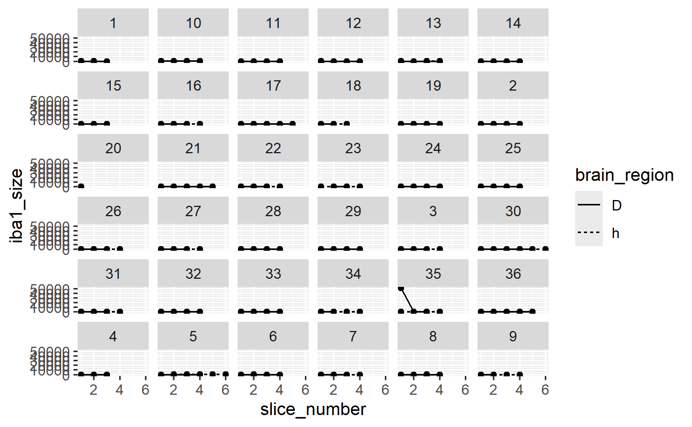
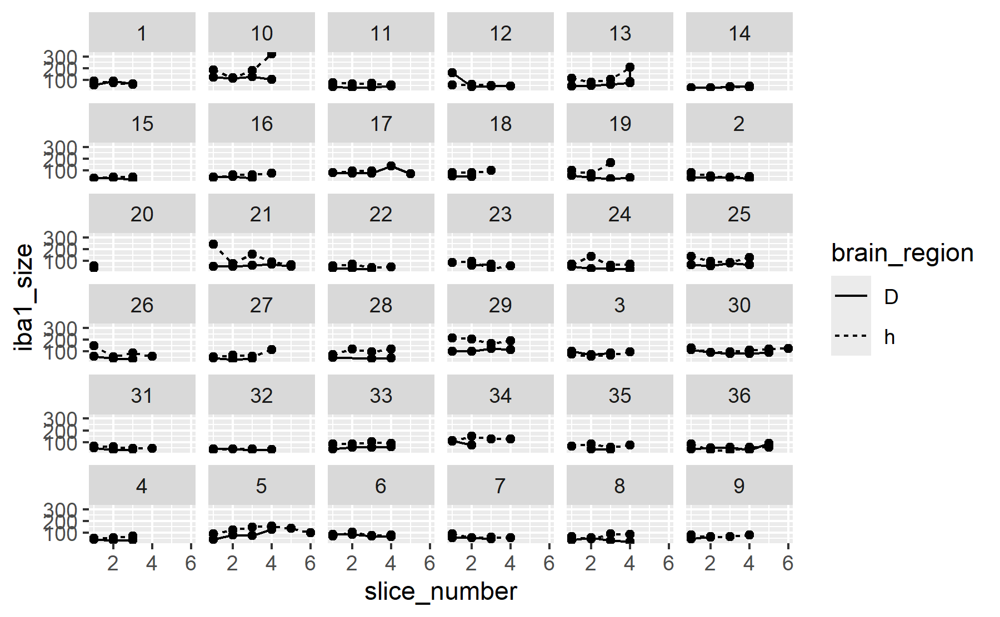
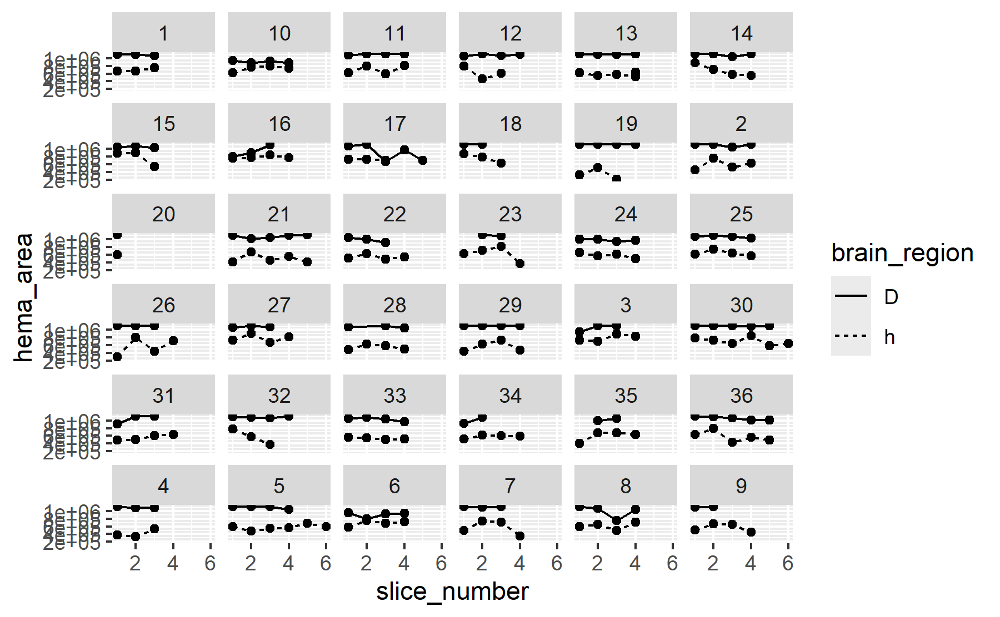
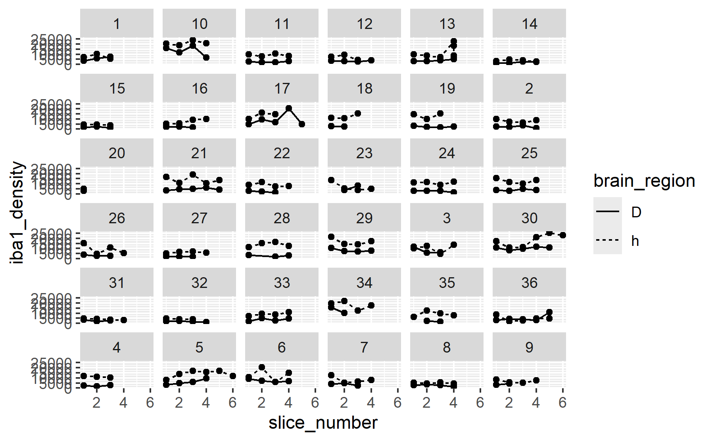

# Experiment 3 - iba1 data processing
Brent Bachman
2025-05-02

- [<span class="toc-section-number">1</span> Packages](#packages)
- [<span class="toc-section-number">2</span> Data](#data)
- [<span class="toc-section-number">3</span> Visualize](#visualize)

# Packages

``` r
library("tidyverse")
```

``` r
# install.packages("tidyverse")
```

``` r
sessionInfo()
```

    R version 4.4.2 (2024-10-31 ucrt)
    Platform: x86_64-w64-mingw32/x64
    Running under: Windows 11 x64 (build 26100)

    Matrix products: default


    locale:
    [1] LC_COLLATE=English_United States.utf8 
    [2] LC_CTYPE=English_United States.utf8   
    [3] LC_MONETARY=English_United States.utf8
    [4] LC_NUMERIC=C                          
    [5] LC_TIME=English_United States.utf8    

    time zone: America/New_York
    tzcode source: internal

    attached base packages:
    [1] stats     graphics  grDevices utils     datasets  methods   base     

    other attached packages:
     [1] lubridate_1.9.3 forcats_1.0.0   stringr_1.5.1   dplyr_1.1.4    
     [5] purrr_1.0.2     readr_2.1.5     tidyr_1.3.1     tibble_3.2.1   
     [9] ggplot2_3.5.1   tidyverse_2.0.0

    loaded via a namespace (and not attached):
     [1] gtable_0.3.5      jsonlite_1.8.8    compiler_4.4.2    tidyselect_1.2.1 
     [5] scales_1.3.0      yaml_2.3.10       fastmap_1.2.0     R6_2.5.1         
     [9] generics_0.1.3    knitr_1.48        munsell_0.5.1     pillar_1.9.0     
    [13] tzdb_0.4.0        rlang_1.1.4       utf8_1.2.4        stringi_1.8.4    
    [17] xfun_0.47         timechange_0.3.0  cli_3.6.3         withr_3.0.1      
    [21] magrittr_2.0.3    digest_0.6.37     grid_4.4.2        rstudioapi_0.16.0
    [25] hms_1.1.3         lifecycle_1.0.4   vctrs_0.6.5       evaluate_1.0.0   
    [29] glue_1.7.0        fansi_1.0.6       colorspace_2.1-1  rmarkdown_2.28   
    [33] tools_4.4.2       pkgconfig_2.0.3   htmltools_0.5.8.1

# Data

``` r
# Create a dataframe called mydata
mydata <- 
  
  # Import the data
  read_csv(
    file ="data/iba1-data/experiment-3-iba1-data.csv",
    show_col_types = FALSE
    ) |> 
  
  # Separate the slice string into components by the delimiter "_"
  separate_wider_delim(
    cols = Slice, 
    delim = "_",
    names = c("id", "region_slice", NA, "signal_type")
  ) |>
  
  # Create three new columns
  # one for the slice number
  # one for the brain region (D = dorsal hippocampus and h = hypothalamus)
  # one for cell type (1 = H, 2 = DAB)
  mutate(
    brain_region = str_sub(region_slice, 1, 1),
    slice_number = parse_number(region_slice),
    signal_type = parse_number(signal_type),
    .before = Count
  ) |> 
  
  # Deselect variables of disinterest
  select(-region_slice, -"%Area")

# Show a summary of the dataframe
summary(mydata)
```

          id             signal_type  brain_region        slice_number  
     Length:530         Min.   :1.0   Length:530         Min.   :1.000  
     Class :character   1st Qu.:1.0   Class :character   1st Qu.:1.000  
     Mode  :character   Median :1.5   Mode  :character   Median :2.000  
                        Mean   :1.5                      Mean   :2.468  
                        3rd Qu.:2.0                      3rd Qu.:3.000  
                        Max.   :2.0                      Max.   :6.000  
         Count         Total Area       Average Size      
     Min.   :  1.0   Min.   :   1396   Min.   :     25.6  
     1st Qu.: 12.0   1st Qu.:  11544   1st Qu.:     64.3  
     Median : 62.5   Median : 254579   Median :   1895.3  
     Mean   :122.0   Mean   : 424680   Mean   : 112358.2  
     3rd Qu.:179.8   3rd Qu.: 805061   3rd Qu.:  61227.1  
     Max.   :803.0   Max.   :1113433   Max.   :1113432.9  

``` r
# Create a new dataframe called "hema_data"
hema_data <-
  
  # Copy the original dataframe
  mydata |>
  
  # Filter to include just the hematoxylin data
  filter(signal_type == "1") |>
  
  # Rename the cell counts to be hematoxylin specific
  rename(
    hema_area  = "Total Area"
  ) |>
  
  # Deselect signal type
  select(-signal_type, -"Count", -"Average Size")

# Show a summary of the data
summary(hema_data)
```

          id            brain_region        slice_number     hema_area      
     Length:265         Length:265         Min.   :1.000   Min.   : 210783  
     Class :character   Class :character   1st Qu.:1.000   1st Qu.: 615290  
     Mode  :character   Mode  :character   Median :2.000   Median : 804259  
                                           Mean   :2.468   Mean   : 824429  
                                           3rd Qu.:3.000   3rd Qu.:1086418  
                                           Max.   :6.000   Max.   :1113433  

``` r
# Create a new dataframe called "iba1_data"
iba1_data <-
  
  # Copy the original dataframe
  mydata |>
  
  # Filter to include just the iba1 data
  filter(signal_type == "2") |>
  
  # Rename the cell counts to be iba1 specific
  rename(
    iba1_number  = Count,
    iba1_size    = "Average Size"
  ) |>
  
  # Deselect signal type
  select(-signal_type, -"Total Area")

# Show a summary of the data
summary(iba1_data)
```

          id            brain_region        slice_number    iba1_number   
     Length:265         Length:265         Min.   :1.000   Min.   : 21.0  
     Class :character   Class :character   1st Qu.:1.000   1st Qu.:123.0  
     Mode  :character   Mode  :character   Median :2.000   Median :178.0  
                                           Mean   :2.468   Mean   :223.5  
                                           3rd Qu.:3.000   3rd Qu.:292.0  
                                           Max.   :6.000   Max.   :803.0  
       iba1_size       
     Min.   :   25.64  
     1st Qu.:   45.26  
     Median :   64.33  
     Mean   :  269.32  
     3rd Qu.:   90.12  
     Max.   :51632.85  

``` r
# Create a new dataframe called "density_data"
density_data <-
  
  # Copy the hematoxylin dataframe
  hema_data |>
  
  # Join the iba1 dataframe to the hematoxylin dataframe
  left_join(
    iba1_data, 
    by = join_by(id, brain_region, slice_number) 
    ) |>
  
  # Compute iba1 cell density (in cells per mm^3)
  mutate(
    iba1_density = iba1_number / (hema_area * 40 / 1e9)
  )
```

    Warning in left_join(hema_data, iba1_data, by = join_by(id, brain_region, : Detected an unexpected many-to-many relationship between `x` and `y`.
    ℹ Row 31 of `x` matches multiple rows in `y`.
    ℹ Row 31 of `y` matches multiple rows in `x`.
    ℹ If a many-to-many relationship is expected, set `relationship =
      "many-to-many"` to silence this warning.

``` r
# Show a summary of the data
summary(density_data)
```

          id            brain_region        slice_number     hema_area      
     Length:267         Length:267         Min.   :1.000   Min.   : 210783  
     Class :character   Class :character   1st Qu.:1.000   1st Qu.: 613350  
     Mode  :character   Mode  :character   Median :2.000   Median : 803096  
                                           Mean   :2.479   Mean   : 822570  
                                           3rd Qu.:3.000   3rd Qu.:1086247  
                                           Max.   :6.000   Max.   :1113433  
      iba1_number      iba1_size         iba1_density    
     Min.   : 21.0   Min.   :   25.64   Min.   :  529.8  
     1st Qu.:123.0   1st Qu.:   45.32   1st Qu.: 3276.6  
     Median :178.0   Median :   64.34   Median : 5908.3  
     Mean   :224.2   Mean   :  268.41   Mean   : 7661.3  
     3rd Qu.:292.5   3rd Qu.:   90.67   3rd Qu.:10808.3  
     Max.   :803.0   Max.   :51632.85   Max.   :25557.0  

# Visualize

``` r
# Call the iba1 dataframe
density_data |>
  
  # Plot each subject's iba1 cell number over slices to visualize potential outliers
  ggplot(
    aes(
      x = slice_number, 
      y = iba1_number, 
      linetype = brain_region
      )
    ) +
  
  # Facet by id
  facet_wrap(vars(id)) +
  
  # Plot individual data points
  geom_point() +
  
  # Plot connecting lines
  geom_line()
```

    `geom_line()`: Each group consists of only one observation.
    ℹ Do you need to adjust the group aesthetic?



It looks like subject 17’s DH slice 4 is higher than the rest of their
DH slices. I looked at the image and the signal seems to be legitimately
higher, so we’ll leave it. Same story for subject 6’s ARC slice 2.

``` r
# Call the iba1 dataframe
density_data |>
  
  # Plot each subject's iba1 cell size over slices to visualize potential outliers
  ggplot(
    aes(
      x = slice_number, 
      y = iba1_size, 
      linetype = brain_region
      )
    ) +
  
  # Facet by id
  facet_wrap(vars(id)) +
  
  # Plot individual data points
  geom_point() +
  
  # Plot connecting lines
  geom_line()
```

    `geom_line()`: Each group consists of only one observation.
    ℹ Do you need to adjust the group aesthetic?



Subject 35’s DH slice 1 is way higher than every other slice across all
subjects. It’s so high that it is throwing off the scale. I took a look
at the image and it seems that there is almost no DAB signal on that
slice, so the thresholding step was erroneous. Let’s exclude the slice.

``` r
# Identify the row number of the outlier identified above
outlier_row <-
  density_data |>
  with(which(id == 35 & brain_region == "D" & slice_number == 1))

# Create a new dataframe excluding the row number of that outlier
density_data_2 <-
  density_data |>
  slice(-c(outlier_row))

# Show a summary of the dataframe
summary(density_data_2)
```

          id            brain_region        slice_number     hema_area      
     Length:266         Length:266         Min.   :1.000   Min.   : 210783  
     Class :character   Class :character   1st Qu.:1.000   1st Qu.: 612379  
     Mode  :character   Mode  :character   Median :2.000   Median : 801722  
                                           Mean   :2.485   Mean   : 821937  
                                           3rd Qu.:3.000   3rd Qu.:1086332  
                                           Max.   :6.000   Max.   :1113433  
      iba1_number      iba1_size       iba1_density  
     Min.   : 47.0   Min.   : 25.64   Min.   : 1056  
     1st Qu.:123.2   1st Qu.: 45.29   1st Qu.: 3304  
     Median :178.5   Median : 64.33   Median : 5916  
     Mean   :225.0   Mean   : 75.31   Mean   : 7688  
     3rd Qu.:292.8   3rd Qu.: 89.93   3rd Qu.:10809  
     Max.   :803.0   Max.   :321.68   Max.   :25557  

Let’s replot the size data.

``` r
# Call the iba1 dataframe
density_data_2 |>
  
  # Plot each subject's iba1 cell size over slices to visualize potential outliers
  ggplot(
    aes(
      x = slice_number, 
      y = iba1_size, 
      linetype = brain_region
      )
    ) +
  
  # Facet by id
  facet_wrap(vars(id)) +
  
  # Plot individual data points
  geom_point() +
  
  # Plot connecting lines
  geom_line()
```

    `geom_line()`: Each group consists of only one observation.
    ℹ Do you need to adjust the group aesthetic?



``` r
# Call the iba1 dataframe
density_data_2 |>
  
  # Plot each subject's iba1 cell density over slices to visualize potential outliers
  ggplot(
    aes(
      x = slice_number, 
      y = hema_area, 
      linetype = brain_region
      )
    ) +
  
  # Facet by id
  facet_wrap(vars(id)) +
  
  # Plot individual data points
  geom_point() +
  
  # Plot connecting lines
  geom_line()
```

    `geom_line()`: Each group consists of only one observation.
    ℹ Do you need to adjust the group aesthetic?



``` r
# Call the iba1 dataframe
density_data_2 |>
  
  # Plot each subject's iba1 cell density over slices to visualize potential outliers
  ggplot(
    aes(
      x = slice_number, 
      y = iba1_density, 
      linetype = brain_region
      )
    ) +
  
  # Facet by id
  facet_wrap(vars(id)) +
  
  # Plot individual data points
  geom_point() +
  
  # Plot connecting lines
  geom_line()
```

    `geom_line()`: Each group consists of only one observation.
    ℹ Do you need to adjust the group aesthetic?



There does not appear to be any extreme outliers. Let’s summarize the
data.

``` r
# Create a new dataframe called "summary_data"
summary_data <-
  
  # Copy the "density_data" dataframe
  density_data |>
  
  # Grouped by subject id and brain region, compute the mean (avg), standard deviation (SD), and coefficient of variation (CV) for the number of hematoxylin stained cells, the number of iba1+ cells, and the iba1+ cell density across slices, as well as the number of slices counted, for each subject,
  group_by(id, brain_region) |>
  summarise(
    
    # Hematoxylin cells
    hema_area_avg = mean(hema_area),
    hema_area_sd  = sd(hema_area),
    hema_area_cv  = hema_area_sd / hema_area_avg * 100,
    
    # Iba1+ cells
    iba1_number_avg = mean(iba1_number),
    iba1_number_sd  = sd(iba1_number),
    iba1_number_cv  = iba1_number_sd / iba1_number_avg * 100,
    
    # Iba1+ cell density
    iba1_density_avg = mean(iba1_density),
    iba1_density_sd  = sd(iba1_density),
    iba1_density_cv  = iba1_density_sd / iba1_density_avg * 100,
      
    # Number of slices
    slices_counted = n()
  ) |>
  ungroup()
```

    `summarise()` has grouped output by 'id'. You can override using the `.groups`
    argument.

``` r
# Show a summary of the data
summary(summary_data)
```

          id            brain_region       hema_area_avg      hema_area_sd      
     Length:72          Length:72          Min.   : 348368   Min.   :     2.83  
     Class :character   Class :character   1st Qu.: 597505   1st Qu.: 26416.32  
     Mode  :character   Mode  :character   Median : 847758   Median : 65211.33  
                                           Mean   : 838366   Mean   : 76269.46  
                                           3rd Qu.:1082042   3rd Qu.:116066.33  
                                           Max.   :1113430   Max.   :236761.21  
                                                             NA's   :2          
      hema_area_cv      iba1_number_avg  iba1_number_sd    iba1_number_cv  
     Min.   : 0.00025   Min.   : 63.33   Min.   :  5.568   Min.   : 4.108  
     1st Qu.: 2.43886   1st Qu.:114.88   1st Qu.: 29.971   1st Qu.:18.308  
     Median : 8.92912   Median :174.88   Median : 44.458   Median :24.800  
     Mean   :11.29157   Mean   :215.32   Mean   : 62.405   Mean   :28.963  
     3rd Qu.:16.35234   3rd Qu.:272.19   3rd Qu.: 84.538   3rd Qu.:38.761  
     Max.   :43.19143   Max.   :618.50   Max.   :275.257   Max.   :78.645  
     NA's   :2                           NA's   :2         NA's   :2       
     iba1_density_avg iba1_density_sd  iba1_density_cv  slices_counted 
     Min.   : 1554    Min.   : 100.8   Min.   : 5.123   Min.   :1.000  
     1st Qu.: 3310    1st Qu.: 805.0   1st Qu.:19.973   1st Qu.:3.000  
     Median : 6052    Median :1492.9   Median :23.630   Median :4.000  
     Mean   : 7236    Mean   :2071.0   Mean   :28.949   Mean   :3.708  
     3rd Qu.:10172    3rd Qu.:2941.5   3rd Qu.:36.707   3rd Qu.:4.000  
     Max.   :21054    Max.   :6564.8   Max.   :70.460   Max.   :7.000  
                      NA's   :2        NA's   :2                       

``` r
# Create a new dataframe called "arc_data
arc_data <-
  
  # Copy the "summary_data" dataframe
  summary_data |> 
  
  # Filter the dataframe to include only the brain region arc (arc = arcuate nucleus)
  filter(brain_region == "h") |>
  
  # Deselect the variable "brain_region", as it is no longer necessary
  select(-brain_region) |>
  
  # Rename the columns to be arc specific
  rename(
    
    # Hematoxylin area
    arc_hema_area_avg = hema_area_avg,
    arc_hema_area_sd  = hema_area_sd,
    arc_hema_area_cv  = hema_area_cv,
    
    # Iba1 cells
    arc_iba1_number_avg = iba1_number_avg,
    arc_iba1_number_sd  = iba1_number_sd,
    arc_iba1_number_cv  = iba1_number_cv,
    
    # Iba1 density
    arc_iba1_density_avg = iba1_density_avg,
    arc_iba1_density_sd  = iba1_density_sd,
    arc_iba1_density_cv  = iba1_density_cv,
    
    # Slices counts
    arc_slices_counted = slices_counted
  )

# Show a summary of the data
summary(arc_data)
```

          id            arc_hema_area_avg arc_hema_area_sd arc_hema_area_cv
     Length:36          Min.   :348368    Min.   : 14529   Min.   : 2.013  
     Class :character   1st Qu.:567595    1st Qu.: 70066   1st Qu.:11.196  
     Mode  :character   Median :595396    Median : 97804   Median :15.228  
                        Mean   :619938    Mean   :107711   Mean   :18.105  
                        3rd Qu.:698357    3rd Qu.:137493   3rd Qu.:23.886  
                        Max.   :789187    Max.   :236761   Max.   :43.191  
                                          NA's   :1        NA's   :1       
     arc_iba1_number_avg arc_iba1_number_sd arc_iba1_number_cv arc_iba1_density_avg
     Min.   : 89.0       Min.   :  6.272    Min.   : 4.108     Min.   : 3849       
     1st Qu.:171.0       1st Qu.: 35.622    1st Qu.:15.834     1st Qu.: 6907       
     Median :204.6       Median : 50.388    Median :24.660     Median : 9103       
     Mean   :243.5       Mean   : 65.967    Mean   :27.583     Mean   : 9975       
     3rd Qu.:316.4       3rd Qu.: 92.654    3rd Qu.:34.744     3rd Qu.:13083       
     Max.   :618.5       Max.   :201.791    Max.   :64.905     Max.   :21054       
                         NA's   :1          NA's   :1                              
     arc_iba1_density_sd arc_iba1_density_cv arc_slices_counted
     Min.   : 385.2      Min.   : 5.881      Min.   :1.000     
     1st Qu.:1492.9      1st Qu.:16.861      1st Qu.:3.750     
     Median :2456.7      Median :22.875      Median :4.000     
     Mean   :2662.8      Mean   :26.891      Mean   :3.944     
     3rd Qu.:3480.1      3rd Qu.:33.271      3rd Qu.:4.000     
     Max.   :6233.0      Max.   :62.298      Max.   :7.000     
     NA's   :1           NA's   :1                             

``` r
# Create a new dataframe called "ca1_data
ca1_data <-
  
  # Copy the "summary_data" dataframe
  summary_data |> 
  
  # Filter the dataframe to include only the brain region ca1 (of the hippocampus)
  filter(brain_region == "D") |>
  
  # Deselect the variable "brain_region", as it is no longer necessary
  select(-brain_region) |>
  
  # Rename the columns to be ca1 specific
  rename(
    
    # Hematoxylin area
    ca1_hema_area_avg = hema_area_avg,
    ca1_hema_area_sd  = hema_area_sd,
    ca1_hema_area_cv  = hema_area_cv,
    
    # Iba1 cells
    ca1_iba1_number_avg = iba1_number_avg,
    ca1_iba1_number_sd  = iba1_number_sd,
    ca1_iba1_number_cv  = iba1_number_cv,
    
    # Iba1 density
    ca1_iba1_density_avg = iba1_density_avg,
    ca1_iba1_density_sd  = iba1_density_sd,
    ca1_iba1_density_cv  = iba1_density_cv,
    
    # Slices counts
    ca1_slices_counted = slices_counted
  )

# Show a summary of the data
summary(ca1_data)
```

          id            ca1_hema_area_avg ca1_hema_area_sd    ca1_hema_area_cv   
     Length:36          Min.   : 906330   Min.   :     2.83   Min.   : 0.000254  
     Class :character   1st Qu.:1032597   1st Qu.: 13350.18   1st Qu.: 1.215576  
     Mode  :character   Median :1084242   Median : 30790.05   Median : 2.877588  
                        Mean   :1056794   Mean   : 44827.54   Mean   : 4.478536  
                        3rd Qu.:1105222   3rd Qu.: 47432.40   3rd Qu.: 4.527943  
                        Max.   :1113430   Max.   :211256.40   Max.   :23.309002  
                                          NA's   :1           NA's   :1          
     ca1_iba1_number_avg ca1_iba1_number_sd ca1_iba1_number_cv ca1_iba1_density_avg
     Min.   : 63.33      Min.   :  5.568    Min.   : 5.893     Min.   : 1554       
     1st Qu.:105.48      1st Qu.: 26.944    1st Qu.:20.439     1st Qu.: 2431       
     Median :143.08      Median : 39.425    Median :24.940     Median : 3256       
     Mean   :187.13      Mean   : 58.844    Mean   :30.342     Mean   : 4498       
     3rd Qu.:252.62      3rd Qu.: 66.983    3rd Qu.:41.034     3rd Qu.: 5812       
     Max.   :513.50      Max.   :275.257    Max.   :78.645     Max.   :13242       
                         NA's   :1          NA's   :1                              
     ca1_iba1_density_sd ca1_iba1_density_cv ca1_slices_counted
     Min.   : 100.8      Min.   : 5.123      Min.   :1.000     
     1st Qu.: 640.0      1st Qu.:21.082      1st Qu.:3.000     
     Median : 896.4      Median :28.965      Median :4.000     
     Mean   :1479.2      Mean   :31.007      Mean   :3.472     
     3rd Qu.:1546.8      3rd Qu.:39.363      3rd Qu.:4.000     
     Max.   :6564.8      Max.   :70.460      Max.   :5.000     
     NA's   :1           NA's   :1                             

``` r
# Create a new dataframe called "iba1_data_processed"
iba1_data_processed <-
  
  # Copy the "arc_data" dataframe
  arc_data |>
  
  # Join the "ca1_data" dataframe to the "arc_data" dataframe by the key subject id
  left_join(ca1_data, by = join_by(id)) |>
  
  # Convert id to numeric
  mutate(id = as.numeric(id))

# Show a summary of the data
summary(iba1_data_processed)
```

           id        arc_hema_area_avg arc_hema_area_sd arc_hema_area_cv
     Min.   : 1.00   Min.   :348368    Min.   : 14529   Min.   : 2.013  
     1st Qu.: 9.75   1st Qu.:567595    1st Qu.: 70066   1st Qu.:11.196  
     Median :18.50   Median :595396    Median : 97804   Median :15.228  
     Mean   :18.50   Mean   :619938    Mean   :107711   Mean   :18.105  
     3rd Qu.:27.25   3rd Qu.:698357    3rd Qu.:137493   3rd Qu.:23.886  
     Max.   :36.00   Max.   :789187    Max.   :236761   Max.   :43.191  
                                       NA's   :1        NA's   :1       
     arc_iba1_number_avg arc_iba1_number_sd arc_iba1_number_cv arc_iba1_density_avg
     Min.   : 89.0       Min.   :  6.272    Min.   : 4.108     Min.   : 3849       
     1st Qu.:171.0       1st Qu.: 35.622    1st Qu.:15.834     1st Qu.: 6907       
     Median :204.6       Median : 50.388    Median :24.660     Median : 9103       
     Mean   :243.5       Mean   : 65.967    Mean   :27.583     Mean   : 9975       
     3rd Qu.:316.4       3rd Qu.: 92.654    3rd Qu.:34.744     3rd Qu.:13083       
     Max.   :618.5       Max.   :201.791    Max.   :64.905     Max.   :21054       
                         NA's   :1          NA's   :1                              
     arc_iba1_density_sd arc_iba1_density_cv arc_slices_counted ca1_hema_area_avg
     Min.   : 385.2      Min.   : 5.881      Min.   :1.000      Min.   : 906330  
     1st Qu.:1492.9      1st Qu.:16.861      1st Qu.:3.750      1st Qu.:1032597  
     Median :2456.7      Median :22.875      Median :4.000      Median :1084242  
     Mean   :2662.8      Mean   :26.891      Mean   :3.944      Mean   :1056794  
     3rd Qu.:3480.1      3rd Qu.:33.271      3rd Qu.:4.000      3rd Qu.:1105222  
     Max.   :6233.0      Max.   :62.298      Max.   :7.000      Max.   :1113430  
     NA's   :1           NA's   :1                                               
     ca1_hema_area_sd    ca1_hema_area_cv    ca1_iba1_number_avg ca1_iba1_number_sd
     Min.   :     2.83   Min.   : 0.000254   Min.   : 63.33      Min.   :  5.568   
     1st Qu.: 13350.18   1st Qu.: 1.215576   1st Qu.:105.48      1st Qu.: 26.944   
     Median : 30790.05   Median : 2.877588   Median :143.08      Median : 39.425   
     Mean   : 44827.54   Mean   : 4.478536   Mean   :187.13      Mean   : 58.844   
     3rd Qu.: 47432.40   3rd Qu.: 4.527943   3rd Qu.:252.62      3rd Qu.: 66.983   
     Max.   :211256.40   Max.   :23.309002   Max.   :513.50      Max.   :275.257   
     NA's   :1           NA's   :1                               NA's   :1         
     ca1_iba1_number_cv ca1_iba1_density_avg ca1_iba1_density_sd
     Min.   : 5.893     Min.   : 1554        Min.   : 100.8     
     1st Qu.:20.439     1st Qu.: 2431        1st Qu.: 640.0     
     Median :24.940     Median : 3256        Median : 896.4     
     Mean   :30.342     Mean   : 4498        Mean   :1479.2     
     3rd Qu.:41.034     3rd Qu.: 5812        3rd Qu.:1546.8     
     Max.   :78.645     Max.   :13242        Max.   :6564.8     
     NA's   :1                               NA's   :1          
     ca1_iba1_density_cv ca1_slices_counted
     Min.   : 5.123      Min.   :1.000     
     1st Qu.:21.082      1st Qu.:3.000     
     Median :28.965      Median :4.000     
     Mean   :31.007      Mean   :3.472     
     3rd Qu.:39.363      3rd Qu.:4.000     
     Max.   :70.460      Max.   :5.000     
     NA's   :1                             

The mean number of ARC slices counted is 3.94; and the mean CV for ARC
iba1 cell density is 26.89%.The mean number of CA1 slices counted is
3.47; and the mean CV for CA1 iba1 cell density is 31.01%.

``` r
# Create a new dataframe
statsdata_iba1 <-
  
  # Import the current stats data frame
  read_csv(
    file ="data/experiment-3-statsdata.csv",
    show_col_types = FALSE
    ) |> 
  
  # Join the iba1 processed data to the stats data frame
  left_join(iba1_data_processed, by = join_by(id))
```

``` r
# Save the stats data frame    
write_csv(
  statsdata_iba1, 
  file = "data/experiment-3-statsdata-iba1.csv" 
  )
```
