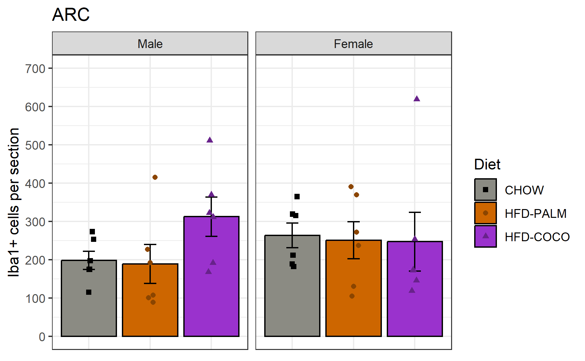
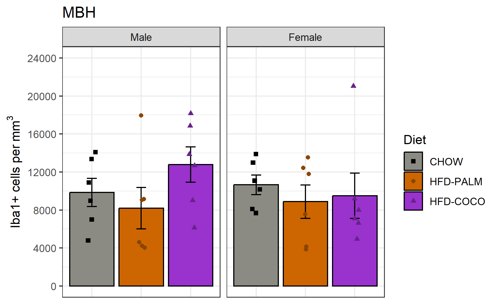
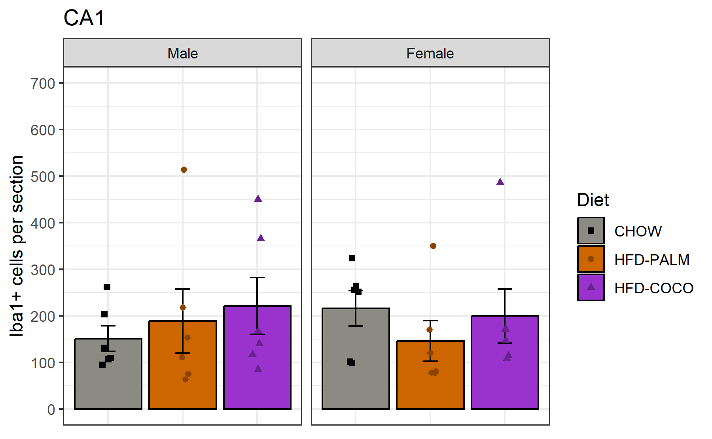
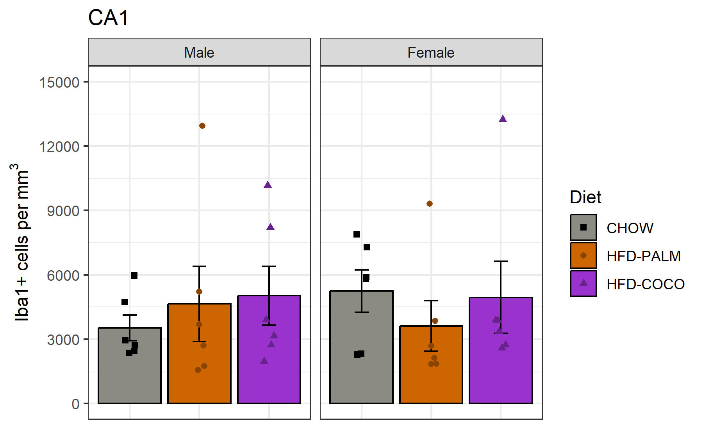
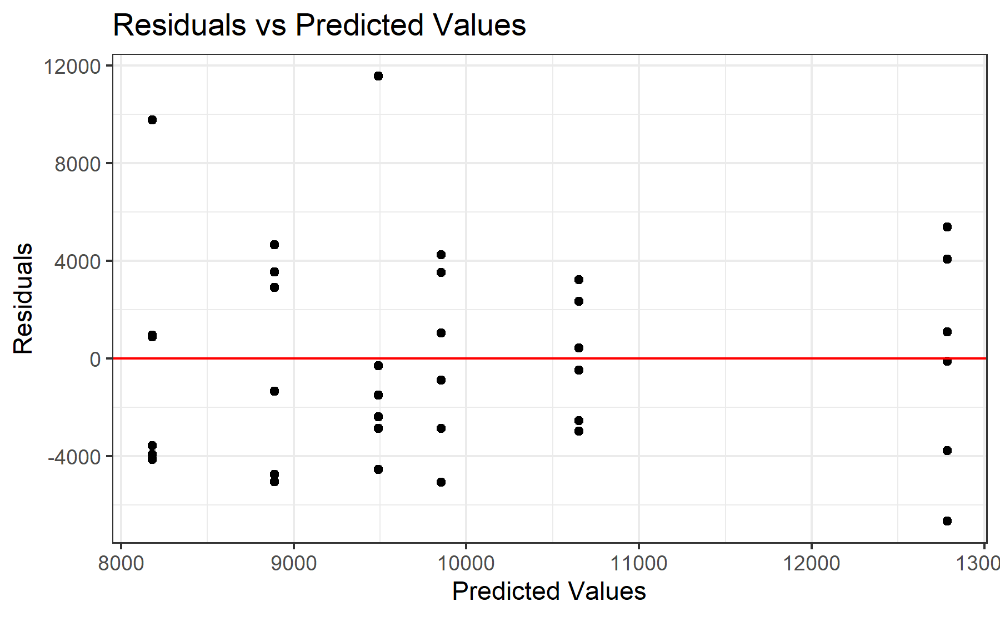
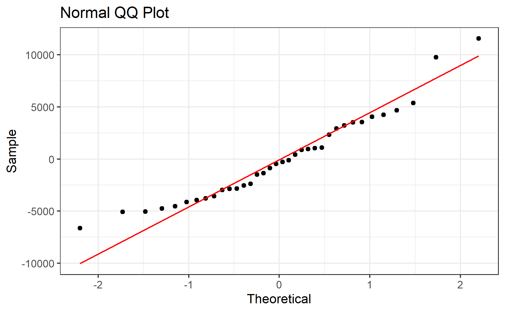
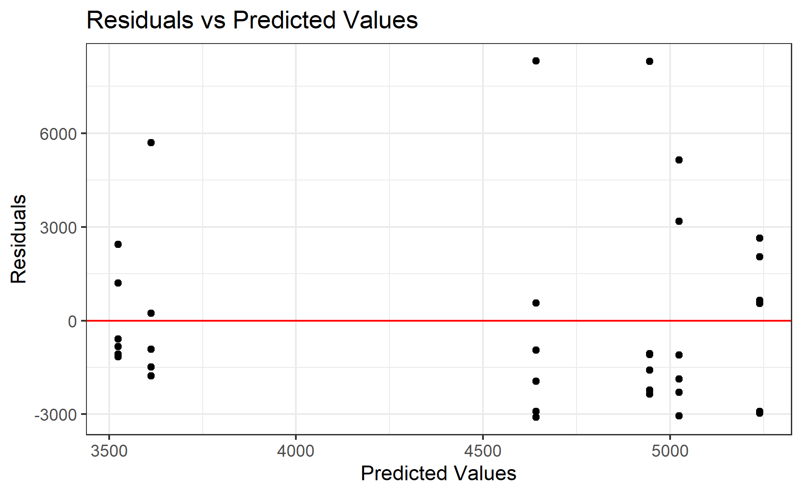
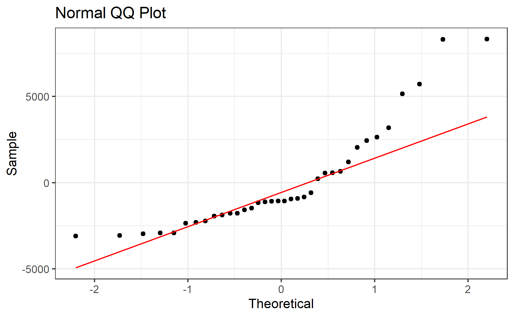
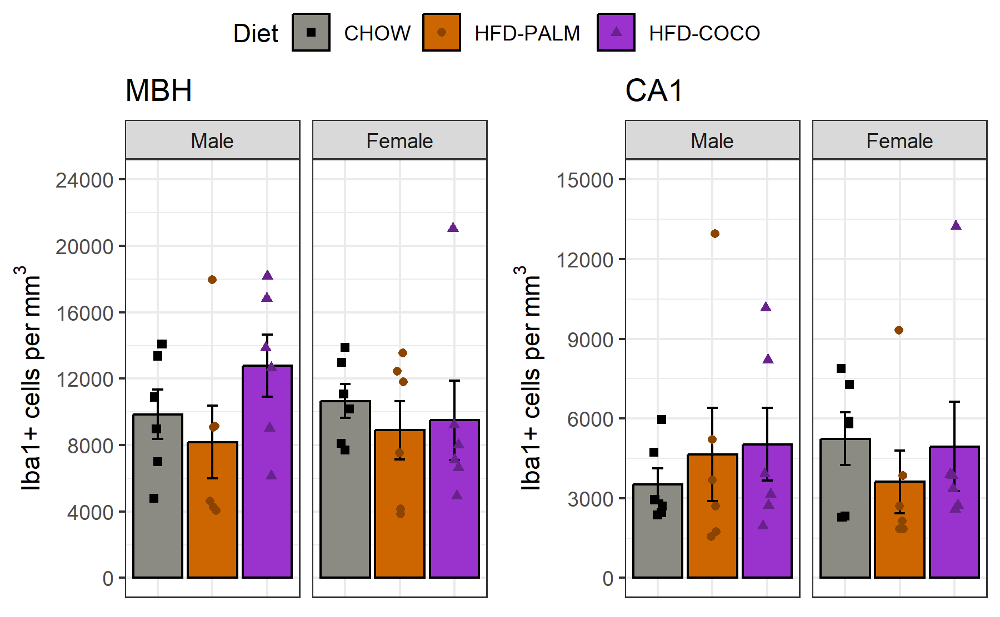

# Experiment 3 - iba1
Brent Bachman
2025-05-02

- [<span class="toc-section-number">1</span> Packages](#packages)
- [<span class="toc-section-number">2</span> Data](#data)
  - [<span class="toc-section-number">2.1</span> Import, tidy, and
    transform](#import-tidy-and-transform)
  - [<span class="toc-section-number">2.2</span> Sample
    Size](#sample-size)
  - [<span class="toc-section-number">2.3</span> Visualize](#visualize)
    - [<span class="toc-section-number">2.3.1</span> ARC
      Number](#arc-number)
    - [<span class="toc-section-number">2.3.2</span> ARC
      Density](#arc-density)
    - [<span class="toc-section-number">2.3.3</span> CA1
      Number](#ca1-number)
    - [<span class="toc-section-number">2.3.4</span> CA1
      Density](#ca1-density)
- [<span class="toc-section-number">3</span> Model 1: ARC](#model-1-arc)
  - [<span class="toc-section-number">3.1</span>
    Assumptions](#assumptions)
    - [<span class="toc-section-number">3.1.1</span> Linearity and
      Homoskedasticity](#linearity-and-homoskedasticity)
    - [<span class="toc-section-number">3.1.2</span>
      Normality](#normality)
  - [<span class="toc-section-number">3.2</span> Omnibus
    Tests](#omnibus-tests)
  - [<span class="toc-section-number">3.3</span> Summary, Reference =
    CHOW](#summary-reference--chow)
- [<span class="toc-section-number">4</span> Model 2: CA1](#model-2-ca1)
  - [<span class="toc-section-number">4.1</span>
    Assumptions](#assumptions-1)
    - [<span class="toc-section-number">4.1.1</span> Linearity and
      Homoskedasticity](#linearity-and-homoskedasticity-1)
    - [<span class="toc-section-number">4.1.2</span>
      Normality](#normality-1)
  - [<span class="toc-section-number">4.2</span> Omnibus
    Tests](#omnibus-tests-1)
  - [<span class="toc-section-number">4.3</span> Summary, Reference =
    CHOW](#summary-reference--chow-1)
- [<span class="toc-section-number">5</span> Communicate](#communicate)

# Packages

``` r
library("tidyverse")
library("ggpubr")
```

``` r
# install.packages("tidyverse")
# install.packages("ggpubr")
```

``` r
sessionInfo()
```

    R version 4.4.2 (2024-10-31 ucrt)
    Platform: x86_64-w64-mingw32/x64
    Running under: Windows 11 x64 (build 26100)

    Matrix products: default


    locale:
    [1] LC_COLLATE=English_United States.utf8 
    [2] LC_CTYPE=English_United States.utf8   
    [3] LC_MONETARY=English_United States.utf8
    [4] LC_NUMERIC=C                          
    [5] LC_TIME=English_United States.utf8    

    time zone: America/New_York
    tzcode source: internal

    attached base packages:
    [1] stats     graphics  grDevices utils     datasets  methods   base     

    other attached packages:
     [1] ggpubr_0.6.0    lubridate_1.9.3 forcats_1.0.0   stringr_1.5.1  
     [5] dplyr_1.1.4     purrr_1.0.2     readr_2.1.5     tidyr_1.3.1    
     [9] tibble_3.2.1    ggplot2_3.5.1   tidyverse_2.0.0

    loaded via a namespace (and not attached):
     [1] gtable_0.3.5      jsonlite_1.8.8    ggsignif_0.6.4    compiler_4.4.2   
     [5] tidyselect_1.2.1  scales_1.3.0      yaml_2.3.10       fastmap_1.2.0    
     [9] R6_2.5.1          generics_0.1.3    knitr_1.48        backports_1.5.0  
    [13] car_3.1-2         munsell_0.5.1     pillar_1.9.0      tzdb_0.4.0       
    [17] rlang_1.1.4       utf8_1.2.4        broom_1.0.6       stringi_1.8.4    
    [21] xfun_0.47         timechange_0.3.0  cli_3.6.3         withr_3.0.1      
    [25] magrittr_2.0.3    digest_0.6.37     grid_4.4.2        rstudioapi_0.16.0
    [29] hms_1.1.3         lifecycle_1.0.4   vctrs_0.6.5       rstatix_0.7.2    
    [33] evaluate_1.0.0    glue_1.7.0        abind_1.4-8       carData_3.0-5    
    [37] fansi_1.0.6       colorspace_2.1-1  rmarkdown_2.28    tools_4.4.2      
    [41] pkgconfig_2.0.3   htmltools_0.5.8.1

# Data

## Import, tidy, and transform

``` r
# Create a dataframe called mydata
mydata <- 
  
  # Import the data
  read_csv(
    file ="data/experiment-3-statsdata-iba1.csv",
    show_col_types = FALSE
    ) |>
  
  # Select the variables of interest 
  select(id, sex, diet, cohort, 
         arc_iba1_number_avg, arc_iba1_density_avg,
         ca1_iba1_number_avg, ca1_iba1_density_avg
         ) |>
  
  # Transform data
  mutate(
  
    # Recode categorical variables as factors
    id = factor(id),
    cohort = factor(
      cohort,
      levels = c(0, 1),
      labels = c("A", "B")
      ),
    sex = factor(
      sex,
      levels = c(0, 1),
      labels = c("Male", "Female")
      ),
    diet = factor(
      diet,
      levels = c(0, 1, 2),
      labels = c("CHOW", "HFD-PALM", "HFD-COCO")
      ),
    
    # Recode sex using sum coding
    sex_sum = C(sex, sum)
    ) |>
  
  drop_na()

# View a summary of the data
summary(mydata)
```

           id         sex           diet    cohort arc_iba1_number_avg
     1      : 1   Male  :18   CHOW    :12   A:36   Min.   : 89.0      
     2      : 1   Female:18   HFD-PALM:12   B: 0   1st Qu.:171.0      
     3      : 1               HFD-COCO:12          Median :204.6      
     4      : 1                                    Mean   :243.5      
     5      : 1                                    3rd Qu.:316.4      
     6      : 1                                    Max.   :618.5      
     (Other):30                                                       
     arc_iba1_density_avg ca1_iba1_number_avg ca1_iba1_density_avg   sex_sum  
     Min.   : 3849        Min.   : 63.33      Min.   : 1554        Male  :18  
     1st Qu.: 6907        1st Qu.:105.48      1st Qu.: 2431        Female:18  
     Median : 9103        Median :143.08      Median : 3256                   
     Mean   : 9975        Mean   :187.13      Mean   : 4498                   
     3rd Qu.:13083        3rd Qu.:252.62      3rd Qu.: 5812                   
     Max.   :21054        Max.   :513.50      Max.   :13242                   
                                                                              

## Sample Size

Since some of the brain data was lost/unusable, let’s compute the
grouped sample sizes of the usable dataset

``` r
# Compute total sample size
mydata |> 
  summarize(
    count = n()
  )
```

    # A tibble: 1 × 1
      count
      <int>
    1    36

``` r
# Compute grouped sample sizes
mydata |>
  group_by(sex, diet) |>
  summarize(
    count = n()
  )
```

    `summarise()` has grouped output by 'sex'. You can override using the `.groups`
    argument.

    # A tibble: 6 × 3
    # Groups:   sex [2]
      sex    diet     count
      <fct>  <fct>    <int>
    1 Male   CHOW         6
    2 Male   HFD-PALM     6
    3 Male   HFD-COCO     6
    4 Female CHOW         6
    5 Female HFD-PALM     6
    6 Female HFD-COCO     6

Looks like the total sample size is 36 and the grouped sample sizes are
6 per group.

## Visualize

### ARC Number

``` r
# Create a plot object
arc_number_plot <-
  
  # Call the dataset
  mydata |>  
  
  # Plot each group's iba1+ cell number in the ARC
  ggplot(
    aes(
      x = diet, 
      y = arc_iba1_number_avg, 
      fill = diet,
      )
    ) +
  
  # Create a plot title
  ggtitle(label = "ARC") +
  
  # Facet by sex (rows)
  facet_grid(
    . ~ sex
    ) + 
  
  # Plot the observed means as bars
  stat_summary(
    fun.data = mean_se,
    geom = "bar",
    color = "black",
    position = position_dodge(0.95)
    ) +
  
  # Plot the observed standard errors as errorbars
  stat_summary(
    fun.data = mean_se,
    geom = "errorbar",
    color = "black",
    width = 0.2,
    position = position_dodge(0.95)
    ) +
  
  # Plot the individual data points
  geom_point(
    aes(
      color = diet, 
      shape = diet
      ),
    position = position_jitterdodge(
      jitter.width = 0.4,
      jitter.height = 0,
      dodge.width = 0.95
      )
    ) +
  
  # Change fill title and scale
  scale_fill_manual(
    name = "Diet",
    values = c(
      "CHOW"      = "ivory4",
      "HFD-PALM"  = "darkorange3",
      "HFD-COCO"  = "darkorchid3"
      )
    ) +
  
  # Change color title and scale
  scale_color_manual(
    name = "Diet",
    values = c(
      "CHOW"      = "black",
      "HFD-PALM"  = "darkorange4",
      "HFD-COCO"  = "darkorchid4"
      )
    ) +
  
  # Change shape title and scale
  scale_shape_manual(
    name = "Diet",
    values = c(
      "CHOW"      = 15,
      "HFD-PALM"  = 16,
      "HFD-COCO"  = 17
      )
    ) +
  
  # Change y-axis title and scale
  scale_y_continuous(
    name = "Iba1+ cells per section",
    limits = c(0, 700),
    breaks = seq(from = 0, to = 700, by = 100)
  ) +
  
  # Change overall plot theme
  theme_bw() + 
  
  # Rotate and adjust the x-axis tick labels
  theme(
    axis.title.x = element_blank(),
    axis.text.x  = element_blank(),
    axis.ticks.x = element_blank()
    )

# Show the plot
arc_number_plot
```



### ARC Density

``` r
# Create a plot object
arc_density_plot <-
  
  # Call the dataset
  mydata |>  
  
  # Plot each group's iba1 cell density in the ARC
  ggplot(
    aes(
      x = diet, 
      y = arc_iba1_density_avg, 
      fill = diet,
      )
    ) +
  
  # Create a plot title
  ggtitle(label = "MBH") +
  
  # Facet by sex (rows)
  facet_grid(
    . ~ sex
    ) + 
  
  # Plot the observed means as bars
  stat_summary(
    fun.data = mean_se,
    geom = "bar",
    color = "black",
    position = position_dodge(0.95)
    ) +
  
  # Plot the observed standard errors as errorbars
  stat_summary(
    fun.data = mean_se,
    geom = "errorbar",
    color = "black",
    width = 0.2,
    position = position_dodge(0.95)
    ) +
  
  # Plot the individual data points
  geom_point(
    aes(
      color = diet, 
      shape = diet
      ),
    position = position_jitterdodge(
      jitter.width = 0.4,
      jitter.height = 0,
      dodge.width = 0.95
      )
    ) +
  
  # Change fill title and scale
  scale_fill_manual(
    name = "Diet",
    values = c(
      "CHOW"      = "ivory4",
      "HFD-PALM"  = "darkorange3",
      "HFD-COCO"  = "darkorchid3"
      )
    ) +
  
  # Change color title and scale
  scale_color_manual(
    name = "Diet",
    values = c(
      "CHOW"      = "black",
      "HFD-PALM"  = "darkorange4",
      "HFD-COCO"  = "darkorchid4"
      )
    ) +
  
  # Change shape title and scale
  scale_shape_manual(
    name = "Diet",
    values = c(
      "CHOW"      = 15,
      "HFD-PALM"  = 16,
      "HFD-COCO"  = 17
      )
    ) +
  
  # Change y-axis title and scale
  scale_y_continuous(
    name = bquote("Iba1+ cells per" ~ mm^3),
    limits = c(0, 24000),
    breaks = seq(from = 0, to = 24000, by = 4000)
  ) +
  
  # Change overall plot theme
  theme_bw() + 
  
  # Rotate and adjust the x-axis tick labels
  theme(
    axis.title.x = element_blank(),
    axis.text.x  = element_blank(),
    axis.ticks.x = element_blank()
    )

# Show the plot
arc_density_plot
```



### CA1 Number

``` r
# Create a plot object
ca1_number_plot <-
  
  # Call the dataset
  mydata |>  
  
  # Plot each group's iba1 cell number in the ca1
  ggplot(
    aes(
      x = diet, 
      y = ca1_iba1_number_avg, 
      fill = diet,
      )
    ) +
  
  # Create a plot title
  ggtitle(label = "CA1") +
  
  # Facet by sex (rows)
  facet_grid(
    . ~ sex
    ) + 
  
  # Plot the observed means as bars
  stat_summary(
    fun.data = mean_se,
    geom = "bar",
    color = "black",
    position = position_dodge(0.95)
    ) +
  
  # Plot the observed standard errors as errorbars
  stat_summary(
    fun.data = mean_se,
    geom = "errorbar",
    color = "black",
    width = 0.2,
    position = position_dodge(0.95)
    ) +
  
  # Plot the individual data points
  geom_point(
    aes(
      color = diet, 
      shape = diet
      ),
    position = position_jitterdodge(
      jitter.width = 0.4,
      jitter.height = 0,
      dodge.width = 0.95
      )
    ) +
  
  # Change fill title and scale
  scale_fill_manual(
    name = "Diet",
    values = c(
      "CHOW"      = "ivory4",
      "HFD-PALM"  = "darkorange3",
      "HFD-COCO"  = "darkorchid3"
      )
    ) +
  
  # Change color title and scale
  scale_color_manual(
    name = "Diet",
    values = c(
      "CHOW"      = "black",
      "HFD-PALM"  = "darkorange4",
      "HFD-COCO"  = "darkorchid4"
      )
    ) +
  
  # Change shape title and scale
  scale_shape_manual(
    name = "Diet",
    values = c(
      "CHOW"      = 15,
      "HFD-PALM"  = 16,
      "HFD-COCO"  = 17
      )
    ) +
  
  # Change y-axis title and scale
  scale_y_continuous(
    name = "Iba1+ cells per section",
    limits = c(0, 700),
    breaks = seq(from = 0, to = 700, by = 100)
  ) +
  
  # Change overall plot theme
  theme_bw() + 
  
  # Rotate and adjust the x-axis tick labels
  theme(
    axis.title.x = element_blank(),
    axis.text.x  = element_blank(),
    axis.ticks.x = element_blank()
    )

# Show the plot
ca1_number_plot
```



### CA1 Density

``` r
# Create a plot object
ca1_density_plot <-
  
  # Call the dataset
  mydata |>  
  
  # Plot each group's iba1+ cell density in the CA1 region
  ggplot(
    aes(
      x = diet, 
      y = ca1_iba1_density_avg, 
      fill = diet,
      )
    ) +
  
  # Create a plot title
  ggtitle(label = "CA1") +
  
  # Facet by sex (rows)
  facet_grid(
    . ~ sex
    ) + 
  
  # Plot the observed means as bars
  stat_summary(
    fun.data = mean_se,
    geom = "bar",
    color = "black",
    position = position_dodge(0.95)
    ) +
  
  # Plot the observed standard errors as errorbars
  stat_summary(
    fun.data = mean_se,
    geom = "errorbar",
    color = "black",
    width = 0.2,
    position = position_dodge(0.95)
    ) +
  
  # Plot the individual data points
  geom_point(
    aes(
      color = diet, 
      shape = diet
      ),
    position = position_jitterdodge(
      jitter.width = 0.4,
      jitter.height = 0,
      dodge.width = 0.95
      )
    ) +
  
  # Change fill title and scale
  scale_fill_manual(
    name = "Diet",
    values = c(
      "CHOW"      = "ivory4",
      "HFD-PALM"  = "darkorange3",
      "HFD-COCO"  = "darkorchid3"
      )
    ) +
  
  # Change color title and scale
  scale_color_manual(
    name = "Diet",
    values = c(
      "CHOW"      = "black",
      "HFD-PALM"  = "darkorange4",
      "HFD-COCO"  = "darkorchid4"
      )
    ) +
  
  # Change shape title and scale
  scale_shape_manual(
    name = "Diet",
    values = c(
      "CHOW"      = 15,
      "HFD-PALM"  = 16,
      "HFD-COCO"  = 17
      )
    ) +
  
  # Change y-axis title and scale
  scale_y_continuous(
    name = bquote("Iba1+ cells per" ~ mm^3),
    limits = c(0, 15000),
    breaks = seq(from = 0, to = 15000, by = 3000)
  ) +
  
  # Change overall plot theme
  theme_bw() + 
  
  # Rotate and adjust the x-axis tick labels
  theme(
    axis.title.x = element_blank(),
    axis.text.x  = element_blank(),
    axis.ticks.x = element_blank()
    )

# Show the plot
ca1_density_plot
```



# Model 1: ARC

To test the effects of sex, diet, and their interaction on iba1+ cell
density in the ARC, a multiple linear regression model will be built
with the predictors sex (sum-coded: male = 1 and female = -1), diet
(treatment coded: CHOW = 0; HFD-PALM and HFD-COCO = 1), and the
interaction between sex and diet.

``` r
# Build the model
model_arc <- lm(
  arc_iba1_density_avg ~ sex_sum * diet,
  data = mydata
)
```

## Assumptions

Before I run any statistical tests, let’s check how well the model
satisfies the assumptions.

First, I need to add the fitted and residual values to the data.

``` r
# Add the fitted and residual values to the dataset
model_arc_fits <- 
  mydata |>
  mutate(
    fits = c(fitted(model_arc)),
    resids = c(residuals(model_arc))
  )
```

### Linearity and Homoskedasticity

Next, I will create a residuals plot to check for linearity and
homoskedasticity.

``` r
# Create a residuals plot to check for linearity and homoskedasticity
model_arc_residuals_plot <-
  model_arc_fits |>
  ggplot(
    aes(x = fits, y = resids)
  ) +
  
  # Plot individual data points
  geom_point() +
  
  # Plot a horizontal line at y = 0
  geom_hline(yintercept = 0, col = "red") + 
  
  # Change aesthetics
  labs(
    title = "Residuals vs Predicted Values",
    x = "Predicted Values",
    y = "Residuals"
  ) +
  theme_bw() 

# Show the plot
model_arc_residuals_plot
```



The data seem to be linear and homoskedastic.

### Normality

Next, I will create a QQ plot to check for normality.

``` r
# Create a QQ plot to check for normality
model_arc_qq_plot <-
  model_arc_fits |>
  ggplot(
    aes(sample = resids)
  ) +
  
  # Plot points and qq line
  geom_qq() +
  geom_qq_line(col = "red") +
  
  # Change aesthestics
  labs(
    title = "Normal QQ Plot",
    x = "Theoretical",
    y = "Sample"
  ) +
  theme_bw() 

# Show the plot
model_arc_qq_plot
```



The data seem to be approximately normally distributed.

## Omnibus Tests

With the model built, let’s perform omnibus tests for the effects of
each predictor using the function “anova()”. This function uses type I
sum of squares. Thus, it will produce F test statistics for the effects
of each predictor entered sequentially (i.e., the residual effect of
each predictor after accounting for the effects of all the other
predictors entered in the model before it).

``` r
# Perform omnibus F tests
model_arc |> anova()
```

    Analysis of Variance Table

    Response: arc_iba1_density_avg
                 Df    Sum Sq  Mean Sq F value Pr(>F)
    sex_sum       1   3196903  3196903  0.1577 0.6941
    diet          2  42062785 21031392  1.0373 0.3668
    sex_sum:diet  2  32800577 16400289  0.8089 0.4548
    Residuals    30 608243949 20274798               

There were not significant effects of sex, $F(1, 30) = 0.16, p = .694$,
diet, $F(2, 30) = 1.04, p = .367$, or an interaction between sex and
diet, $F(2, 30) = 0.81, p = .455$.

## Summary, Reference = CHOW

Let’s take a look at the summary output.

``` r
# Produce summary output
model_arc |> summary()
```


    Call:
    lm(formula = arc_iba1_density_avg ~ sex_sum * diet, data = mydata)

    Residuals:
        Min      1Q  Median      3Q     Max 
    -6645.4 -3112.7  -383.3  2996.0 11563.6 

    Coefficients:
                          Estimate Std. Error t value Pr(>|t|)    
    (Intercept)            10252.4     1299.8   7.887 8.39e-09 ***
    sex_sum1                -399.6     1299.8  -0.307    0.761    
    dietHFD-PALM           -1718.3     1838.2  -0.935    0.357    
    dietHFD-COCO             885.3     1838.2   0.482    0.634    
    sex_sum1:dietHFD-PALM     45.5     1838.2   0.025    0.980    
    sex_sum1:dietHFD-COCO   2047.2     1838.2   1.114    0.274    
    ---
    Signif. codes:  0 '***' 0.001 '**' 0.01 '*' 0.05 '.' 0.1 ' ' 1

    Residual standard error: 4503 on 30 degrees of freedom
    Multiple R-squared:  0.1137,    Adjusted R-squared:  -0.03397 
    F-statistic:  0.77 on 5 and 30 DF,  p-value: 0.5788

The model did not explain a significant portion of the variance in iba1+
cell density in the ARC,
$F(5, 30) = 0.77, R^2 = 0.11, R^2_{adj} = -0.04, p = .579$.

# Model 2: CA1

To test the effects of sex, diet, and their interaction on iba1+ cell
density in the CA1 region, a multiple linear regression model will be
built with the predictors sex (sum-coded: male = 1 and female = -1),
diet (treatment coded: CHOW = 0; HFD-PALM and HFD-COCO = 1), and the
interaction between sex and diet.

``` r
# Build the model
model_ca1 <- lm(
  ca1_iba1_density_avg ~ sex_sum * diet,
  data = mydata
)
```

## Assumptions

Before I run any statistical tests, let’s check how well the model
satisfies the assumptions.

First, I need to add the fitted and residual values to the data.

``` r
# Add the fitted and residual values to the dataset
model_ca1_fits <- 
  mydata |>
  mutate(
    fits = c(fitted(model_ca1)),
    resids = c(residuals(model_ca1))
  )
```

### Linearity and Homoskedasticity

Next, I will create a residuals plot to check for linearity and
homoskedasticity.

``` r
# Create a residuals plot to check for linearity and homoskedasticity
model_ca1_residuals_plot <-
  model_ca1_fits |>
  ggplot(
    aes(x = fits, y = resids)
  ) +
  
  # Plot individual data points
  geom_point() +
  
  # Plot a horizontal line at y = 0
  geom_hline(yintercept = 0, col = "red") + 
  
  # Change aesthetics
  labs(
    title = "Residuals vs Predicted Values",
    x = "Predicted Values",
    y = "Residuals"
  ) +
  theme_bw() 

# Show the plot
model_ca1_residuals_plot
```



The data seem to be linear and homoskedastic.

### Normality

Next, I will create a QQ plot to check for normality.

``` r
# Create a QQ plot to check for normality
model_ca1_qq_plot <-
  model_ca1_fits |>
  ggplot(
    aes(sample = resids)
  ) +
  
  # Plot points and qq line
  geom_qq() +
  geom_qq_line(col = "red") +
  
  # Change aesthestics
  labs(
    title = "Normal QQ Plot",
    x = "Theoretical",
    y = "Sample"
  ) +
  theme_bw() 

# Show the plot
model_ca1_qq_plot
```



The data seem to be approximately normally distributed.

## Omnibus Tests

With the model built, let’s perform omnibus tests.

``` r
# Perform omnibus F tests
model_ca1 |> anova()
```

    Analysis of Variance Table

    Response: ca1_iba1_density_avg
                 Df    Sum Sq  Mean Sq F value Pr(>F)
    sex_sum       1    368651   368651  0.0352 0.8524
    diet          2   4654427  2327213  0.2223 0.8020
    sex_sum:diet  2  11640428  5820214  0.5559 0.5794
    Residuals    30 314106639 10470221               

There were not significant effects of sex, $F(1, 30) = 0.04, p = .852$,
diet, $F(2, 30) = 0.22, p = .802$, or an interaction between sex and
diet, $F(2, 30) = 0.56, p = .579$.

## Summary, Reference = CHOW

Let’s take a look at the summary output.

``` r
# Produce summary output
model_ca1 |> summary()
```


    Call:
    lm(formula = ca1_iba1_density_avg ~ sex_sum * diet, data = mydata)

    Residuals:
        Min      1Q  Median      3Q     Max 
    -3087.7 -1892.0 -1062.5   785.8  8314.5 

    Coefficients:
                          Estimate Std. Error t value Pr(>|t|)    
    (Intercept)             4381.7      934.1   4.691 5.57e-05 ***
    sex_sum1                -857.1      934.1  -0.918    0.366    
    dietHFD-PALM            -254.8     1321.0  -0.193    0.848    
    dietHFD-COCO             602.7     1321.0   0.456    0.651    
    sex_sum1:dietHFD-PALM   1371.5     1321.0   1.038    0.307    
    sex_sum1:dietHFD-COCO    896.4     1321.0   0.679    0.503    
    ---
    Signif. codes:  0 '***' 0.001 '**' 0.01 '*' 0.05 '.' 0.1 ' ' 1

    Residual standard error: 3236 on 30 degrees of freedom
    Multiple R-squared:  0.05038,   Adjusted R-squared:  -0.1079 
    F-statistic: 0.3183 on 5 and 30 DF,  p-value: 0.898

The model did not explain a significant portion of the variance in iba1+
cell density in the CA1 region,
$F(5, 30) = 0.32, R^2 = 0.05, R^2_{adj} = -0.11, p = .898$.

# Communicate

Let’s combine the plots

``` r
# Combine the plots for each brain region into a single, multi-panel plot
arranged_plot <- 
  ggarrange(
    arc_density_plot, ca1_density_plot,
    nrow = 1, ncol = 2,
    # labels = c("A", "B", "C", "D"),
    common.legend = T
  )

# Show the plot
arranged_plot
```



Now let’s save the plots.

``` r
# Save the ...

# MBH density plot
ggsave(
  plot = arc_density_plot,
  filename = "output/experiment-3/07-iba1/01-MBH-density-plot.tiff",
  width = 6, height = 3.708, units = "in", dpi = 300
)

# MBH residuals plot
ggsave(
  plot = model_arc_residuals_plot,
  filename = "output/experiment-3/07-iba1/02-MBH-residuals-plot.tiff",
  width = 6, height = 3.708, units = "in", dpi = 300
)

# MBH qq plot
ggsave(
  plot = model_arc_qq_plot,
  filename = "output/experiment-3/07-iba1/03-MBH-qq-plot.tiff",
  width = 6, height = 3.708, units = "in", dpi = 300
)

# CA1 plot
ggsave(
  plot = ca1_density_plot,
  filename = "output/experiment-3/07-iba1/04-CA1-density-plot.tiff",
  width = 6, height = 3.708, units = "in", dpi = 300
)

# CA1 residuals plot
ggsave(
  plot = model_ca1_residuals_plot,
  filename = "output/experiment-3/07-iba1/05-CA1-residuals-plot.tiff",
  width = 6, height = 3.708, units = "in", dpi = 300
)

# CA1 qq plot
ggsave(
  plot = model_ca1_qq_plot,
  filename = "output/experiment-3/07-iba1/06-CA1-qq-plot.tiff",
  width = 6, height = 3.708, units = "in", dpi = 300
)

# arranged plot - 300 dpi
ggsave(
  plot = arranged_plot,
  filename = "output/experiment-3/07-iba1/07-arranged-plot-300.tiff",
  width = 6, height = 3.708, units = "in", dpi = 300
)

# arranged plot - 1200 dpi
ggsave(
  plot = arranged_plot,
  filename = "output/experiment-3/07-iba1/08-arranged-plot-1200.tiff",
  width = 6, height = 3.708, units = "in", dpi = 1200
)
```
